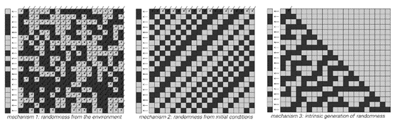

### 7.2  随机性的三种机制

在自然界中，人们最常观察到的现象之一就是明显的随机性。事实上，有许多不同类型的系统都展现出随机性，而且每一种情况下随机性的原因可能都不同。但通过对简单程序的研究，我得出了结论：实际上，我们可以识别出随机性的三种基本机制，如下图所示。

在第一种机制中，随机性被明确地引入到系统的基本规则中，使得每一步都会为每个单元随机选择一个颜色。

这种机制是传统科学中最常考虑的。它基本上对应于假设存在一个随机的外部环境，该环境不断影响人们正在观察的系统，并不断向其注入随机性。

在第二种机制中（如下图所示），系统与环境之间不存在这样的相互作用。系统的初始条件是随机选择的，但随后系统的演化则假定遵循不涉及随机性的明确规则。

 
>随机性可能由三种机制造成。对角线箭头代表外部输入。在第一种情况下，每一步都有来自环境的随机输入。在第二种情况下，只有初始条件包含随机输入。在第三种情况下，实际上没有任何随机输入。然而，尽管这些机制的基础结构不同，但每一种机制都会导致左侧列出的随机性。第一种机制对应于由外部噪声产生的随机性，如所谓的随机模型所描述的那样。第二种机制本质上是混沌理论所暗示的。第三种机制是新的，由本书中关于简单程序行为的研究结果所提示。我将提供证据表明，第三种机制是自然界中最常见的一种。

(p 299)

然而，这些规则的一个关键特征是，它们使系统的行为对初始条件的细节极为敏感。在所示的具体情况下，规则只是简单地设置为在每一步中将每种颜色向左移动一个位置。

这样做的结果是，任何特定单元格所呈现的颜色序列将取决于初始条件中越来越远的单元格的颜色。因此，由于初始条件是随机的，因此任何特定单元格的颜色序列也将相应地是随机的。

一般来说，规则可能比前一页示例中所示的更复杂。但这种随机性机制的基本思想是，人们所看到的随机性源于初始条件中存在的某种随机性的转录。

刚才讨论的两种随机性机制有一个共同的重要特征：它们都假设在任何特定系统中看到的随机性最终必须来自该系统之外。从某种意义上说，因此，这两种机制都没有真正承担起解释随机性起源的责任：它们最终都只是说随机性来自人们正在观察的系统之外的任何地方。

然而，多年来，这种相当令人不满意的陈述一直是人们能做出的最好陈述。但本书中对简单程序的发现终于使新的进展成为可能。

我们首先在27页看到的关键点是，即使简单程序没有获得任何随机输入，它们也能产生看似随机的行为。这意味着存在第三种可能的随机性机制，这次它不再依赖于人们正在观察的系统之外的任何随机性。

如果我们只发现了少数几个能够以这种方式产生随机性的程序示例，那么我们可能会认为这种第三种机制是罕见且特殊的。但事实上，在过去的几章中，我们已经看到，我们几乎可以构造的每一种简单程序都能够产生这样的随机性。

(p 300)

因此，有理由推测，相同的机制也应该发生在自然界中的许多系统中。实际上，正如我将在本章及后续章节中讨论的那样，我相信这种机制实际上最终负责了我们在自然界中看到的随机性的很大一部分，如果不是全部的话。

但这并不是说其他两种机制在实践中从不相关。即使它们可能无法解释在最低层面上如何产生随机性，但它们仍然可以在描述特定系统中关于随机性的观测时发挥作用。

在接下来的几节中，我将讨论各种类型的系统，其中观察到的随机性最好地可以用这里确定的三种随机性机制中的每一种来描述。

 

