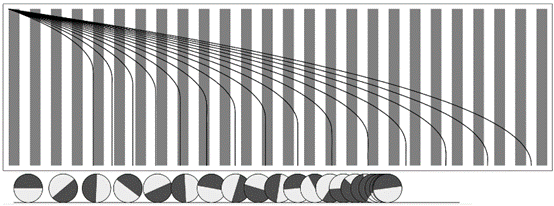
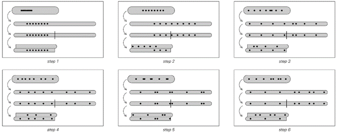
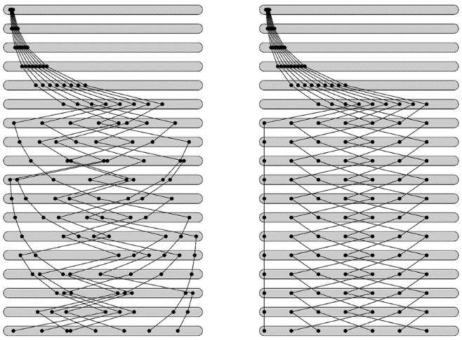
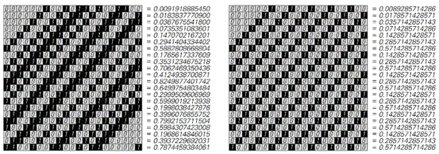
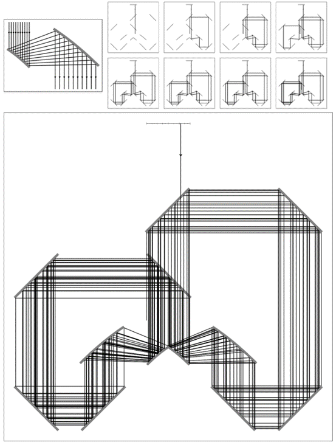
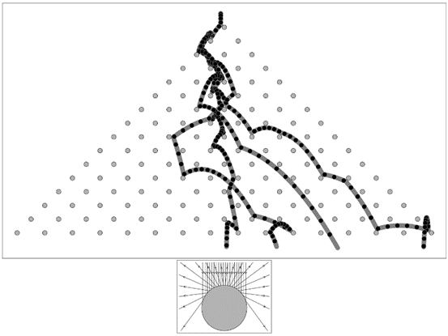
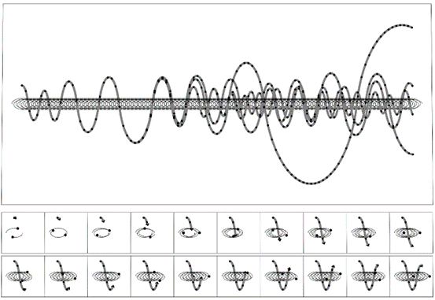

### 7.4  混沌理论与初始条件中的随机性

在本章开头，我概述了三种可能导致明显随机性的基本机制。在上一节中，我讨论了这些机制中的第一个——基于系统演化不断受到来自其环境随机性影响的想法。

但是，为了在一个特定系统中获得随机性，事实证明，系统与外部随机环境之间并不需要持续的相互作用。在本章开头讨论的第二个随机性机制中，在系统演化过程中并没有明确插入随机性。但初始条件中仍然存在随机性，关键在于随着系统的演化，它会越来越多地抽取这种随机性，从而产生相应随机的行为。

作为一个相对简单的例子，我们可以想象一辆车在崎岖不平的道路上行驶。与海洋上的波浪不同，当汽车开始行驶时，道路上所有的颠簸都已经存在，因此，我们可以将这些颠簸视为系统初始条件的一部分。但关键在于，随着时间的推移，汽车会越来越多地遇到这些颠簸，如果这些颠簸中存在随机性，那么就会导致汽车的运动也表现出相应的随机性。

(p 304)

另一个有些类似的例子是一个球在粗糙表面上滚动。例如，球最终停在哪里将取决于表面颠簸的模式。但现在，初始条件的另一个特征也很重要：球的初始速度。

令人有些惊讶的是，即使表面上没有明显的颠簸，这种系统的行为在实践中也已经表现出一些明显的随机性。事实上，基于掷骰子、抛硬币等机会游戏都依赖于这种随机性。

作为一个简单的例子，考虑一个球，它有一个半球是白色的，另一个半球是黑色的。我们可以像掷骰子一样滚动这个球，然后观察球静止时哪个颜色朝上。如果我们这样做，通常会发现结果看起来相当随机。但这种随机性来自哪里呢？

答案是它来自滚动球时的初始速度的随机性。下面的图片展示了具有一系列不同初始速度的球的运动。我们可以看到，只需要对初始速度进行微小的改变，就能使球静止时处于完全不同的方向。

>一幅图展示了以不同初速度滚动的球的位置。时间向下延伸。球从左侧开始，初速度由曲线的初始斜率给出。由于摩擦，球的速度逐渐减慢，并最终停止。球是半白半黑的，图片中的条纹表示球在特定位置时哪种颜色在上面。图片中曲线的发散表示运动对球的确切初速度的敏感性。初速度的微小变化会导致球以不同的颜色在上面停止。正是这种对初始条件随机性的敏感性，使得像掷骰子或抛硬币这样的过程产生了看似随机的结果。

(p 305)

关键在于，人类滚动球时通常无法以足够的精度控制这个速度，以确定最终是黑色还是白色在上面。事实上，在连续试验中，初速度通常会有足够大的随机变化，使得结果看起来完全是随机的。

抛硬币、幸运轮盘、轮盘赌轮和类似的随机性产生器在本质上都是以相同的方式工作的。在每种情况下，导致我们看到随机性的基本机制都是对典型初始条件中存在的随机性的敏感依赖。

然而，如果没有初始条件的随机性，这些系统的输出就不会有随机性。事实上，完全有可能制造出精确的机器来抛硬币、滚球等，这些机器总是产生确定的结果，没有任何随机性。

但是，被称为混沌理论的发现表明，至少从原则上讲，可能存在一些系统，它们对初始条件的敏感性如此之大，以至于任何具有固定容差的机器都无法产生可重复的结果。

一个经典例子是揉面过程的理想化版本，这种过程用于制作面条或太妃糖等。基本想法是取一团类似面团的材料，反复将其拉伸至原始长度的两倍，然后将其切成两半，再将这两半堆叠在一起。对面页顶部的图片展示了这一过程中的几个步骤。需要注意的重要一点是，每次拉伸材料时，相邻点之间的距离都会加倍。

这样做的结果是，点的初始位置的任何变化都会在每一步中被放大两倍。虽然特定的机器可能能够以一定的精度控制点的初始位置，但这种重复的放大最终会导致对更小变化的敏感性。

但这实际上对材料中点的运动意味着什么？对面页底部的图片展示了两组起点非常接近的点的运动情况。最明显的效果是，这些点在连续的步骤中迅速分散。但过了一段时间后，它们会到达材料的边缘，无法再进一步分散。然后，在第一种情况下，后续的运动看起来相当随机。但在第二种情况下，它是相当规则的。为什么会这样呢？

(p 306)

稍作分析就能明白其中的原因。基本想法是将每一步中每个点的位置表示为一个数字，比如x，它从0到1变化。当材料被拉伸时，这个数字会加倍。而当材料被切割并堆叠时，对数字的影响是提取其小数部分。

>一个类似于制作面条或太妃糖的揉面过程，它对初始条件表现出非常敏感的依赖性。在每个步骤的第一部分，材料被拉伸到原始长度的两倍。然后它被切成两半，这两半被堆叠在一起。图片显示，最初靠得很近的点迅速分离。（一个更现实的揉面过程会折叠材料而不是切割，但同样会对初始条件产生敏感的依赖性。）

>当上述揉面过程应用于附近的点集时，可能会发生以下两种情况。在两种情况下，点最初都按指数方式发散，这符合混沌理论的预测。但过了一段时间后，它们到达了材料的边缘，尽管在第一种情况下它们随后表现出相当随机的行为，但在第二种情况下，它们只是表现出简单的重复行为。这两种情况之间的区别在于点的位置的详细数字序列：在第一种情况下，这些数字序列是相当随机的，而在第二种情况下，它们具有简单的重复形式。

(p 307)

但事实证明，这个过程与我们在第153页基于数字的系统章节中讨论的过程完全相同。

我们在那里发现的关键是，不要从数字x的大小来考虑，而是要从它们在二进制中表示的数字序列来考虑。事实上，就这样的数字序列而言，揉面过程仅仅是在每一步中将所有数字向左移动一位，如下面的图片所示。

数字序列的工作方式是，数字中越靠右的数字对其整体大小的影响越小。因此，人们可能会认为，在初始条件中位于很右侧的数字永远不会很重要。但上面的图片显示，这些数字总是会被向左移动，因此最终它们实际上会变得很重要。因此，随着时间的推移，系统实际上是在对初始条件中越来越靠右的数字进行采样。

从某种意义上说，这与本节开头讨论的汽车在崎岖不平的道路上行驶的例子并不相同。事实上，在很多方面，唯一的真正区别是，我们不能再看到道路上明确的一系列颠簸，而是在揉面过程中，点的位置的初始条件被编码为更抽象的数字序列形式。

>上一页底部两个揉面过程示例中，各步骤上点位置的数字序列。在每个步骤中，这些数字序列都会向左移动一位。因此，如果初始数字序列是随机的，如第一个示例所示，那么后续行为也将相应地是随机的。但如果初始数字序列很简单，如第二个示例所示，那么行为也会相应地很简单。一般来说，在特定步骤上位于x位置的点将在下一步移动到2x的小数部分所对应的位置。

(p 308)

但关键的一点是，我们所观察到的行为只会像初始条件中的数字序列一样随机。而在对面页面上的第一个例子中，恰好每个初始点所显示的数字序列确实相当随机，所以我们所观察到的行为也相应地表现出随机性。但在第二个例子中，数字序列是有规律的，因此行为也相应地表现出规律性。

因此，对初始条件的敏感依赖性本身并不意味着系统将以随机的方式运行。实际上，它所做的只是使那些对初始条件中数字大小贡献任意小的数字最终产生显著影响。但是，为了使系统的行为具有随机性，除了数字序列本身必须是随机的之外，还需要其他条件。事实上，本节中关于随机性机制的整个想法正是，我们所看到的任何随机性都必须来自我们所观察的系统初始条件的随机性。

那么，为什么这些初始条件中会有随机性，这是一个独立的问题。而最终，这个问题只能通过跳出我们所观察的系统，去研究是什么设定了它的初始条件来得到答案。

然而，近年来关于混沌理论的描述却常常在这个问题上引起混淆。因为从混沌理论数学中的一个隐含假设出发，人们得出了这样的结论：在实际中出现的数字中，随机数字序列几乎是不可避免的。

这一观点的基础是传统数学理想化，即任何数字的唯一相关属性是其大小。正如第152页所讨论的，这种理想化表明，所有大小足够接近的数字在某种程度上都应该同样常见。而如果这是真的，那么它将意味着典型的初始条件将不可避免地涉及随机数字序列。

但没有任何特别的理由认为，这种恰好便于数学分析的理想化应该适用于自然界。而实际上，假设它适用于自然界，实际上只是忽略了自然界中随机性来源的根本问题。

(p 309)

但除了这些原则性问题之外，从初始条件中获取随机性的想法还存在严重的实际问题，至少在上文讨论的揉面过程的案例中是这样。

问题在于，我们所使用的揉面过程描述忽略了某些显而易见的物理现实。其中最重要的是，我们使用的任何材料可能都是由原子构成的。因此，能够任意改变一个点位置的想法是不切实际的。

人们可能会认为原子总是那么小，以至于它们的大小在实际中无关紧要。但关键是，揉面过程会不断放大距离。而实际上，仅仅经过三十步，上述揉面过程的描述就意味着，最初仅相隔一个原子的两个点最终会相隔近一米。

然而，在实际中，这种情况发生之前很久，我们简单描述的揉面过程中没有考虑到的其他效应也必然会变得重要。而且，这些效应往往会从环境中引入新的随机性。因此，随机性完全来自初始条件的想法只能在相当少数的步骤中是现实的；之后的随机性通常必须归因于其他机制。

人们可能会认为，我们一直在讨论的揉面过程只是一个不好的例子，而在其他情况下，来自初始条件的随机性会更加显著。

对面页面上的图片展示了一个系统，其中一束光反复从一系列镜子上反射。系统设置得使光每次绕行时，其位置的变化方式与揉面过程中点的位置变化方式完全相同。正如在揉面过程中一样，这里对初始条件的细节也非常敏感，所观察到的行为反映了这些初始条件的数字序列。

但同样，在任何实际实现中，光在受到镜子上的微观扰动和其他在我们简单描述中没有考虑到的现象的影响之前，只能绕行几十次。

(p 310)

>这是一组镜子的布置，用于展示由于对初始条件的敏感依赖而产生的随机性。系统的初始条件由每幅图片顶部灰色区域中入射光线的位置指定。然后，光线在每一步是向左还是向右移动，由给出初始条件的数字的二进制表示中的连续数字决定。系统的核心是左侧所示的“放大器”，它使用一对抛物面镜将每个入射光线的位移加倍。这里使用的初始条件是π/4，其二进制表示为0.1100100100001111111。

(p 311)

上一页所示系统的核心是稍微复杂的抛物面镜布置。但事实证明，几乎任何凸面反射器都会导致轨迹发散，从而获得对初始条件的敏感依赖。

实际上，下面所示的简单木钉板也表现出相同的现象，即使以无限小的不同初始位置落下的球最终也会遵循截然不同的轨迹。

这些轨迹的细节不能像以前那样直接从初始位置的数字序列中推断出来，但同样会出现连续采样越来越不重要的数字的现象。同样，至少在一段时间内，球运动的任何随机性都可以归因于这个初始数字序列的随机性。

>四个理想化的球从初始位置落下，这些初始位置在千分之一的差距内，进入一个由相同圆形木钉组成的阵列。假设这些球在重力作用下下落，并在每次撞到木钉时弹性反弹。如图中插图所示，每次反弹时，方向上的微小差异都会被放大——大约加倍，结果是几次反弹后，三个球的轨迹差异很大。在物理系统中，如果球的实际大小与页面上的相同，那么来自环境的扰动在大约相同次数的反弹后，其影响将不可避免地被放大，从而对轨迹产生显著影响。这里所示的系统版本——特别是木钉间距更小的版本——有时被称为高尔顿板或五点形板，自19世纪末以来一直被用来演示概率论的原理。如果假设球在每个木钉的每一侧随机落下，那么当球的数量很大时，最终位置将接近二项分布。

(p 312)

但是，在实际中，经过最多十次左右的碰撞后，许多其他效应，主要与环境的持续相互作用有关，总是会变得重要，因此随后的任何随机性都不能仅仅归因于初始条件。

事实上，在任何系统中，初始条件的细节可以被视为随机性的主要来源的时间长度，都不可避免地受到观察到的大尺度特征与不易控制的小尺度特征之间分离程度的限制。

那么，在哪种类型的系统中会出现最大的这种分离呢？答案往往是天文学中的系统。事实证明，天文学中的所谓三体问题是第一个广泛研究对初始条件的敏感依赖性的地方。

三体问题是指确定三个通过引力相互作用的物体（如地球、太阳和月亮）的运动。对于只有两个物体的系统，近四百年来人们已经知道其轨道是简单的椭圆或双曲线。但是，对于三个物体的系统，其运动可能会复杂得多，而且——如19世纪末所显示的那样——可能会敏感地依赖于给定的初始条件。

下一页的图片展示了三体问题的一个特定案例，其中有两个大质量物体在简单的椭圆轨道上运行，同时还有一个无限小的质量物体在这个轨道的平面上上下移动。图片所展示的是，即使这个微小质量物体的初始位置仅改变了一亿分之一，那么在两个大质量物体绕转50圈后，这个小质量物体的轨迹最终也会变得几乎完全不同。

那么，在我们的太阳系中，行星和其他天体实际上会发生什么呢？观测表明，至少在人类的时间尺度上，它们的大部分运动都是相当有规律的。事实上，这种规律性在过去被认为是自然界存在简单定律的关键证据之一。

(p 313)

但计算表明，即使在我们的太阳系中，对初始条件的敏感依赖性最终也应该会发生。不用说，我们不可能明确地设置不同的初始条件。但是，如果我们能观察太阳系几百万年，那么应该会出现显著的随机性，这种随机性可以归因于对初始条件数字序列的敏感依赖性——而这种随机性在过去的存在可能解释了太阳系一些目前观测到的特征。

>这是一个三体问题的例子，其中一个理想化的行星在两个等质量理想化恒星的完美椭圆轨道平面上上下移动。图中展示了行星四个可能的初始位置（相差10^-8）所得到的轨迹。这些图片假设系统从左到右做匀速运动。连续的黑点表示行星在每颗恒星绕转一圈时的位置。主图显示了行星在100圈绕转过程中的情况。假设行星的质量与恒星相比可忽略不计，并且行星开始时在两颗恒星之间的等距处具有零垂直速度。轨迹在初始垂直位置略有不同时的发散，表明了对初始条件的敏感依赖性。

(p 314)

