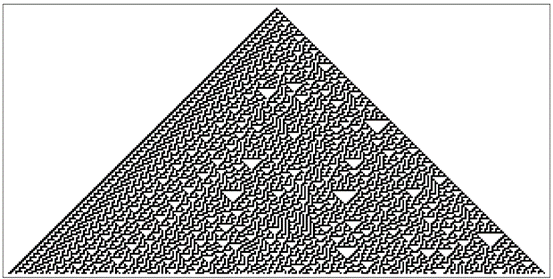
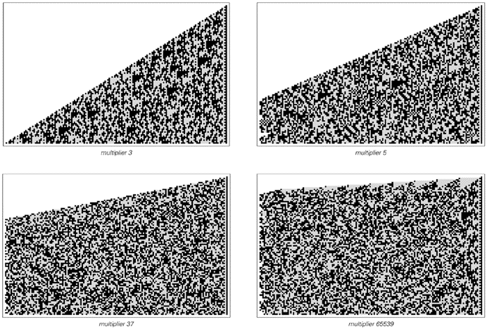
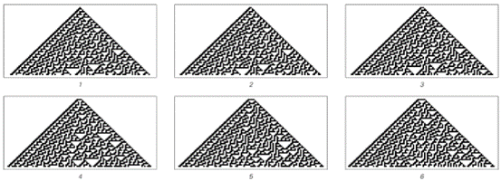

### 7.5  随机性的内在产生

在过去的两节[3, 4]中，我们研究了两种可能导致观测到随机性的机制。但正如我们所讨论的，这两种机制在任何实际意义上都不产生随机性。相反，它们本质上只是接受来自外部的随机输入，并将其转移到所研究的任何系统中。

然而，本书的一个重要结论是，还存在第三种可能的随机性机制，它不需要来自外部的随机输入，而是在所研究的系统内部内在地产生随机性。

下面的图片展示了规则30的元胞自动机，我首先在其中识别出了这种随机性机制。该系统的基本规则非常简单，初始条件也非常简单。

然而，尽管缺乏任何可以合理视为随机输入的因素，但系统的演化却内在地产生了在许多方面看似随机的行为。

正如我们之前所讨论的，传统直觉很难相信如此复杂的行为能够源自如此简单的底层过程。但过去几章已经证明，这不仅是可能的，而且实际上相当普遍。

>第27页的规则30元胞自动机是我发现的第一个内在随机性生成的例子。该系统没有随机输入，但其行为在许多方面却看似随机。我怀疑自然界中我们所看到的许多随机性都是这样产生的。

(p 315)

然而，观察前一页的元胞自动机，其产生的图案中显然至少存在一些规律性——比如左边的对角线条纹。但是，如果特别挑选出连续步骤中中心单元格的颜色，那么所得到的似乎是一个完全随机的序列。

但这个序列究竟有多随机呢？

就我们的目的而言，最相关的一点是，到目前为止，这个序列至少与我们通常认为随机的自然界中任何现象的序列一样随机。

当我们说某物看似随机时，实际上我们通常指的是在其中看不到任何规律性。因此，当我们说自然界中的某个特定现象看似随机时，我们的意思是我们的所有标准分析方法都没有成功在其中找到规律性。因此，为了评估像元胞自动机这样的东西产生的序列的随机性，我们必须对它采用与自然系统相同的分析方法。

正如我将在第10章中讨论的那样，其中一些方法已经在标准数学和统计学中得到了很好的编纂，而其他方法则有效地隐含在我们的视觉和其他感知过程中。但令人瞩目的是，这些方法似乎都没有在规则30元胞自动机序列中揭示出任何真正的规律性。因此，就我们所知，这个序列至少与我们在自然界中看到的任何东西一样随机。

但它真的是随机的吗？

在过去的一个世纪左右的时间里，人们提出了各种关于真正随机性的定义。根据其中大多数定义，该序列确实是真正随机的。但有一类定义并不认为它是真正随机的。

这些定义基于将只有那些绝不可能通过任何简单程序生成的序列才归类为真正随机的观念。然而，从一个简单的初始条件开始，然后应用一个简单的元胞自动机规则就构成了一个简单的程序。因此，根据这些定义，规则30的中心列不能被认为是真正随机的。

(p 316)

但尽管这种类型的定义在概念上具有一定的吸引力，但它们不太可能在讨论自然界中的随机性时发挥作用。因为正如我们稍后将在这本书中看到的那样，根据这些定义，任何自然过程几乎都不可能生成一个保证是真正随机的序列。

对于我们的目的来说，更有用的定义往往不太关注是否存在一种在原则上生成特定序列的简单方法，而是关注是否可以通过对序列进行各种分析来现实地识别出这种方法。如上所述，有充分的证据表明，根据所有合理的此类定义，规则30的中心列确实是随机的。

因此，无论一个人是否选择说该序列是真正随机的，就我们所知，它至少在所有实际用途中都是随机的。事实上，与它密切相关的序列已经被非常成功地用作实际计算中随机性的来源。

多年来，大多数计算机系统和语言都具备生成它们通常称为随机数的功能。而在Mathematica中——自它首次发布以来——Random[Integer]就使用规则30元胞自动机来生成0和1。

它的工作原理是，每次调用Random[Integer]时，都会执行元胞自动机进化的另一个步骤，并返回中心单元格的值。但与两页前的图示不同的是，出于实际原因，该模式不允许永远无限制地变宽。相反，它被包裹在一个只有几百个单元格宽的区域内。

正如第259页所讨论的，这样做的一个结果是生成的0和1序列最终必然会重复。但即使是用最快的可预见的计算机，实际的重复周期也通常会超过宇宙年龄的万亿亿倍。

另一个问题是，如果一个人总是从第315页所示的特定初始条件开始运行元胞自动机，那么他将总是得到完全相同的0和1序列。但是，通过使用不同的初始条件，可以得到完全不同的序列。而在实践中，如果初始条件没有明确指定，那么Mathematica（例如）就会使用Random首次被调用时计算机系统精确状态的各种特征的表示作为初始条件。

(p 317)

规则30元胞自动机为内在随机性生成提供了一个特别清晰且良好的例子。但在之前的章节中，我们也看到了许多其他系统，它们同样内在地产生了明显的随机性。事实证明，其中之一与自20世纪40年代末期以来几乎所有实际计算机系统中生成随机数所使用的方法有关。

对页的图片展示了如果一个数连续乘以各种常数因子，然后观察所得数字的数位序列会发生什么。正如我们首先在119页看到的那样，通过这种方式获得的数位模式看起来相当随机。而所谓线性同余随机数生成器的想法正是利用这种随机性。

出于实际原因，此类生成器通常在每个步骤中仅保留数字的最右边31位。然而，即使有这样的限制，生成的序列也足够随机，以至于至少到最近它们几乎是实际计算中用作随机性来源的通用方法。

因此，从某种意义上说，线性同余生成器是内在随机性生成这一普遍现象的另一个例子。但事实证明，在某些方面，它们相当不寻常且具有误导性。

在每个步骤中仅保留有限数量的数字不可避免地导致生成的序列最终会重复。而线性同余生成器之所以受欢迎的原因之一是，通过相当直接的数学分析，可以准确地确定哪些乘法因子将使这个重复周期最大化。

人们经常假设，拥有最大的重复周期将在某种程度上意味着所得到的序列在所有方面都具有最大的随机性。但多年来在实践中，一个接一个地被构造成具有最大重复周期的线性同余生成器被发现与完美的随机性存在非常大的偏差。

(p 318)

一个典型的失败例子，如下一页的图片所示，是由生成器中连续数字确定的坐标点以一种令人尴尬的方式规则地分布。起初，这样的失败可能表明，如果要想获得良好的随机性，就必须采用更复杂的方案。实际上，正是基于这种想法，人们提出了各种线性同余生成器与其他生成器的复杂组合。但尽管这类系统的某些行为方面可以变得相当随机，但仍经常发现它们与完美的随机性存在偏差。

看到这一点，人们可能会得出结论，认为用任何具有相对简单规则的系统来产生良好的随机性在本质上是不可能的。但我们之前讨论的规则30元胞自动机表明，事实上情况绝非如此。

>从数字1开始，然后反复乘以各种固定常数，在二进制下产生的数位模式。在所有情况下，完整的模式都呈三角形，但除了第一种情况外，这里左侧都被截断了。然而，这些系统的数学结构是这样的：更靠左侧的数位不会影响所显示的数位：在每个步骤中，获得的数字都被有效地取模2n，其中n是图片的宽度。

(p 319)

>三个所谓的线性同余随机数生成器的示例。在每个例子中，它们都从数字1开始，然后依次乘以指定的乘数，并在每一步获得的数字的二进制表示中仅保留最右边的31位。在第120页上已经展示了乘数为3的情况的一个版本。从20世纪60年代的大型机开始，许多计算机系统都使用乘数65539作为随机数生成器。上面每行中的最后两张图片给出了点的分布，这些点的二维和三维坐标是通过从线性同余生成器中连续取数得到的。如果生成器的输出是完全随机的，那么在这些情况下，这些点将均匀分布。但如图所示，在二维或三维中，或两者中，都可以看到条纹。

(p 320)

事实上，这个元胞自动机的规则在某些方面甚至比相当基本的线性同余生成器还要简单得多。然而，它产生的序列看起来完全是随机的，并没有线性同余生成器中通常出现的任何问题。

那么，为什么线性同余生成器不能产生更好的随机性呢？讽刺的是，其基本原因也是它们受欢迎的原因。关键在于，与我们之前讨论的规则30元胞自动机不同，线性同余生成器很容易进行详细的数学分析。因此，例如，可以保证某个特定的生成器确实具有最大的重复周期。

然而，几乎不可避免地，具有这样的最大周期意味着某种规律性。事实上，正如我们稍后在本书中将看到的，任何详细的数学分析的可能性都往往意味着至少存在与完美随机性的一些偏差。

但是，如果不受这种分析需求的限制，那么正如我们在上面的元胞自动机示例中所看到的，非常简单的规则就可以成功地产生高度随机的行为。

事实上，这种简单规则的存在对于证明内在随机性生成的普遍机制在自然界中可能广泛存在是至关重要的。因为如果内在随机性生成只能通过非常复杂的规则集来实现，那么人们就会期望这种机制实际上只会在极少数非常特殊的情况下出现。

但是，简单的元胞自动机规则就足以产生内在随机性生成这一事实表明，在现实中，这种机制的出现是相当容易的。因此，人们可以期待在自然界中经常发现这种机制。

那么，这种机制的出现与我们之前讨论过的两种随机性机制相比如何呢？

我认为，基本的答案是，每当在短时间内产生大量随机性时，内在随机性生成机制极有可能是负责此事的机制。

我们在上一节中看到，系统初始条件的随机细节可以导致系统行为出现一定程度的随机性。但正如我们所讨论的，在大多数情况下，能够实际归因于这种机制的随机序列的长度是有限制的。然而，在内在随机性生成的情况下，则没有这样的限制：例如，在上面的元胞自动机中，要获得更长的随机序列，只需让元胞自动机运行更多步骤即可。

(p 321)

但是，正如本章中讨论的第一种随机性机制那样，通过与随机外部环境的持续相互作用，也有可能获得长的随机序列。

然而，这种机制的问题在于，从它那里获得一定数量的高质量随机性可能需要很长时间。关键在于，在大多数情况下，内在随机性生成可以在更短的时间内产生类似的随机性。

事实上，一般来说，内在随机性生成往往比从环境中获取随机性更为高效。基本原因是，内在随机性生成在某种意义上使系统中的所有组件都参与产生新的随机性，而从环境中获取随机性则不会。

因此，例如，在之前讨论的规则30元胞自动机中，每个细胞实际上都积极地贡献了我们所看到的随机性。但是，在一个仅仅放大环境随机性的系统中，系统内部的任何组件都不会贡献任何新的随机性。事实上，颇具讽刺意味的是，参与放大过程的组件越多，通常获得每个新的随机输出的速度就越慢。正如我们在两节前所讨论的，从某种意义上说，每个组件都为放大过程增加了更多的惯性。

但是，随着组件数量的增加，通过内在随机性生成来产生随机性变得越来越容易。事实上，除非系统的基础规则以某种方式明确阻止它，否则最终我们会发现，内在随机性生成几乎不可避免地会发生——而且通常会产生大量的随机性，以至于它完全淹没了可能由其他两种机制产生的任何随机性。

(p 322)

然而，话虽如此，人们可能会问，在自然界中某个特定系统的实际实验中，如何判断内在随机性生成确实是导致观察到的任何看似随机行为的机制，以及这种机制在多大程度上是负责的。

最明显的迹象是一个有点意想不到的现象：随机行为的细节可以在实验的一次运行到另一次运行中重复。行为的一般特征会相同，这并不奇怪。但令人瞩目的是，如果内在随机性生成是起作用的机制，那么行为的精确细节也可以重复。

在随机性来自与环境持续相互作用的机制中，不可能有可重复性。因为每次运行实验时，环境的状态都会不同，所以观察到的行为也会相应地不同。同样地，在随机性来自初始条件细节的机制中，也很少会有可重复性，如果有的话。因为初始条件的细节通常受到系统环境的影响，并且不能从一次运行到另一次运行中保持相同。

但关键是，在内在随机性生成的机制中，不存在对环境的依赖。因此，只要人们观察的系统设置保持不变，它产生的行为就会完全相同。例如，无论人们运行多少次规则30元胞自动机，只要从一个黑色细胞开始，得到的行为将始终完全相同。因此，例如中心细胞的颜色序列，虽然看似随机，但也会完全相同。

但是，要干扰这个序列有多容易呢？如果进行相当剧烈的扰动，比如将细胞的颜色全部从白色变为黑色，那么正如下一页顶部图片所示，序列确实经常会发生变化。

但是，对于不太剧烈的扰动，序列可以相当稳健。作为一个例子，可以考虑允许每个细胞不仅仅是黑色或白色，而是像我们在第155页讨论的连续元胞自动机中那样，可以是任何灰度的。在这样的系统中，可以研究如果每一步都随机地稍微改变每个细胞的灰度级会发生什么。

(p 323)

对面页面的图片显示了各种大小扰动的结果。可以看到的是，当扰动足够大时，中心细胞的颜色序列确实会发生变化。但关键的是，对于小于一定临界大小的扰动，序列基本上保持不变。

尽管持续存在小的扰动，但系统的演化会使这些扰动被抑制，并产生在实践中与无扰动时观察到的行为无法区分的行为。

可以容忍而不产生显著影响的扰动大小取决于基础规则的细节。正如图片所示，产生更复杂行为的规则往往只能容忍更小的扰动。但关键的是，即使行为涉及内在随机性生成，也仍然可以容忍至少某些大小的扰动。

这一点之所以重要，是因为在任何真实的实验中，对正在观察的系统来说，都不可避免地存在扰动。

在更仔细地设置实验时，通常可以实现更高程度的环境隔离。但是，绝对消除与环境的所有相互作用是不可能的。

>改变规则30元胞自动机中初始黑色细胞数量的效果如上文所示。只有2个或3个黑色细胞时，图案中心的序列不会改变。但是，一旦添加了更多黑色细胞，它就会改变。

(p 324)

>具有规则90和30推广的连续元胞自动机在不同水平外部随机性影响下的行为。每个细胞的值可以是0到1之间的任何灰度级。对于规则90的推广，将左侧和右侧细胞的值相加，然后通过应用右侧所示的模2函数的连续推广来找到下一步中细胞的值。对于规则30的推广，使用基于规则代数表示的类似方案。在这两种情况下，每一步的每个值也会受到随机量的扰动，直到达到每幅图片所示的百分比。

(p 325)

因此，正在观察的系统将受到至少一定水平的来自环境的随机扰动。

但是，上一页的图片表明，当这种扰动足够小时，它们基本上不会产生影响。这意味着当内在随机性生成是主导机制时，确实可以预期在真实实验中观察到的随机行为中至少有一定程度的可重复性。

那么，在实践中是否确实观察到了这种可重复性呢？

不幸的是，到目前为止，关于这一点的好信息非常少，因为如果没有内在随机性生成的想法，那么在实验中观察到看似随机的行为时，就没有理由去寻找这种可重复性。

但是，在科学文献的各个领域——物理学、化学、生物学和其他领域的各个角落——我设法找到了至少一些案例，这些案例报告了多次运行同一严格控制实验的结果，并且在看似随机的行为中也存在明显的可重复性迹象。

如果人们超越传统上在科学实验中收集的纯数值数据，转而例如观察系统的视觉外观，那么有时可重复性的现象会变得更加明显。事实上，例如，正如我将在第8章中讨论的那样，同一生物物种的不同成员往往在许多详细的视觉特征上具有相似性——即使这些特征本身看起来复杂且显然相当随机。

例如，当某个系统具有两个对称面时，通常可以比较每侧产生的视觉模式，并观察存在的相似性。正如第8章中的各种示例所示，在整个物理、生物和其他系统中，确实可能存在惊人的相似性。

因此，在这些所有情况下，人们看到的随机性不能合理地归因于从环境中引入的随机性——无论是持续的还是通过初始条件。相反，只能得出结论，这种随机性实际上必须来自我在简单程序中发现的并在本节中讨论的内在随机性生成机制。

(p 326)

