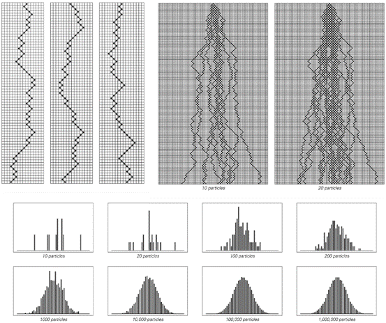
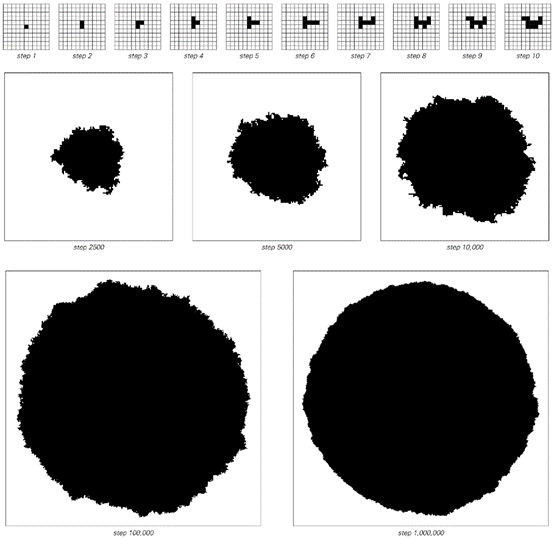
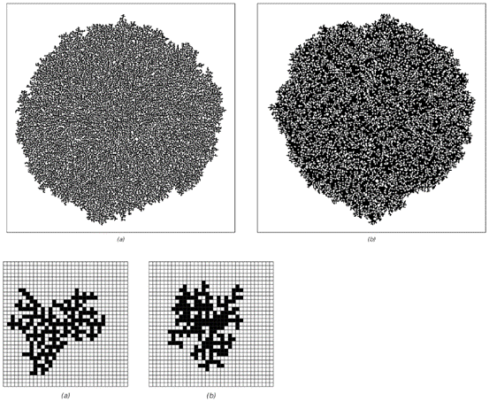
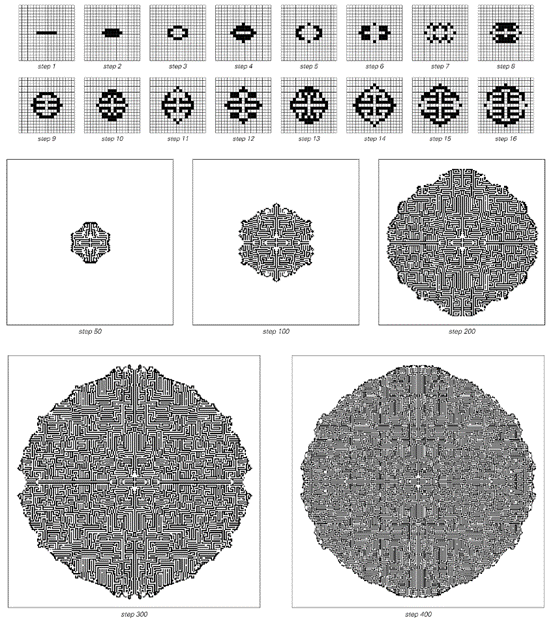
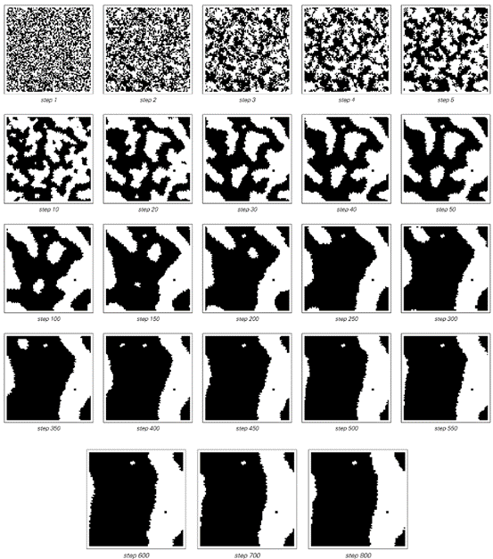

### 7.6  连续性的现象

我们在自然界中遇到的许多系统，其行为在某种程度上似乎都是平滑或连续的。然而，元胞自动机和我们讨论过的其他大多数程序都只涉及离散元素。那么，这样的系统如何能够再现我们在自然界中看到的现象呢？

关键在于，尽管系统中的单个组件可能是离散的，但通过观察大量这些组件所获得的平均行为可能仍然显得平滑和连续。事实上，自然界中确实存在许多这样的系统。

因此，例如，空气和水看起来像是连续的流体，尽管我们知道在微观层面上，它们实际上都是由离散的分子组成的。类似地，沙子流动起来很像连续的流体，尽管我们可以很容易地看到它实际上是由离散的颗粒组成的。那么，是什么基本机制使得具有离散组件的系统能够产生看似平滑和连续的行为呢？

大多数情况下，关键因素是随机性。

如果没有随机性，那么人们看到的整体形态往往会反映出底层组件的离散性。例如，晶体的多面体形状就反映了晶体中离散原子规则的微观排列。

但是，当存在随机性时，这些微观细节往往会被平均化，以至于最终不会留下任何离散性的痕迹，结果看起来就是平滑和连续的。下一页将基于所谓的“随机游走”展示这一现象的经典例子。

每个随机游走是通过取一个离散粒子，然后在每一步随机地将粒子向左或向右移动一个位置来完成的。如果一开始有几个粒子，那么在任何一个特定的时间，每个粒子都将处于一个确定的离散位置。但是，如果人们不关注每个单独粒子的位置，而是关注所有粒子的整体分布，会发生什么呢？

如下一页所示，答案是，如果有足够的粒子，那么人们看到的分布就会呈现出平滑和连续的形式，并且不显示系统底层离散性的任何痕迹；随机性在某种意义上成功地抹去了系统几乎所有的微观细节。

(p 327)

对面页面顶部的图片展示了如果使用几种不同的基本规则来控制每个粒子的运动，会发生什么。人们看到的是，尽管在微观层面上存在差异，但在每种情况下获得的总体分布都具有完全相同的连续形式。

>这些图片展示了遵循随机游走的粒子达到的位置分布。左上角的三张图片分别展示了三个随机游走的例子，其中每个粒子随机地向左或向右移动一个位置。尽管单个粒子是离散的，但这些图片表明，当考虑大量粒子时，获得的总体行为看起来是平滑和连续的。

(p 328)

事实上，在随机游走等特定系统的情况下，两个多世纪前提出的中心极限定理确保，对于非常广泛的底层微观规则，总是会获得相同的连续所谓高斯分布。

这种微观细节的独立性有许多重要的后果。例如，下一页的图片展示了在正方形和六边形网格上进行二维随机游走时会发生什么。

人们可能会认为，这些晶格的不同底层形式会导致整体分布的不同形状。但下一页所展示的一个显著事实是，当考虑足够多的粒子时，最终得到的分布具有纯粹的圆形，不显示底层晶格不同离散结构的任何痕迹。

>这一事实证明了在随机游走的每一步中，对于广泛的底层规则，获得的总体分布始终具有相同的连续形式。在情况（a）中，每个粒子在每一步只向左或向右移动一个位置。在情况（b）中，它可以移动0、1或2个位置，而在情况（c）中，它可以在每一步中移动0到1之间的任何距离。最后，在情况（d）中，粒子在交替的步骤中要么总是向右移动，要么总是向左移动。

(p 329)

>正方形和六边形晶格上随机游走的例子。尽管底层晶格不同，但足够多的粒子的平均值在两种情况下最终都呈现出圆形行为——这是由中心极限定理所暗示的。

(p 330)

除了随机游走之外，还有许多其他基于离散组件的系统，其中微观层面的随机性也会导致大规模的连续行为。下面的图片展示了一个简单聚集模型中发生的情况作为一个例子。

>一个简单聚集模型的行为，其中每一步都在随机选择的与现有黑色细胞簇相邻的位置添加一个新的黑色细胞。该系统是所谓伊登模型的一个版本。获得的形状最终是一个几乎完美的圆。

(p 331)

该模型的思想是通过在每一步中只添加一个新的细胞来构建一个黑色细胞的簇。这个细胞的位置是完全随机选择的，唯一的约束是它应该与簇中的现有细胞相邻。

在早期阶段，以这种方式生长的簇看起来相当不规则。但是经过几千步之后，一个平滑的大致圆形的整体形状开始显现。与随机游走的情况不同，目前还没有已知的方法可以对这一过程进行严格的数学分析。但就像随机游走一样，再次出现的情况是，系统底层规则的细节对观察到的行为的主要特征没有太大影响。

例如，下面的图片展示了聚集模型的推广，其中新细胞仅在具有一定数量现有邻居的位置添加。尽管底层规则发生了这样的变化，但产生的簇的整体形状仍然非常相似。

 

>在推广的聚集模型中产生的图案，其中新细胞仅在以下情况下添加：（a）它只有一个直接邻居（在四个可能的位置中），或（b）它有一个或四个邻居。上面的图片显示了第30,000步，而右下方的图片显示了第200步。尽管底层规则不同，但最终产生的图案的基本整体形状是相同的。

(p 332)

然而，在所有这些例子中，所涉及的随机性都来自同一个基本机制：它是在系统演化的每一步中明确地从外部插入的。

但事实证明，真正重要的是随机性的存在：随机性产生的机制似乎在很大程度上是不相关的。特别是，这意味着前一节中讨论的由内在随机性生成机制产生的随机性能够使具有离散组件的系统以看似连续的方式运行。

下一页的图片展示了一个二维元胞自动机，其中就发生了这种情况。该系统的规则或初始条件中没有随机性。但是，通过内在随机性生成机制，系统的行为表现出相当大的随机性。而这种随机性最终导致了一个总体增长模式，产生了与聚集模型中相同的基本平滑圆形形式。

看到这一点后，人们可能会想，是否任何涉及随机性的系统最终都会产生平滑的总体增长模式。答案肯定是否定的。例如，在第五章讨论二维元胞自动机时，我们看到了许多随机性发生的例子，但产生的总体增长形式具有复杂的结构，没有特别的平滑性或连续性。

粗略地说，只有当小规模随机变化的发生率远大于总体增长率时，才可能产生连续的增长模式。因为从某种意义上说，只有这样，随机性才有足够的时间来抵消底层离散结构的影响。

事实上，除了增长过程之外，其他问题也存在同样的情况。一般来说，只有当存在相对于小规模随机变化率而缓慢演变的特征时，具有离散组件的系统才会出现连续行为。

(p 333)

>在第178页首次展示了一个二维元胞自动机，其规则是：如果围绕一个给定元胞的八个邻居（包括对角线）中，恰好有三个黑色元胞，则下一个步骤中该元胞本身变为黑色。如果元胞有1、2或4个黑色邻居，则它保持与前一步相同的颜色；如果有5个或更多黑色邻居，则下一个步骤中它变为白色。（外总体码746。）这条简单的规则通过内在随机性生成机制产生随机性，而这种随机性进而导致了增长模式，该模式呈现出越来越平滑的圆形或多边形形式。

(p 334)

下一页的图片展示了这种情况的一个例子。这些图片中黑白元胞的详细图案在每个步骤中都会变化。但关键点是，形成的黑白大区域边界移动得相当缓慢。而在总体上，这些边界的行为看起来相当平滑和连续。

然而，仍然真实的是，在小尺度上，边界由离散元胞组成。但如下面的图片所示，这些元胞的详细配置以看似随机的方式迅速变化。就像我们之前讨论过的其他系统一样，所有这些小尺度随机变化的平均结果再次在许多方面看起来平滑和连续。

 

>下一页所示的元胞自动机中单个黑色元胞区域的行为。该区域的边界表现出看似随机的波动。但在总体上，所产生的行为在许多方面看起来相当平滑和连续。该区域有效地表现为具有表面张力，因此它首先演化为大致的圆形，然后逐渐缩小至消失。主要的黑色矩形最初的大小为39×29个元胞。

(p 335)

>从随机初始条件开始的二维元胞自动机的行为。在每个步骤中，每个元胞都会查看由该元胞本身和与其相邻的8个元胞（包括对角线）组成的9元胞邻域中的黑色元胞总数。如果总数小于4，则下一个步骤中该元胞变为白色；如果总数大于6，则变为黑色。如果总数正好是5，则元胞变为白色；如果总数正好是4，则变为黑色。（该规则的总码为976。）图片显示，在大规模上，该规则导致了黑色和白色区域，这些区域的边界行为看起来平滑且连续。请注意，每张图片的宽度都是80个元胞，并且它们实际上是首尾相连的，即最左侧元胞的左邻居是最右侧元胞，依此类推。

(p 336)

