### 7.8  满足约束条件的问题

程序的一个特点是它们立即提供了可以遵循的明确规则，以确定系统的行为方式。但在传统科学中，人们通常试图用仅仅隐含地迫使某些行为发生的约束条件来工作。

在第五章的结尾，我给出了一些约束条件的例子，并展示了确实存在能够迫使相当复杂行为发生的约束条件。但尽管如此，我强烈怀疑，在我们所看到的自然界中所有复杂行为的例子中，几乎没有一个最终能够最好地用约束条件来解释。

造成这种情况的基本原因是，要弄清楚哪种行为模式能满足给定的约束条件，这通常看起来太难了，以至于它不太可能是自然界中常规发生的事情。

许多类型的约束（包括第五章中的约束）具有这样的特性：给定一个特定的模式，检查该模式是否满足约束条件相对容易。但关键的是，这一事实绝不意味着从约束条件出发找到满足它们的模式就一定容易。

这与明确的演化规则所发生的情况截然不同。因为如果一个人知道这样的规则，那么这些规则会立即产生一个程序，来计算出将要发生的行为。然而，如果一个人只知道约束条件，那么这些约束条件本身并不会立即产生任何具体的程序来计算出将要发生的行为。

原则上，可以想象查看每一个可能的模式，然后选择满足约束条件的模式。但是，即使是一个10x10的黑白方格阵列，可能的模式数量也已经达到了1,267,650,600,228,229,401,496,703,205,376。而对于一个20x20的阵列，这个数字比宇宙中粒子的总数还要大。因此，自然界中的系统似乎不可能进行如此彻底的搜索。

(p 342)

然而，人们可能会想，如果这样的系统只是随机尝试模式，那么尽管只有极少数模式能够完全满足给定的约束条件，但合理数量的模式至少可能会接近满足。但通常情况并非如此。例如，下面的图片显示了随机选择的模式中，有多少比例的模式具有给定百分比的方格违反了第211页上描述的约束条件。

对于大多数模式，大约70%的方格违反了约束条件。在10x10的阵列中，找到违反约束条件的方格比例甚至低于50%的模式的几率只有千分之一，而找到比例低于25%的模式的几率则是四万亿分之一。

这意味着，一个基于随机选择模式的过程几乎不可能产生接近满足约束条件的结果。

那么，如何做得更好呢？在自然系统和实际计算中，一个常用的方法是采用某种形式的迭代过程，即从一个随机选择的模式开始，然后逐步修改该模式，以使其更接近满足约束条件。

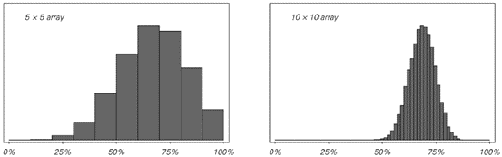

>在所有可能的模式中，有一定比例的方格违反了第211页上讨论的约束条件。只有极少数模式能完全满足约束条件（即0%的方格是错误的）。对于大型阵列，绝大多数可能的模式都有大约70%的方格是错误的。

(p 343)

以具体例子为例，考虑采取一系列步骤，在每个步骤中随机选择上述阵列中的一个方格，然后只要这样做不会增加阵列中违反约束条件的方格总数，就反转该方格的颜色。

下面的图片显示了使用此过程获得的结果。在前几步中，有快速的改进。但随着时间的推移，可以看出改进的速度越来越慢。即使在一百万步之后，结果表明，在10x10的阵列中，平均仍有15%的方格不满足约束条件。

在实际情况中，这种近似结果有时可能是有用的，但对面页面顶部的图片显示，获得的实际模式与我们在第5章中看到的该系统的精确结果相去甚远。

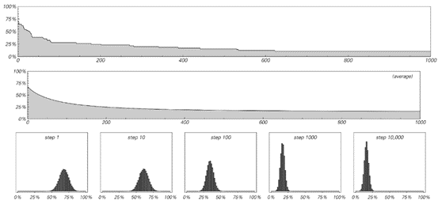

>一个旨在产生逐渐接近满足第211页上描述的约束条件的模式的过程的结果。该过程从一个随机选择的模式开始，然后在每一步中随机选择模式中的一个方格，并在这样做不会增加模式中违反约束条件的方格总数的情况下反转该方格的颜色。上面的图片显示了该过程的一次特定运行。第二张图片显示了从多次运行中获得的平均行为。最后，底部图片显示了随着过程的进行，具有不同比例违反约束条件的方格的模式比例如何变化。在所有情况下，都使用了10x10的模式。

(p 344)

那么，为什么这个过程不能更好地工作呢？问题其实相当普遍。以一个简单的例子来说明，考虑一行黑白方格，以及每个方格应与其右侧相邻方格颜色相同的约束条件。这个约束条件只有在每个方格颜色都相同（黑色或白色）时才会被满足。但是，迭代过程在多大程度上能够成功地找到这个解决方案呢？

作为第一个例子，考虑一个过程，该过程在每一步中随机选择一个方格，然后在这样做可以减少违反约束条件的方格总数的情况下反转其颜色。下一页顶部的图片显示了这种情况下的结果。结果非常糟糕：系统没有稳定地演变为全黑或全白，而是迅速陷入了一个包含不同颜色区域的状态。

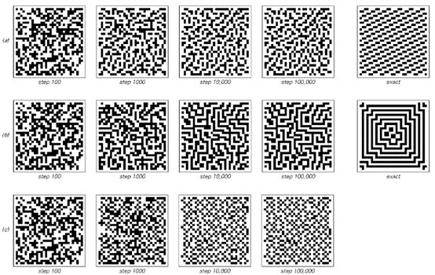

>使用与上一张图片中相同的程序但带有三组不同约束条件生成的模式。情况（a）使用与上一张图片中相同的约束条件，（b）要求每个黑色方格和每个白色方格都必须恰好有两个相邻的黑色方格，（c）要求每个黑色方格必须有3个相邻的黑色方格和1个白色方格，而每个白色方格必须有4个相邻的白色方格。在情况（a）和（b）中，有可能完全满足约束条件；在情况（c）中则不可能。图片展示了30x30阵列的演变过程，其面积几乎是上一张图片中阵列面积的10倍。尽管在100,000步之后，违反约束条件的方格比例不到20%，但整体模式仍然与精确结果相去甚远。

(p 345)

事实证明，这种行为在迭代过程中并不罕见；甚至在尝试找到曲线上的最低点这样简单的情况下也会出现。对于此类问题，最明显的迭代程序是采取一系列小步骤，每个步骤的方向都选择为局部向下。

对于下面展示的第一条曲线，这个程序确实工作得很好，并且迅速找到了最低点。但对于第二条曲线，该程序通常无法工作；它通常会陷入局部最小值之一，而永远无法达到全局最小值。

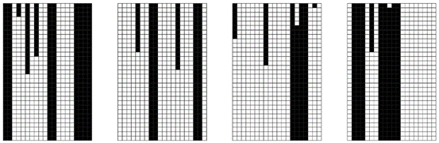

>四次尝试应用迭代程序来找到满足简单约束的配置的结果，该约束是每个方格的颜色都应与其右侧的方格颜色相同。（假设方格是循环排列的，因此最右侧方格的右侧相邻方格是最左侧方格。）该过程从方格的一个随机配置开始，然后在每一步中随机选择一个方格，并在这样做可以减少违反约束条件的方格总数时反转该方格的颜色。最终满足约束条件的唯一配置是全白和全黑。但是，在达到这些配置之前很久，该过程就已经陷入停滞。问题在于，对于任何跨越超过一个方格的块，改变任一末端方格的颜色都不会减少违反约束条件的方格总数。因此，这样的块保持不变，无法消失。

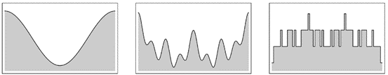

>三个曲线示例。在第一种情况下，最明显的机械或数学过程——即不断下坡——将成功引导人们到达最低点。但在其他两种情况下，这个过程通常会陷入局部最小值。这是使用基于逐步改进的程序来精确找到满足约束条件的模式时遇到的基本现象。上面第三张图片是几乎所有基于约束的离散系统中出现的曲线的表示。

(p 346)

对于仅涉及黑色和白色方格的离散系统，事实证明，出现的曲线几乎不可避免地具有对面页面底部第三张图片中所示的锯齿状形式。因此，这导致了一个后果，即总是试图下坡的简单迭代程序几乎总是会陷入停滞。

如何避免这种情况？一个一般性的策略是增加随机性，以便在本质上不断震动系统，防止其陷入停滞。但是，如何实现这一点的细节往往会对结果产生巨大影响。

对面页面顶部的程序在某种意义上已经涉及到了随机性，因为它在每个步骤中随机选择一个方格。但正如我们所见，使用这种特定的程序，系统仍然可能陷入停滞。

然而，对程序进行轻微修改可以避免这种情况。作为示例，下面的图片展示了如果在每个步骤中，不仅当这会减少违反约束条件的方格总数时反转一个随机方格的颜色，而且当这个数量保持不变时也这样做，会发生什么。在这种情况下，系统永远不会永久停滞，而是最终会演化为满足约束条件的配置。

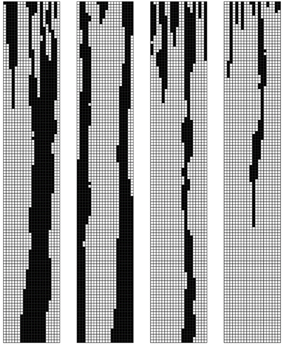

>这是对面页面顶部图片中使用的程序的轻微修改结果。在每个步骤中，仍然会随机选择一个方格。但现在，如果该方格的颜色反转实际上改变了违反约束条件的方格总数，或者这个数量保持不变，都会反转其颜色。使用此程序，从任何初始条件开始的演化都可以访问所有可能的配置，因此至少最终会达到满足约束条件的配置。

(p 347)

但是这个过程可能仍然需要非常长的时间。事实上，在本节前面讨论的二维情况下，所需的步骤数量可能是天文数字般的漫长。

那么可以加速这个过程吗？对特定系统了解得越多，就可以为该系统发明越多的技巧。但通常这些技巧只会导致适度的加速，而且尽管多年来有各种希望，但最终似乎没有哪种技术能在非常广泛的系统范围内发挥良好作用。

因此，这表明即使从某种理想化的角度来看，自然界中的系统可能满足某些约束条件，但在实践中，该系统很可能实际上并没有办法接近实现这一点。

在传统科学中，引入约束的概念通常是为了尝试总结进化规则的影响。通常的想法是，经过足够长的时间后，系统应该只处于在其进化规则应用下保持不变的状态。而且，往往可以证明，以这种方式保持不变的状态必须满足相当简单的约束条件。但问题是，除非整体行为非常简单，否则系统实际上并不会进化到严格保持不变的状态，这一说法往往不成立。

下面两个元胞自动机都有全白和全黑的不变状态。在第一种情况下，从随机初始条件开始，系统迅速稳定到全黑的不变状态。但在第二种情况下，并没有发生类似的情况，相反，系统继续表现出复杂且看似随机的行为，永远如此。

第5章末尾由约束产生的二维模式都对应于各种二维元胞自动机的不变状态。例如，第211页的模式被发现是4,294,967,296种可能的五邻元胞自动机规则中572,522种规则的唯一不变状态。但是，如果从这些规则的随机初始条件开始，通常永远也得不到第211页的模式。相反，正如对面页面顶部的图片所示，人们会看到各种各样的模式，这些模式更多地反映了明确的进化规则，而不是与不变状态相关的约束。

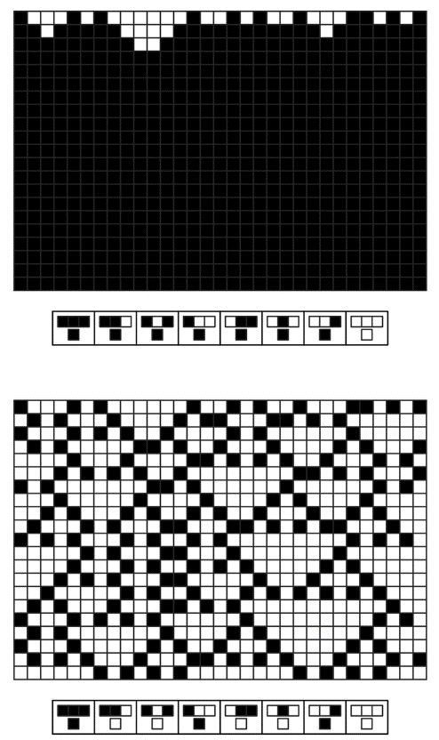

>在28种基本元胞自动机中，有两种自动机的唯一不变状态是颜色均匀的。在第一种情况下，这些不变状态之一总是会被达到；在第二种情况下则不会。

(p 348)

那么物理中的实际系统呢？它们的行为有什么不同吗？以大量圆形硬币被推挤在桌子上的情况为例。可以将这样的系统视为具有一个不变状态，该状态满足硬币应尽可能紧密地堆积在一起的约束。对于相同的硬币，这种约束由右侧所示的简单重复模式满足。事实证明，在这个特定情况下，如果人们实际上在桌子上推挤硬币，这个模式会很快产生。

但在三维空间中放置球体时，情况就大不相同了。在这种情况下，当球体以右侧所示的简单重复方式排列时，就满足了最密堆积的约束。但是，如果仅仅试图将球体推挤在一起，它们几乎总是会卡住，并且永远不会形成所示的排列。即使人们晃动球体，也基本上无法得到这种排列。事实上，唯一可行的方法似乎是小心翼翼地一个接一个地放置球体。

在二维空间中，一旦有了不止一种大小的硬币，就会出现类似的问题。事实上，即使只有两种大小，要想满足最密堆积的约束也已经非常困难，在大多数情况下，仍然不知道这种配置是什么样的。

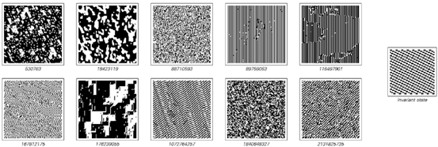

>二维元胞自动机的典型行为是只保留右侧图案的不变状态。所示的结果是从随机初始条件开始的500步进化的结果。在任何情况下，观察到的全局行为都远远不能满足确定不变状态的简单约束。

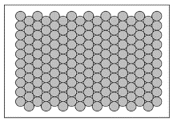

>平面上相同圆的最密堆积。每个圆都被其他六个圆包围。

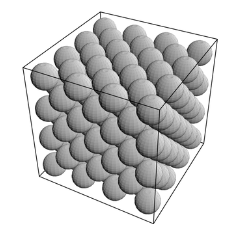

>三维空间中相同球体的最密堆积。每个球体都被其他12个球体包围。

(p 349)

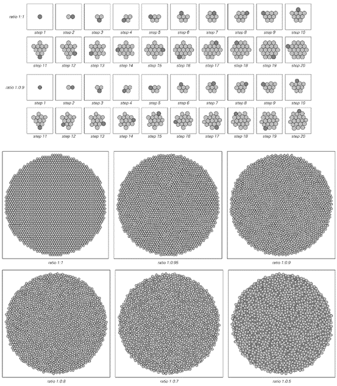

>通过连续放置圆来获得的图案，使得每个新圆的中心都尽可能接近第一个圆的中心。除了第一个图案之外，这些图案在多大程度上代表了最密堆积并不清楚，而且，在大多数这样的实际堆积中，不同大小的圆很可能只是被分隔成几个均匀的区域。

(p 350)

对面页面的图片展示了如果从一个圆开始，然后连续添加新圆，使得每个新圆的中心都尽可能接近第一个圆的中心，会发生什么。当所有圆的大小都相同时，这个过程会产生一个简单的重复图案。但是，一旦圆的大小存在显著差异，对面页面的图片就显示，这个过程往往会产生更复杂的图案——这些图案最终可能与最密堆积的约束有关，也可能无关。

人们可以观察各种各样的其他物理系统，但据我目前所知，情况总是大同小异：每当出现复杂的行为时，其最合理的解释往往是某种明确的进化过程，而不是隐含的约束满足。

然而，人们可能仍然会假设，在生物系统中情况可能不同，并且自然选择的过程可能会以某种方式产生成功由约束满足决定的形态。

但正如我在下一章中讨论的那样，我坚信，最终，就像在物理系统中一样，通过这种方式只能得到相当简单的形态，而当看到更复杂的形态时，它们往往又与约束无关，而是与明确的进化规则的影响有关——主要是那些控制个体生物生长的规则。

