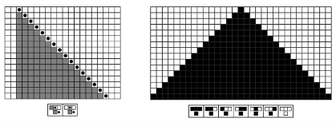
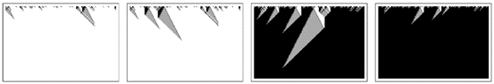
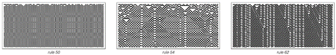
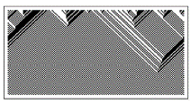
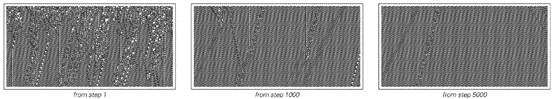
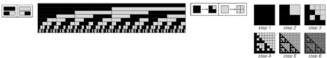
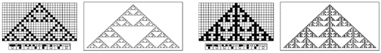
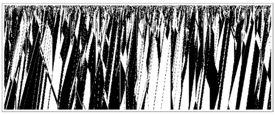
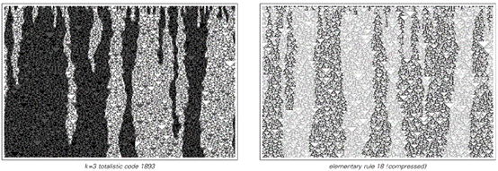

### 7.9  简单行为的起源

自然界中存在许多表现出高度复杂行为的系统。但也有很多系统表现出相对简单的行为——最常见的是完全的一致性、重复性或嵌套性。

而我们在本书中发现，程序也大致相同：一些程序表现出高度复杂的行为，而另一些则只表现出相对简单的行为。

传统的直觉可能会让人认为，观察到的行为的复杂性与底层规则的复杂性之间必须存在直接对应关系。但本书的一个核心发现是，事实上并非如此。

(p 351)

因为即使是一些规则非常简单的程序也能产生高度复杂的行为，而规则相当复杂的程序往往只产生相对简单的行为。事实上，正如我们在本书中多次看到的，以及下面的图片所展示的，即使是非常相似的规则也能产生截然不同的行为。

如果只是看一个规则的原始形式，那么通常几乎无法判断它将产生怎样的总体行为。但在行为最终表现为简单的情况下，人们往往能在其中识别出似乎在起作用的特定机制。

如果一个系统的行为是简单的，那么这不可避免地意味着它将有许多规律性。而通常，我们无法明确地说出这些规律性中哪些应被视为所见事物的原因，哪些应被视为结果。

但是，识别简单的机制仍然很有用，因为它们至少可以作为系统行为的描述。

在许多方面，任何系统中可能存在的最简单行为类型是纯粹的一致性。时间上的一致性尤为直接，因为它仅仅对应于系统演化过程中没有发生变化。但空间上的一致性则稍微复杂一些，实际上，其中可能涉及几种不同的机制。下面第一组图片展示了一个相对直接的机制，即某个过程可以从空间中的一个点开始，然后逐渐传播，在每个到达的点都做同样的事情。

>一系列基本元胞自动机，它们的规则只在一个位置上有所不同（格雷码序列）。尽管这些规则的相似性很高，但这些元胞自动机的总体行为却大相径庭。

(p 352)

另一种机制是系统的每一部分都可以完全独立地演化到相同的状态，如下面第二组图片所示。

下面第三组图片展示了一个稍微不那么直接的机制。在这里，系统中的不同元素确实会相互作用，但结果仍然是它们都演化到了相同的状态。

到目前为止，我所提到的所有一致性机制都涉及在某种意义上每个层次上都简单的行为。但在自然界中，一致性似乎常常与相当复杂的微观行为相关联。最常见的情况是，在小尺度上，系统表现出随机性，但在大尺度上，这种随机性平均化后留下了明显的一致性，如下面第四组图片所示。

>从单一点开始的均匀生长是产生空间一致性的一个直接方法，这里通过一个移动自动机和一个元胞自动机进行说明。

>如果系统中的每个元素都独立地演化到相同的状态，那么实现空间上的一致性就几乎是不费吹灰之力的。

>第6章中讨论了演化到均匀状态的1类元胞自动机。

>小尺度随机性的平均化会产生明显的一致性，如下面规则30模式所示。

(p 353)

一致行为通常与系统的初始条件或其他输入相当独立。但有时，不同的输入会产生不同的一致行为。

这种情况可能发生的一种方式（如下面第一组图片所示）是系统保持某些量（如黑色总密度）不变，并且这些量在其演化过程中最终会均匀地分布在整个系统中。

另一种情况是，系统可能总是演化到某些特定的均匀相，但选择哪个相可能取决于某些量的总值，如下面第二组图片所示。

约束是统一性的另一个基础。以一个简单的例子来说，在一行黑色或白色单元格中，每个单元格都应该与其两个相邻单元格颜色相同的约束，直接意味着整行必须是完全黑色或完全白色。

除了一致性之外，重复可以被认为是下一种最简单的行为形式。时间上的重复仅仅对应于系统反复回到特定状态。

例如，如果系统的行为实际上遵循某些闭合曲线（如总是回到同一点的圆），那么就会发生这种情况。而且，一般来说，在任何具有明确规则且只访问有限数量状态的系统中，正如第255页所讨论的和下面第一组图片所示，系统的行为最终将不可避免地重复。

>在每个步骤中，每个单元格的灰度级是其前一个单元格和两个相邻单元格灰度级的平均值，因此黑色总量保持不变，但最终会均匀地分布在整个系统中。

>在不同的初始条件下，第339页中提到的这个元胞自动机可以演化成完全白色或完全黑色。这种离散转变在一维空间中比其他地方要少见一些。

(p 354)

在某些情况下，系统的基本结构可能只允许有限数量的可能状态。但在其他情况下，实际发生的是系统的实际演化从未超过有限数量的状态。

通常，仅仅通过观察基本规则就很难预测是否会出现这种情况。但在像元胞自动机这样的系统中，出现这种情况的典型原因只是最终效应从未超出有限区域，如下面第一组图片所示的例子。

在时间上的重复之后，每当系统中有规律地重复移动的元素时，空间上的重复就会随之而来。下面的图片展示了这种情况的两个例子，第二张图片展示了传统物理学中常见的波的概念。

从一个简单的种子开始生长也可以很容易地导致在空间和时间上的重复，如下面第二组图片所示。

>每当系统实际上遵循闭合曲线（无论是在空间上还是在它所访问的状态上）时，系统的行为就会在时间上重复。

>移动自动机和元胞自动机中行为保持局限在有限区域内并因此最终总是重复的例子。

>时间上的重复直接导致空间上重复的例子。第二张图片显示了标准的波动。

>元胞自动机通过从一个简单的种子开始演化，在空间和时间上生成重复模式。

(p 355)

那么随机初始条件呢？时间上的重复仍然很容易实现——比如说，系统中不同的部分独立地表现。但空间上的重复就比较难实现了。因为即使形成了局部重复的领域，它们也需要某种机制来合并。

而且，不同领域之间的界限通常最终不够活跃，无法使这种情况发生，如下面第一组例子所示。

但确实存在一些情况——在一维空间中，特别是下面第一组图片中——其中不同的领域会合并，从而实现精确的重复。有时这种情况发生得很快，如左图所示。

但在其他情况下，它只发生得相当慢。例如规则110，其中在空间上以14为周期、在时间上以7为周期形成重复领域，但如下面第二张图片所示，分隔这些领域的局部结构需要很长时间才会消失。

正如我们在第5章末尾所看到的，许多基于约束的系统在理论上也会产生重复——但从上一节的讨论来看，这似乎很少能很好地解释我们在自然界中看到的实际重复。

>在元胞自动机中，会形成重复行为的领域，但这些领域之间的界限通常会永远存在。

>一种元胞自动机（规则184），其中的领域会迅速合并，使整个系统在空间上重复。

>从随机初始条件开始的规则110的行为。会形成重复行为的领域，在大多数情况下，随着分隔它们的局部结构的消失，这些领域会逐渐合并。

(p 356)

除了统一性和重复性之外，我们在本书中经常遇到的另一种简单行为是嵌套。与统一性和重复性一样，嵌套似乎也有几种截然不同的产生方式。

嵌套可以通过根据某个固定规则分解成越来越小的元素来定义。如下面第一组图片所示，在替代系统中，嵌套模式非常直接地由每个元素依次明确分解成越来越小的元素块而产生。

一个本质上等价的过程涉及每个元素分支成越来越小的元素，并最终形成树状结构，如下面第二组图片所示。

那么，是什么使自然中的系统以这种方式运行呢？部分原因是无论物理尺度如何，都必须应用相同的基本规则。但仅凭这一点，它就与各种均匀或螺旋增长非常一致，并不意味着会出现我们通常所说的嵌套。事实上，要得到嵌套，似乎还需要某种离散的分裂或分支过程，其中几个不同的元素从一个单独的元素中产生。

>在一维和二维非邻接替代系统中，每个元素在每个步骤中都分解成一个小元素块，从而产生嵌套。

>由简单分支过程产生的嵌套模式。（与第406页比较。）

(p 357)

与许多数学系统中相关的嵌套现象的另一个略有相关的来源是连续数字的数位序列形成的嵌套模式，如第117页所示。

但一般来说，嵌套不仅仅是由较大的元素分解成较小的元素而产生的：正如我们在本书中发现的那样，当较大的元素由较小的元素构建而成时，也会产生嵌套——而且我怀疑这在自然界中更为常见。

作为例子，下面第一组图片展示了如何从单个黑色单元格开始，然后遵循简单的加法元胞自动机规则，构建出具有越来越大特征的嵌套模式。

事实证明，同样的模式也可以通过另一种过程产生——如下面第二组图片所示——在这个过程中，新的分支以固定的间隔形成，并在任何一对分支碰撞时消失。

那么随机初始条件呢？嵌套也会从这些条件中产生吗？事实证明，它可以。基本机制通常是某种逐步消除最初随机分布的元素的过程。

>从单个黑色单元格开始，通过规则90和规则150加法元胞自动机的演化构建的嵌套模式。

>通过每隔一段时间形成两个或三个分支，并在任何一对分支碰撞时消失的过程获得的嵌套模式。

(p 358)

下面第一组图片展示了一个基于规则184元胞自动机的例子。从随机初始条件开始，该规则产生一系列条纹，这些条纹在相遇时会消失，从而形成一系列逐渐增大的嵌套区域。

如图所示，这些区域形成了一种模式，这种模式对应于一棵从最小分支构建起来的随机树，与河流从支流汇聚而成的方式非常相似。

当初始条件中黑色和白色单元格的数量完全相等时，规则184中的嵌套现象最容易观察到，这样左右条纹的数量就完全平衡，所有条纹最终都会消失。但即使初始条件使得一些条纹存活下来，那些消失的条纹仍然会形成嵌套区域。实际上，在任何系统中，只要存在相对独立生长并最终逐渐合并的域，都会观察到相同的基本整体嵌套结构。

作为例子，下面第二张图片展示了从随机初始条件开始演化的规则110元胞自动机。该图片仅采样了每个14x7单元格块中的第一个单元格，使得每个重复行为域都突出显示为统一颜色。

>从随机初始条件开始，通过规则184生成嵌套模式。该模式由一系列条纹组成，这些条纹在第二张图片中被高亮显示，并形成了第三张图片中所示的树状结构。所使用的初始条件中黑色和白色单元格的数量完全相等，导致所有条纹最终都消失了。

>从随机初始条件开始，规则110演化的高度压缩表示，其中仅采样了每个14x7单元格块中的第一个单元格。

(p 359)

在这些分隔重复行为域的局部结构的详细行为中，存在着各种各样的复杂性。但图片所表明的是，在某种粗略的总体层面上，这些结构逐渐倾向于相互湮灭，并在此过程中形成近似的嵌套模式。

事实证明，这一基本过程并不局限于产生简单均匀或重复域的系统。下面的图片展示了例如每个域内部行为相当随机的情况。

这些域的边界不再遵循简单的直线，而是执行看似随机的游走。但每当它们相遇时就会湮灭，这一事实再次倾向于导致整体的嵌套行为模式。

那么基于约束的系统呢？它们也能导致嵌套吗？在第五章中，我展示了它们可以。但我发现的是，虽然至少在原则上，约束可以相当容易地强制产生均匀性和重复性，但嵌套通常不能。

一开始，人们可能认为每种简单行为都只有一种确定的机制。但我们在本节中所看到的是，事实上通常有几种看似截然不同的机制是可能的。

>包含明显随机性的域的例子。在第二张图片中，每个显示的元素代表一个2x2的原始单元格块。在这两种情况下，域之间的边界似乎都遵循随机游走，在相遇时湮灭，从而形成整体的嵌套模式。

(p 360)

通常，人们可以在任何特定行为的各种机制之间找到共同特征。但通常，这些最终只是产生某种特定行为这一事实的必然结果。

因此，例如，人们可能会注意到，大多数嵌套机制在某种程度上都可以被视为涉及层次结构，其中较高级别的组件影响较低级别的组件，而不是相反。但从某种意义上说，这一观察只是嵌套本身属性的一种重述。

因此，最终人们确实可以将我在本节中讨论的大多数机制视为在某种意义上是真正不同的。然而，正如我们所见，所有这些机制都可以用非常简单的程序来捕捉。在第12章中，我将讨论这与最终似乎只出现少数几种根本不同类型的整体行为这一事实之间的关系。

(p 361)

 