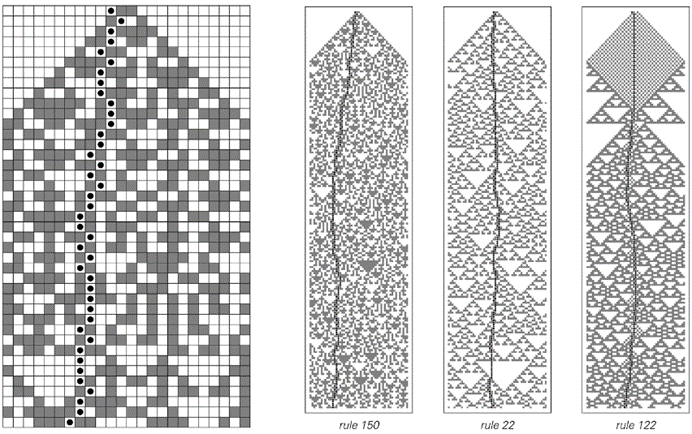

### 8.3  材料的断裂

在日常生活中，产生随机性的一种最熟悉的方式是打破固体物体。因为尽管不同材料的细节各不相同，但几乎普遍的情况是，实际发生断裂的线或表面看起来粗糙，并且在许多方面都是随机的。

那么，这种随机性的起源是什么呢？起初，人们可能会认为它必须是材料内部小规模随机不规则性的反映。事实上，在由许多单独的晶体或晶粒组成的材料中，断裂往往倾向于沿着这些元素之间的边界发生。

但是，如果取一个完美的单晶——比如一个标准的高纯度工业硅晶体——并打破它，会发生什么呢？答案是，除了在少数特殊情况下，得到的断裂模式看起来与其他材料一样随机。

这表明，无论导致这种随机性的基本机制是什么，它都不能依赖于特定材料的细节。事实上，几乎无法区分的断裂模式既出现在微观尺度上，也出现在地质系统中，尺度达到数公里，这是另一个线索，表明必须有一个更一般的机制在起作用。

那么这个机制可能是什么呢？

当固体材料破裂时，通常会发生的情况是形成裂纹——通常是在材料的边缘——然后扩展。从手持物品到工程结构和地震等系统的经验表明，裂纹的形成可能需要一段时间，但一旦形成，裂纹往往会迅速而猛烈地移动，通常在这个过程中会产生大量的噪音。

人们可以将固体的组成部分——无论是原子、分子还是岩石碎片——视为由类似弹簧的力结合在一起。当裂纹在固体中传播时，这实际上会在这些“弹簧”中建立起复杂的振动模式。然后，裂纹的路径又由“弹簧”被拉伸到断裂的位置所决定。

(p 374)

有许多因素会影响固体中位移和振动的细节。但作为一个粗略的近似，人们可能会假设固体的每个元素要么发生位移，要么不发生位移，而相邻元素的位移则通过某些确定的规则（比如一个简单的元胞自动机规则）相互作用。

下面的图片展示了这种简单模型的行为。尽管模型中没有以任何方式插入明确的随机性，但出现的裂纹路径看起来仍然相当随机。

当然，这个模型甚至无法捕捉到真实材料的许多方面。但我仍然怀疑，即使使用针对特定材料的更现实模型，导致随机性的基本机制仍然与这里展示的极其简单的模型非常相似。

一个非常简单的用于模拟断裂的元胞自动机模型。在每一步中，每个单元格的颜色（大致代表固体元素的位移）都会根据元胞自动机规则进行更新。代表裂纹位置的黑点会根据相邻单元格的位移从一个单元格移动到另一个单元格，并在每一步中将到达的单元格设置为白色。尽管没有从外部插入随机性，但该模型产生的裂纹路径在很大程度上看起来仍然是随机的。物理实验的一些证据表明，裂纹周围的位错可以形成看起来与上面灰色和白色背景相似的图案。

(p 375)

