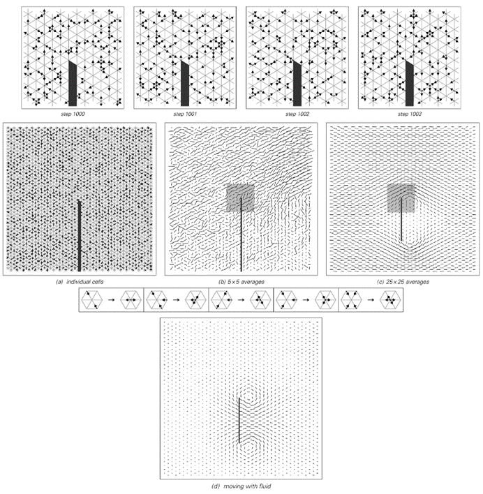
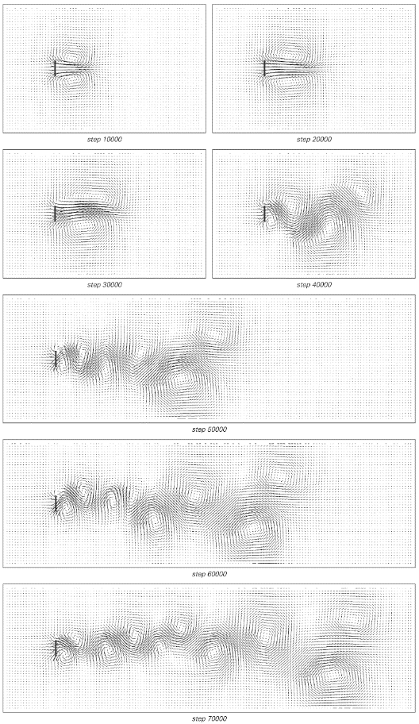
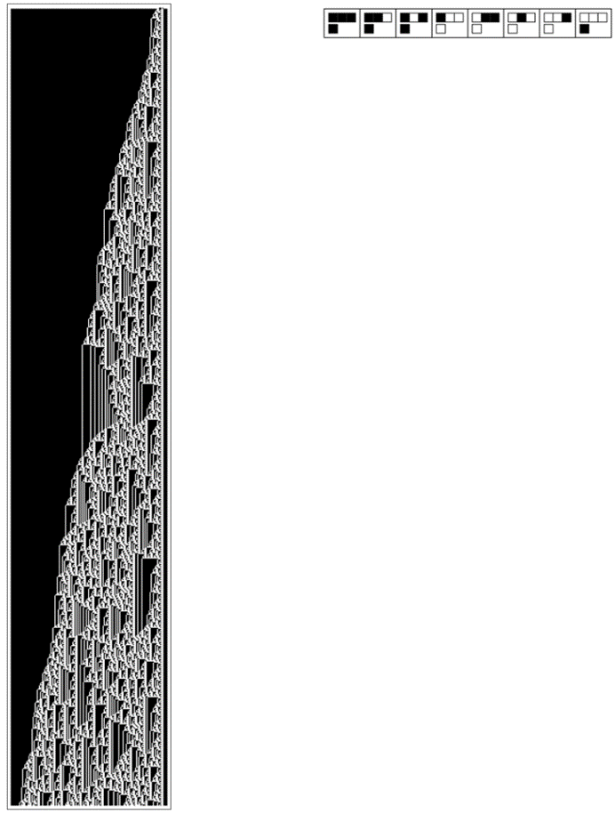

### 8.4  流体流动

自然界中许多引人注目的现象都涉及到流体（如空气和水）的流动，正如对面页面所示。典型的现象是水流绕过固体物体时所看到的。在足够慢的速度下，水实际上只是平滑地绕过，形成非常简单的层流模式。但在更高的速度下，物体后面开始出现一个缓慢移动的水域，当水旋入这个区域时，会形成一对漩涡。

随着速度的增加，这些漩涡逐渐拉长。然后，当达到一个临界速度时，漩涡实际上开始断裂，并被带到下游。但每次一个漩涡断裂时，另一个漩涡又开始形成，因此最终在物体后面的尾流中可以看到一整条漩涡街道。

起初，这些漩涡以非常规则的方式排列。但随着流速的增加，开始出现故障，最初是在物体后面很远的地方，但最终遍布整个尾流。即使在最高速度下，也仍然保持着某种整体规律性。但在此基础上，叠加着各种复杂且看似随机的行为。

但这只是流体湍流这一非常普遍现象的一个例子。正如对面页面上的图片所示——以及一般经验所表明的——几乎任何时候，当流体被快速流动时，它往往会形成在许多方面看似随机的复杂图案。

那么，这从根本上为什么会发生呢？

以数学方程为基础的传统科学一直未能提供任何令人信服的潜在解释。但是，从我发现即使是非常简单的程序也能在某种程度上产生复杂且看似随机的行为这一发现来看，流体湍流现象立刻变得不那么令人惊讶了。

但是，简单的程序真的能再现我们在流体中看到的特定行为吗？在微观层面上，物理流体由大量相互移动和碰撞的分子组成。因此，作为一种简单的理想化方法，人们可以考虑让大量粒子在固定的离散网格上移动，并根据类似元胞自动机的简单规则进行碰撞。

(p 376)

>以下是各种流体流动中产生的典型模式示例。请注意，看似随机的湍流频繁出现。

(p 377)

下面的图片给出了这样一个系统的示例。在图片的第一行以及图片（a）中，人们看到的只是一群离散粒子在四处弹跳。但是，如果人们放大视野，并观察越来越大的粒子块的平均运动——就像图片（b）和（c）中那样——那么开始出现的是看似平滑且连续的行为——就像人们在流体中所期望看到的那样。

>一个简单的元胞自动机系统被设置来模拟流体中分子的微观行为。在每一步中，粒子的配置都会根据上面显示的简单碰撞规则进行更新。每当粒子击中板时，它们都会被反射。在左侧远处以规则的方式插入一股稳定的粒子流，其平均速度为最大可能速度的3/10。图片（a）显示了单个粒子的配置；图片（b）和（c）显示了连续更大粒子块的总速度。图片（d）是通过转换到一个参考框架获得的，在该框架中，流体平均处于静止状态。

(p 378)

这种情况发生的原因与在真实流体中或我们在第7章中看到的各种示例中的原因完全相同：即使在基础层面上，系统由离散粒子组成，但这些粒子详细微观运动的有效随机性使得它们的大规模平均行为看起来平滑且连续。

我们从物理实验中知道，空气、水和其他所有普通流体的流动特性几乎完全相同。然而，在基础层面上，这些不同的流体由非常不同种类的分子组成，具有非常不同的特性。但不知何故，如果人们观察大规模类似流体的行为，这种微观结构的细节就会被抹去。

在本书中，我们多次看到不同系统可以产生几乎完全相同的总体行为的示例，尽管它们基础规则的细节差异很大。但是，在像流体这样的特定系统中，事实证明，只要某些物理量（如粒子数和动量）得到守恒，那么只要存在足够的微观随机性，就几乎不可避免地会得到相同的总体流体行为，这将在下一章中进行讨论。

因此，这意味着为了再现物理流体的观测特性，人们不需要构建一个涉及真实分子的模型：甚至对面页面上的高度理想化粒子也应该产生基本上相同的总体流体行为。

实际上，在图片（c）和（d）中，人们已经可以看到一对漩涡的形成，就像第377页上的一张图片一样。

如果增加流体的流速会发生什么？人们会看到与第377页上相同的现象吗？下一页的图片表明，人们确实会看到。在达到某个临界速度以下时，会形成完全规则的涡流阵列。但在下一页图片所使用的速度下，涡流阵列已经开始出现随机的不规则性，就像真实流体中的湍流一样。

那么，这种随机性从何而来呢？

在过去的几十年里，人们普遍认为湍流流体中的随机性必然与对初始条件的敏感依赖性有关，以及与我们在第4章中讨论的混沌现象有关。

(p 379)

>上一页所示的元胞自动机系统的一个更大示例。在每张图片中，总共有3000万个基础单元。绘制的单个速度向量对应于20x20个单元块的平均值。粒子以规则的方式在左端插入，以保持整体流速约等于最大可能流速的0.4。为了使流动模式更易于观察，所显示的速度进行了转换，以便流体平均处于静止状态，而板在移动。粒子的基础密度大约是每单元一个，或最大可能密度的1/6——这种密度或多或少地将流体的粘度降至最低。所示流动的雷诺数大约为100。这与实际流体流动的实验结果惊人地一致。

(p 380)

然而，尽管确实存在展示这种现象的数学方程，但通常研究的那些方程与流体流动的现实描述之间并没有密切联系。

而在对面页面的模型中，事实证明，在整体流体行为层面，基本上不存在对初始条件的敏感依赖性。如果观察单个粒子，那么改变任何一个粒子的位置通常都会产生迅速传播的效果。但如果观察许多粒子的平均行为，则此类效果会完全消失。事实上，就大规模流体行为而言，在几乎所有情况下，不同详细初始条件下发生的情况似乎都没有明显差异。

那么，是否存在对初始条件的敏感依赖性呢？

可以推测，确实存在某种微妙平衡的情况——比如第一个涡流是在物体的顶部还是底部脱落——在这种情况下，初始条件的小变化可能会产生重大影响。但这种情况似乎是例外而非常态。在绝大多数情况下，小变化似乎会迅速减弱——正如人们从流体粘度的日常经验中可能期望的那样。

因此，这意味着我们在流体流动中观察到的随机性不能简单地反映为通过初始条件的细节插入的随机性。事实证明，在对面页面的图片中，初始条件被特意设置得非常简单。然而，尽管如此，在观察到的整体行为中仍然存在明显的随机性。

因此，再一次地，就像我们在本书中研究过的许多其他系统一样，我们别无选择，只能得出结论：在湍流流体中，我们看到的大多数随机性并不是以任何方式从外部插入的，而是系统内部固有的。在第378页的图片中，在单个粒子层面已经存在明显的随机性。但是，由于此类粒子配置的变化似乎对整体流动模式没有可察觉的影响，因此人们不能现实地将湍流流体中看到的大规模随机性归因于单个粒子层面的随机性。

(p 381)

相反，似乎正在发生的是，固有的随机性生成直接发生在大规模流体运动的层面。作为建模这种简单方法的一个例子，可以考虑在流体中的离散位置出现一系列离散涡流，并通过简单的元胞自动机规则进行相互作用。

下面的图片展示了可能发生的事情的一个例子。虽然许多细节与在真实流体中看到的不同，但整体上的规律性和随机性的混合却惊人地相似。

流体中存在固有随机性生成且发生在大规模流体运动层面的观点的一个后果是，通过足够仔细的准备，应该能够产生看似随机但实际上可重复流动的图案——这样，在实验的每次连续运行中，它们看起来都基本相同。

即使人们观察现有的流体流动实验，也会发现相当多的实例——特别是例如涉及少数涡旋之间的相互作用——其中存在看似复杂但实际上基本上可重复的流体流动模式。虽然这些模式还没有复杂到可以合理地称为随机的程度，但我怀疑随着时间的推移，会发现类似但复杂得多的例子。

在第377页的流体流动模式中，每一种都有其独特的细节和特征。然而，虽然其中一些较简单的模式已经被基于传统数学方程的方法相当完整地捕获，但更复杂的模式则没有。事实上，从本书的角度来看，这并不奇怪。

但是，现在根据本书发现的经验和直觉，我预计实际上会找到令人惊讶的简单程序，这些程序将能够成功地再现即使是最复杂且看似随机的流体流动形式的主要特征。

>一个元胞自动机（规则225），其行为让人联想到湍流流体流动。

(p 382)

