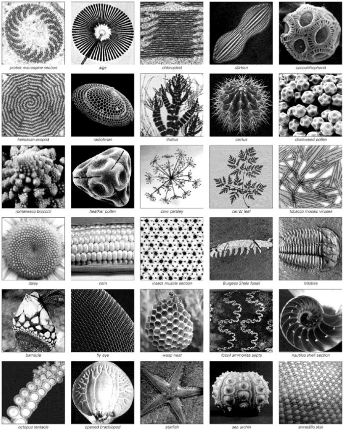
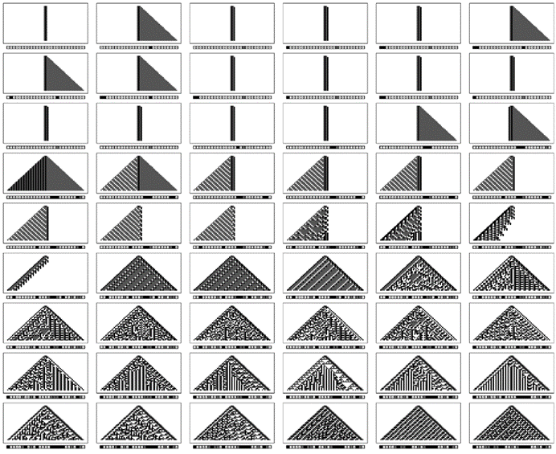
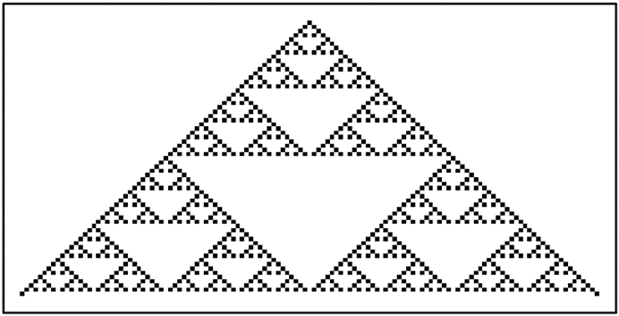

### 8.5  生物学中的基本问题

生物系统经常被引为自然界中复杂性的最高典范，而且人们常常假设它们的复杂性在某种程度上比其他系统更高。

通常认为，这一定是生物系统中独特的适应和自然选择过程的结果。但尽管多年来有各种讨论，但为什么这些过程最终会导致如此高的复杂性，却从未有过明确的理解。

而事实上，我现在认为，生物系统中许多最明显的复杂性例子实际上与适应或自然选择关系不大。相反，我怀疑它们主要是我在本书中通过简单程序发现的非常基本现象的另一后果：即在几乎所有类型的系统中，许多基础规则的选择都不可避免地导致极其复杂的行为。

从程序的角度思考的一般想法，如果说有什么的话，那么对于生物系统来说，它甚至比物理系统更加明显。因为在物理系统中，程序的规则通常必须根据物理定律间接推导出来。但在生物体中，有遗传物质，它可以被直接视为为生物体发展提供程序的物质。

然而，我在本书中讨论的大多数程序都非常简单。但今天所知的每个生物体的遗传程序都是漫长且复杂的：例如，在人类中，它可能涉及数百万条单独的规则——这使得它在许多方面与像Mathematica这样的大型实用软件系统一样复杂。

因此，从这一点出发，人们可能会认为我们在生物体中看到的复杂性只是其基础规则复杂性的反映——这使得关于简单程序的发现并不真正相关。当然，一个典型的完整生物体中许多不同类型的器官和其他元素的存在，似乎很可能与基础程序中许多单独的规则集的存在有关。但如果我们不看完整的生物体，而是只看生物体的一部分呢？

(p 383)

特别是在微观尺度上，人们看到的形式往往非常规则且相当简单，就像对面页面上的图片一样。当看到这些时，完全有理由假设它们实际上是由相当简单的程序产生的。

但是，生物系统中看到的更复杂的形态呢？基于传统的直觉，人们可能会认为这样的形态永远不可能由简单的程序产生。但从本书中的发现中，我们现在知道，事实上，即使是非常简单的程序也能产生惊人的复杂性。

那么，这真的是生物系统中发生的事情吗？

复杂生物形态和对面页面上形态的基本细胞类型或其他元素之间确实没有显著差异。由此，人们可能开始怀疑，最终生成所有这些形态的程序类型是相当相似的——而且所有程序都可能是相当简单的。

即使一个生物体的完整遗传程序既长又复杂，但控制生物体各个方面的子程序仍然可以是简单的——现在已经有很多具体的简单例子证明了这一点。但人们仍然可能会认为，要获得显著的复杂性需要更多的东西。事实上，最初人们可能会认为，仅仅通过观察生物体的部分，是永远不可能对复杂性说太多的。

但事实证明，生物复杂性最明显的例子中，有很大一部分似乎只涉及生物体令人惊讶的有限部分。例如，复杂的色素沉着模式通常只存在于外层皮肤上，并且只由几种类型的细胞组成。而且，绝大多数复杂的形态结构都是通过非常有限数量的细胞类型或其他元素的排列来形成其形状的。

(p 384)

>生物系统中出现的高度规则形式的例子。这些形式中的大多数都足够简单，以至于它们实际上可能由简单的程序生成，这似乎是显而易见的。大多数形式都呈现出简单的几何形状或相同元素的重复。然而，也有一些呈现出各种类型的嵌套。请注意，一个形式的复杂程度与其在地质时间上首次出现的时间之间似乎没有明显的相关性。

(p 385)

但是，这些和其他生物特征的程序实际上是如何确定的呢？在过去的一个世纪左右的时间里，人们几乎普遍相信，在某种程度上，这些程序最终必须成为使生物体适应度最大化、产生的可存活后代数量最多的程序。

这一观点是，如果具有特定程序的生物体通常会产生更多的后代，那么在几代之后，具有这种程序的生物体数量将不可避免地远远多于具有其他程序的生物体。如果假设每个新后代的程序都涉及小规模的随机突变，那么这意味着在许多代的过程中，生物进化实际上将进行随机搜索，以找到使生物体适应度最大化的程序。

但是，我们可以期待这样的搜索有多成功呢？

最大化适应度的问题本质上与我们在第7章末尾讨论的满足约束条件的问题相同。我们在那里发现的是，对于足够简单的约束条件——特别是连续的约束条件——迭代随机搜索可以相当快地收敛到最优解。但是，一旦约束条件变得更加复杂，情况就不再是这样了。事实上，即使最优解相对简单，也需要天文数字般的步骤数才能接近它。

生物系统似乎确实有一些加速搜索过程的技巧。例如，有性繁殖允许相似程序的大规模混合，而不是仅仅是小规模的突变。而且，分化成器官实际上允许程序的不同部分分别更新。但是，即使有了这一系列技巧，从地球生命开始以来的大约一万亿代生物体也仍然不足以找到任何具有显著复杂性的约束条件的最优解，这完全是不合逻辑的。

事实上，人们怀疑，生物体的大部分特征实际上并不对应于接近最优解的东西：相反，它们代表的是相当容易找到的解决方案，但足以不会对生物体造成致命问题。

(p 386)

生物体倾向于进化以实现最大适应度的基本观念，在过去确实为理解物种历史进程提供了非常有用的总体框架，并为特定物种的各种相对简单的特性提供了具体解释。

然而，在当今对生物学的思考中，这一观念往往被推向极端，尤其是在那些不日常接触生物系统详细数据的人群中，人们开始假设生物体的每一个特征在本质上都可以基于其某种程度上最大化生物体适应度的基础上进行解释。

当然，人们认识到当前生物体的某些方面实际上是生物进化早期阶段的遗留物。同时，人们也越来越意识到，生物体内个体生长和发育的实际过程可以使某些类型的结构更容易或更难出现。

但除此之外，还存在一个令人惊讶的普遍信念，即人们在任何生物体中所看到的任何显著特性都必然存在，因为它在本质上服务于最大化生物体适应度的目的。

通常，这一目的最初可能相当不明确，但至少在相对简单的情况下，通常可以构建出某种假设。一旦确定了假定的目的，生物学在找到实现该目的的解决方案方面所表现出的巧妙之处往往令人惊叹。

例如，植物茎干上的黄金比例螺旋状分枝可以被视为一种奇妙的方式，以最大限度地减少叶子的遮挡，而某些软体动物壳上的复杂图案则可以被视为一种奇妙的方式，以迷惑假想捕食者的视觉系统。

但我强烈怀疑，这些目的实际上与这些特定特征存在的真正原因关系不大。相反，正如我将在接下来的几节中讨论的那样[6, 7]，我相信这些特征实际上在本质上只是因为它们很容易通过相对简单的程序产生。事实上，当人们观察生物体越来越复杂的特征时——特别是纹理和色素沉着模式——人们越来越难以找到任何可信的目的来解释所看到的细节。

(p 387)

在过去，为了某些复杂目的而优化的想法似乎是解释许多生物系统中复杂程度的唯一可想象的解释。但是，随着本书中的发现，即仅需要一个简单的程序就能产生非常复杂的行为，一种截然不同且最终更具预测性的解释立即成为可能。

在生物进化的过程中，随机突变实际上会导致一系列程序被尝试。关键是我们从本书中的发现得知，现在我们知道，这些程序中相当一部分会产生复杂行为，这几乎是不可避免的。

一些程序可能会导致生物体比其他生物体更成功，自然选择最终会使这些程序占据主导地位。但在大多数情况下，我强烈怀疑，是比较粗糙的特征倾向于决定一个生物体的成功，而不是可能发生的任何复杂行为的所有细节。

因此，在一个非常简单的例子中，很容易想象，如果一个生物体的皮肤是棕色和白色的混合，而不是比如说统一的亮橙色，那么它可能更不容易被其捕食者注意到，从而生存下来并更成功。但随后可能是，大多数产生任何颜色混合的程序也恰好使得颜色以高度复杂的图案出现。

如果真是这样，那么在随机突变的过程中，很可能遇到的第一个足够成功以生存下来的程序也会非常巧合地表现出复杂的行为。

根据传统的生物学思维，人们往往会认为，所看到的任何复杂性最终都必须经过精心设计以满足一系列复杂的约束条件。但我相信，我们在生物系统中看到的绝大多数复杂性实际上都源于一个纯粹抽象的事实，即在随机选择的程序中，许多都会产生复杂行为。

过去，人们往往隐含地认为，在生物系统中获得实质性的复杂性在某种程度上必须是非常困难的。但是，从本书中的发现来看，我得出的结论是，实际上这相当容易。

那么，人们如何判断这是否真的是这样呢？

(p 388)

一个间接的证据是，即使在非常早期的化石生物体中，人们已经看到了相当大的复杂性。在过去大约十亿年的过程中，越来越多的器官和其他装置出现了。但复杂性的最明显的外在表现，如纹理和其他形态特征，似乎从很早的时候就已经存在了。

事实上，所有迹象都表明，生物体各个部分的复杂性水平在至少数亿年内并没有发生太大变化。因此，这表明我们所看到的复杂性必须以某种直接且普遍的机制产生——而不是，例如，通过生物进化的长期过程中复杂的精细化过程所产生的机制。

另一个间接的证据表明，复杂性在生物系统中在某种程度上是容易获得的，这一观察来自于这样一个事实：在其他方面非常相似的现代生物体中，特征如色素沉着模式往往从非常简单到高度复杂不等。

无论是看鱼类、蝴蝶、软体动物还是几乎任何其他种类的生物体，人们通常会发现，跨物种甚至在同一物种内，生活在相同环境中且内部结构基本相同的生物体，其色素沉着模式却可能有根本性的不同。在某些情况下，这些模式可能很简单，但在其他情况下却非常复杂。

关键是，为了获得这些更复杂的模式，似乎不需要复杂的结构变化和复杂的适应过程。最终，我怀疑，只是可能的一些潜在遗传程序恰好产生了复杂的模式，而其他的则没有。

从现在起的两节内容中，我将讨论一个相当引人注目的潜在例子：如果人们观察各种类型的软体动物，就会发现它们壳上的色素沉着模式的范围与基于元胞自动机的简单随机选择程序所产生的模式范围惊人地相似。

像这样的例子——以及接下来几节中的许多其他例子[6, 7]——提供了证据，表明我们在生物体中所看到的复杂性确实可以通过短而简单的潜在程序成功地再现。但仍然存在一个问题，即实际的生物体是否真的使用这样的程序，还是它们以某种方式使用了更复杂的程序。

(p 389)

现代分子生物学应该很快能够分离出负责（例如）软体动物壳上图案的特定程序，并明确看到它们的长度。但已经有迹象表明，这些程序相当简短。

程序简短的一个后果是，它几乎没有多余元素的空间。这意味着程序中几乎任何突变或变化——无论多小——都可能会对其产生的图案的至少某些细节产生显著影响。

有时很难判断同一物种内生物体之间图案的变化是否真正源于遗传。但在它们似乎是遗传变化的情况下，通常会发现不同的生物体显示出各种不同的图案——这支持了负责这些图案的程序确实很短的观点。

那么，生物进化的实际过程是怎样的呢？它是如何选择要使用的程序的呢？作为生物进化的一个非常简单的理想化模型，我们可以考虑一系列元胞自动机程序，其中每个后续程序都是通过在前一个程序上进行随机突变来添加或修改单个元素而获得的。

接下来，对页上的图片展示了这种设置下的典型情况。如果从一个非常短的程序开始，那么最初得到的行为是相当简单的。但是，一旦底层程序变得稍微长一点，人们就会立即看到高度复杂的行为。

传统的直觉会认为，如果程序变得更长，行为就会变得更加丰富和复杂。但从本书中的发现我们知道，这通常不会发生：在达到一个相当低的阈值之后，增加底层程序的复杂性并不会从根本上改变它能够产生的行为类型。

因此，我们得出结论，生物系统应该能够在某种程度上通过使用仅由几个突变形成的短程序来产生基本上任意的复杂性。

(p 390)

但是，如果复杂性如此容易获得，为什么它在生物学中并没有更加普遍呢？因为在生物系统中，虽然确实存在许多复杂的形态和图案的例子，但典型生物体的总体形状和许多最明显的特征通常都相当简单。

那么为什么会这样呢？我的猜测是，这从本质上反映了与自然选择过程相关的局限性。虽然自然选择经常被吹捧为几乎具有任意力量的力量，但我越来越相信，事实上它的力量是极其有限的。实际上，我怀疑的是，最终自然选择只能以某种有意义的方式作用于那些行为在某种程度上相当简单的系统或系统的部分。

>通过连续随机突变获得的一系列元胞自动机程序的行为。第一个程序不包含任何改变具有任何邻域的细胞颜色的规则。连续程序中的突变增加了改变具有特定邻域的细胞颜色的规则，或修改了这些规则。序列中的每个程序都与前一个程序通过一个完全随机的单一突变而不同。该序列提供了一个非常简单的生物进化理想化模型，其中没有明确的自然选择。这里显示的元胞自动机都有3种可能的颜色和最近邻规则。每幅图片的标签给出了27种可能的3细胞邻域中每一种的规则表示。点表示该规则不改变邻域中中心细胞的颜色。

(p 391)

如果一个生物体的某个特定部分总是以简单的直线方式生长，那么可以很容易地想象自然选择能够成功地挑选出任何给定环境下的最佳长度。但是，如果一个生物体能够以更复杂的方式生长，比如像前一页的图片那样呢？我强烈怀疑，在这种情况下，自然选择通常只能取得很少的成果。

这有几个原因，它们之间都有一定的联系。

首先，随着行为的复杂性增加，通常会有大量的可能变异，而在现实生物种群中，探索这些变异的任何显著部分都变得不可行。

其次，复杂的行为不可避免地涉及许多复杂的细节，由于这些细节中的不同部分可能恰好是决定单个生物体命运的关键因素，因此自然选择很难以一致和明确的方式发挥作用。

第三，每当系统的整体行为比其底层程序更复杂时，程序中几乎任何突变都会导致行为上的一系列详细变化，从而使自然选择没有机会从非有益变化中挑选出有益变化。

第四，如果随机突变只能增加或减少长度，那么即使一个突变朝着错误的方向进行，另一个突变也很容易通过向相反方向进行来恢复。但是，如果实际上存在许多可能的方向，那么从错误中恢复并展现出任何形式的系统性收敛就会变得更加困难。

最后，正如第7章的结果所表明的，对于任何超出最简单行为形式的情况，迭代随机搜索往往会迅速陷入困境，并且在任何类型的全局最优解方面取得的进展都极其缓慢。

(p 392)

从某种意义上说，当面对复杂行为时，自然选择所能取得的成果很少，这并不令人惊讶。因为实际上，它被要求预测需要对底层程序进行哪些更改以产生或增强某种形式的整体行为。然而，本书的主要结论之一是，即使给出了一个特定的程序，也很难看出该程序的行为将是什么。而从行为回溯到程序则是一项更加困难的任务。

在撰写本书时，如果能够系统地找到展现特定复杂行为形式的程序示例，那无疑会非常方便。事实上，我也努力开发过能够实现这一点的迭代搜索程序。但是，即使使用了生物学建议的一系列技巧——以及许多并非来自生物学的技巧——我也从未成功过。事实上，在每一种情况下，我最终都回到了穷举搜索或纯随机搜索，没有进行任何迭代改进。

那么，这对生物体来说意味着什么？这表明，如果生物体的某个特定特征想要通过自然选择在不同的环境中得到优化，那么这个特征必须以某种方式相当简单。

毫无疑问，这是生物体总是倾向于由单独的器官或其他部分组成的一个重要原因，其中每个部分都至少具有一些相当简单的属性。因为通过这种方式，最终会形成一些足够简单的组件，这些组件可以通过自然选择以有意义的方式进行调整。

人们经常声称，自然选择是生物学系统能够展现出比我们在工程中明确构建的系统更多的复杂性的原因。但我强烈怀疑，事实上自然选择的主要影响几乎正好相反：它倾向于使生物系统避免复杂性，而更像工程中的系统。

在进行工程设计时，人们通常会在所构建的系统必须以一种易于预测和理解的方式运行的约束下工作。为了实现这一点，人们通常会限制自己只构建由数量相对较少的组件组成的系统，这些组件的行为和相互作用在某种程度上是简单的。

(p 393)

但是，自然界的系统通常不需要在行为可预测或可理解的约束下运行。这意味着，从某种意义上说，它们可以使用任何数量和类型的组件——正如我们在本书中看到的那样，它们产生的行为往往非常复杂。

然而，如果自然选择要成功地系统地塑造一个系统的特性，那么该系统可以拥有的组件类型就会再次受到限制。事实上，似乎需要的是那些以简单且相对独立的方式运作的组件——与传统工程中的情况非常相似。

在某种程度上，工程和自然选择之间存在类比并不令人惊讶。因为这两种情况都可以被视为试图创建将实现或优化某些目标的系统。

事实上，主要区别在于，在工程领域，人们会明确地付出努力来找到系统的适当形式，而在自然选择中，则使用迭代随机搜索过程。但关键在于，这两种方法起作用的条件实际上并没有太大的不同。

事实上，我怀疑，在相当详细的问题上，如可以对单个组件进行的调整类型，甚至存在相似之处。在工程领域，人们通常会使用其属性可以平滑变化的组件，因此可以使用微积分和传统连续数学的方法进行分析。

事实证明，正如我们在第7章中看到的那样，这种平滑变化也是使迭代搜索方法（如自然选择）成功的原因。

在基于离散遗传程序的生物系统中，平滑变化的出现远非显而易见。可以推测，在某些情况下，它可能通过底层程序中重复次数的变化来近似。而更常见的是，它可能是由大量元素组合而成的结果，每个元素都产生相当随机的行为。

(p 394)

但是，平滑变化的可能性对自然选择的有效性似乎足够重要，以至于在实际生物系统中极为常见。事实上，虽然有一些特征——比如人类的眼睛颜色和血型——或多或少是离散的，但绝大多数观察到的特征，比如植物和动物的繁殖，都表现出相当平滑的变化。

那么，生物进化的实际历史在多大程度上反映了我所认为的自然选择应该具有的简单特征呢？

如果观察现存的物种以及过去物种的化石记录，那么最引人注目的特征之一就是，在广泛的不同生物体之间存在着多少共同之处。例如，动物的基本体型在数亿年来几乎保持不变，而许多器官和发育途径可能甚至更加古老。

事实上，在进化的过程中，绝大多数在结构上重要的特征似乎都只发生了相当缓慢和逐渐的变化——这正如人们所期望的那样，是一个基于相当简单的属性的平滑变化过程的自然选择。

但尽管如此，很明显，在实际出现的生物体形态上，至少从视觉外观的层面来看，仍然存在着相当大的多样性。那么，这种多样性是如何产生的呢？

一个将在下一节更详细讨论的影响，本质上只是几何学的问题。如果生物体不同部分的相对生长速率发生轻微变化，那么结果有时会对生物体的整体形状及其机械运动产生戏剧性的影响。

这意味着，仅仅通过逐渐改变相对生长速率等数量，自然选择就能成功地产生至少在某些方面看起来截然不同的生物体。

但是生物体之间的其他差异呢？它们都在多大程度上是由自然选择系统地决定的？

根据本节前面的讨论，我强烈怀疑，至少许多视觉上最显著的差异——例如与纹理和色素沉着模式相关的差异——最终几乎与自然选择无关。

(p 395)

我相信，这些差异在本质上只是基础遗传程序中完全随机变化的反映，而没有自然选择的系统效应。

特别是在密切相关的生物物种之间，色素沉着模式等特征上经常出现的巨大差异与其他特征的惊人稳定性之间，无疑存在相当大的对比。而很可能那些表现出高度稳定性的特征，正是自然选择成功塑造的特征。

但正如我之前提到的，几乎总是那些在不同物种之间变化最快的特征，显示出最明显的复杂性迹象。这一观察结果与这样的观点完全吻合：通过随机选择简单的程序，复杂性很容易获得，但自然选择很难以任何系统的方式处理它。

因此，最终我得出的结论是，生物体中许多最明显的复杂性特征在某种意义上并不是因为自然选择而产生的，而是尽管存在自然选择而产生的。

毫无疑问，对于许多人来说，要放弃自然选择在某种程度上对生物体中复杂性的存在至关重要的观念将是很困难的。因为传统的直觉让人认为，要达到在生物系统中看到的复杂性水平，必须付出巨大的努力——而化石记录中揭示的漫长而沉重的进化过程似乎正是应该涉及的那种过程。

但关键是我在这本书中发现的内容表明，事实上，如果只是随机选择程序，那么很容易获得高度复杂的行为。而且我相信，这正是我们在自然界中看到的绝大多数复杂性的核心，无论是在生物系统还是非生物系统中。

每当自然选择是一个重要的决定因素时，我怀疑人们将不可避免地看到许多与通过工程创建的系统相同的简化特征。因此，只有当自然选择不是关键因素时，生物系统才能展现出与物理学中许多系统相同水平的复杂性。

(p 396)

在生物学中，存在许多独立部分的长程序可以导致一种相当直接的复杂性，类似于将许多不同类型的物理对象聚集在一起。但生物学中复杂性的最显著例子往往发生在系统的各个部分中——而且经常涉及与物理学中非常相似的模式或结构。

然而，如果生物学基本上是以随机的方式对基础遗传程序进行采样，那么为什么这些程序的行为会与根据特定物理定律得出的程序相似呢？

正如我们在这本书中多次看到的那样，答案是，在非常广泛的程序范围内，出现的行为具有极大的普遍性。细节取决于每个程序的确切规则，但总体特征仍然非常相似。

这一点的一个重要后果是，它表明可能发展出一种相当一般的生物学预测理论，该理论可以告诉人们，例如，哪些基本形式可能在生物系统中出现，哪些不太可能出现。

人们可能认为，传统的生物体被选择以适应其环境的观点早已导致了某种预测理论的出现。事实上，它确实允许人们成功地推导出与生物种群相关的一些简单数值比率。但是，关于生物体可能出现哪些形态的问题，它所能说的就少得多了。

在许多情况下，相当复杂的结构似乎在几种非常不同类型的生物体中独立出现。有时人们声称，这种趋同进化的发生是因为这些结构在某种意义上是最优的，因此它们最终的产生是不可避免的。

但如果这种解释是正确的，我会感到非常惊讶。相反，我强烈怀疑某些结构反复出现的原因仅仅是它们在某种类型的程序中很常见——就像我们之前看到的那样，下面显示的复杂嵌套模式来自许多不同的简单程序。

(p 397)

自从进化论最初发展以来，人们就普遍相信，化石记录中观察到的生物体类型逐渐变得更加复杂的总体趋势，必然与整体最优性的增加有关。

不言而喻，我们不知道真正最优的生物体会是什么样子。但如果最优性与尽可能多地繁衍后代有关，那么像病毒和原生动物这样的非常简单的生物体似乎已经做得非常好了。

那么，为什么高级生物体会存在呢？我猜想，这几乎与最优性无关，而基本上只是随机突变的连续发生所带来的后果，这些突变偶然地增加了越来越多的特征，而没有引入致命的缺陷。

当然，情况并非如人们常常假设的那样，自然选择以某种方式不可避免地导致生物体拥有越来越复杂的结构和越来越多的部分。

首先，有些生物体已经经历了超过十亿年的自然选择，但从未变得复杂得多。而且，虽然有些生物体最终确实变得更复杂了，但它们也经常变得更简单。

一个典型的模式——与技术在历史上的发展惊人地相似——是，在化石记录的某个时刻，会突然看到一些新的主要能力或特征。起初，这些新特征会迅速扩展，许多新物种会尝试各种可能性。通常，其中一些可能性会变得相当华丽和复杂。但过了一段时间，哪些是有意义的，哪些不是，就会变得很清楚。然后，事情通常会再次变得简单。

那么，自然选择在这一切中扮演了什么角色呢？我猜想，就像在其他情况下一样，它的主要系统性贡献是使事情变得更简单，而且，如果事情最终变得更复杂，这几乎总是基础程序的随机采样的结果——而没有自然选择的任何系统性影响。

>一个基本模式的例子，这个模式由各种简单的程序以多种变体产生。

(p 398)

对于生物体的更表层的方面——比如色素分布模式——在随机采样的程序中，很可能有相当一部分会产生对生物体来说不是灾难性的结果。但是，当涉及到生物体的基本结构时，毫无疑问，随机采样的绝大多数程序都会立即产生灾难性的后果。从某种意义上说，正是自然选择导致了这些程序无法存活。

但关键是，在这种情况下，自然选择的效果并不是系统性的或累积性的。而且，我强烈怀疑，对于生物体的重要新特征来说，几乎在所有情况下，唯一合理的模型就是它们来自纯随机选择的程序。

那么，这是否意味着永远不可能有一种针对高等生物体所有特征的一般性理论呢？可以预见的是，在生物进化的历史中，哪些新特征被添加到何时，这一模式并不比人类历史上的具体事件更容易用一般性理论来解释。但我强烈怀疑，生物体中出现的绝大多数重要的新特征，至少在最初，都与相当短的底层程序相关联。如果是这样的话，本书的结果应该允许人们发展出一些相当一般性的特征描述，来描述可能发生的事情。

因此，所有这一切意味着，我们在生物学中看到的许多东西应该与我们在本书中研究的简单程序的典型行为非常吻合——主要的警告是，自然选择的效果会使某些方面变得平滑和简化。在本书前面的章节中，我们看到了简单程序可以做的各种各样的事情，很容易让人联想到生物界动植物的书籍。然而，我们现在看到的是，事实上，这样的类比可能非常直接——而且，许多生物体最明显的特征实际上可能是简单程序中所见典型行为的直接反映。

(p 399)

