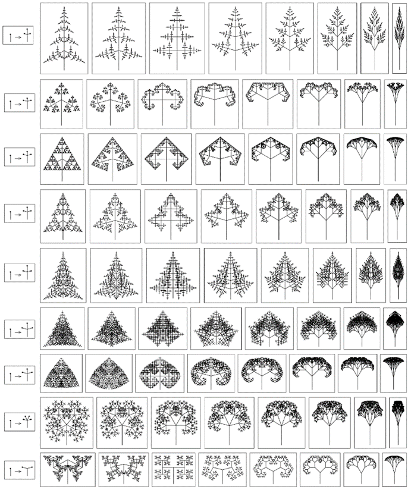
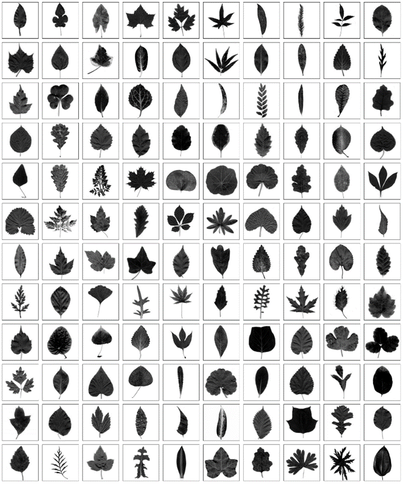
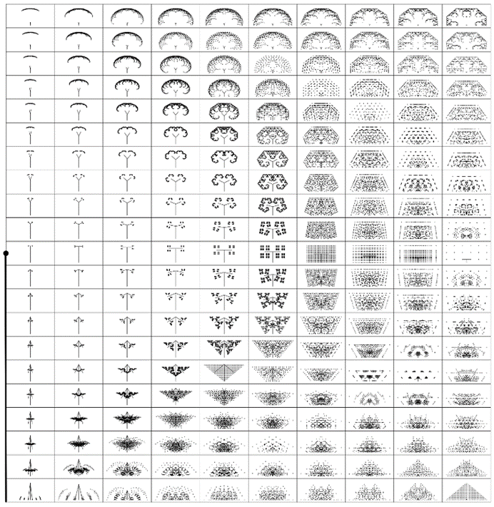
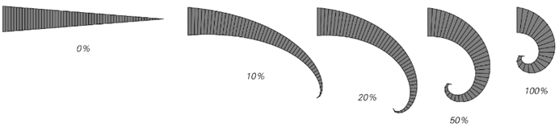
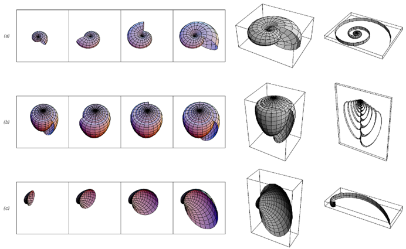
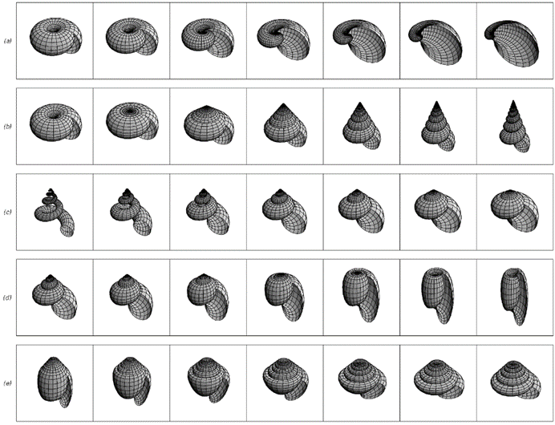
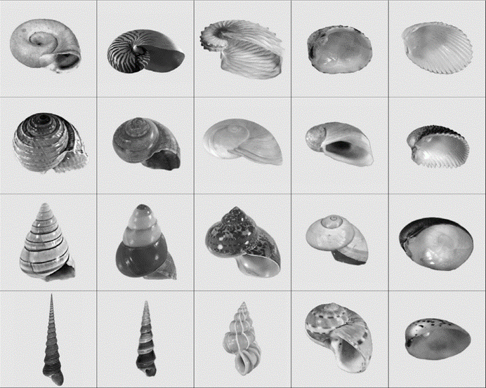
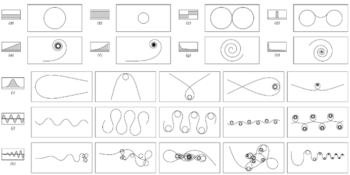

### 8.6  植物和动物的生长

观察植物和动物的所有复杂形态，人们可能会首先认为它们生长的基本规则一定非常复杂。但在这本书中，我们发现即使遵循非常简单的规则，也有可能获得极其复杂的形态。而我现在所相信的是，事实上，植物和动物生长的大多数方面最终都是由一些极其简单的规则所控制的。

作为生物生长的第一个例子，我们来看看植物的茎。茎的生长通常只发生在茎尖，而且大多数情况下，茎只是逐渐变长。但是，最终导致我们在许多种类的植物中看到的许多结构的关键现象是，在茎尖有可能形成新的茎并分叉。在最简单的情况下，这些新的茎本质上只是原始茎的较小复制品，具有相同的生长和分叉的基本规则。

有了这样的设置，分支的连续过程就可以通过邻居无关替代系统演化的步骤来表示，其中每个茎的尖端在每个步骤中都被一些固定配置的较小茎的集合所替代。

下面两张图片展示了这种替代系统的两个例子。在这两种情况下，规则都设置为每个茎在每个步骤中正好分叉成三个新的茎。这意味着茎之间的连接网络必然具有非常简单的嵌套形式。但是，如果观察茎的实际几何排列，就不再那么简单了；事实上，尽管底层规则非常简单，但在对面页面底部的图片中，即使立即也能看出相当大的复杂性。

>替代系统演化的步骤，为植物生长提供简单模型。在每个步骤中，每个生长的茎都会根据所示规则被三个新的茎的集合所替代。在植物学中，这种分支类型对于单个茎而言被称为单轴分支。

(p 400)

下一页的图片展示了通过选择新茎的长度和角度的不同序列所获得的图案。在少数情况下，这些图案相当简单；但在大多数情况下，它们却呈现出高度复杂且极其多样的特点。

这些图片立刻让人联想到各种植物的整体分支模式——从藻类到蕨类，再到树木以及许多种类的开花植物。毫无疑问，大多数这样的整体分支模式都是由如此简单的生长规则形成的。

但是，关于植物的更详细特征呢？它们是否也可以被视为简单基本生长规则的结果？

多年来，我尤其对叶子的形状感到好奇。因为不同植物之间的叶子形状差异巨大——正如第403页图片所示。一些植物的叶子具有简单的平滑边界，人们可能会想象这些边界可以用传统的数学函数来描述。其他植物的叶子则具有各种尖锐点的配置。还有一些植物的叶子具有复杂且看似随机的边界。

鉴于这种多样性，人们可能会首先认为，没有任何一种基本的规则能够解释所看到的这些现象。但是，像下一页上的图片阵列那样仔细观察后，人们会做出一个惊人的发现：在简单替代系统可以生成的图案中，有一些图案的轮廓看起来与各种类型叶子的轮廓极为相似。

有边缘平滑的图案，看起来像睡莲的叶子。有尖锐点的图案，看起来像各种带刺的叶子。还有复杂且看似随机的图案，看起来像梧桐叶或葡萄叶。

过去，叶子的形状是如何形成的这一问题一直不太清楚。可以推测，大多数重要的过程都发生在叶子仍然折叠在芽内且尚未非常坚硬的时候。

(p 401)

>由前图所示类型的替代系统产生的限制模式。每行上的模式都是根据设定的规则获得的，这些规则给定了具有特定相对长度的分支。在行中的连续图片中，分支之间的角度增加了15°。请注意，不同行上显示的图片比例不同，因此初始的垂直茎并不总是以相同的高度出现。本页上的图片与许多种类植物的整体分支模式和叶子形状之间的相似性令人惊叹。

(p 402)

>不同种类叶子的示例，主要来自常见的开花植物。形状的多样性非常显著，与对面页面上显示的形状相似度也很高。叶子的尺寸从不到一英寸到几英尺不等。

(p 403)

尽管叶子通常在长出后会显著扩展，但它们形状的基本特征几乎从来不会改变。

有证据表明，至少在叶子表面被填满之前，叶脉模式的一些方面就已经确定了，也许我在这里描述的分支过程中的茎对应于与叶脉相关的结构的前体。实际上，高等植物叶子中叶脉的交错可能与前两页图片中茎经常交叉的事实有关——尽管当然在实际成熟的叶子中，许多叶脉很可能是在叶子形状确定后很久才添加的。

人们可能最初会认为，叶子的形状是通过与植物生长其他方面完全无关的机制获得的。但我强烈怀疑，事实上，正是同一个简单的分支过程最终决定了植物的整体形态和叶子的形状。

很有可能，整体生长规则和叶子生长规则中出现的长度和角度之间至少会有一些对应关系。但总的来说，所有这些规则的细节无疑将取决于个别植物的非常具体的特征。

例如，新茎出现之前的距离可能由植物激素和相关物质的产生和扩散速率决定，而这些速率将不可避免地取决于茎的厚度和机械结构，以及植物的各种生化特性。至于旧茎和新茎之间的角度，如果它们受到细胞个体形状和细胞分裂序列等微观细节的控制，我也不会感到惊讶。

生物学的传统直觉表明，每当人们看到复杂性（比如叶子的形状）时，它一定是通过某种复杂的自然选择过程为了某种特定目的而产生的。但前面页面[400, 402]上的图片所展示的是，事实上，高度的复杂性可以在某种意义上毫不费力地产生，仅仅是遵循某些简单的生长规则的结果。

毫无疑问，植物的一些基本特性确实是由自然选择引导的。但我强烈怀疑的是，在大多数情况下，复杂性的出现（比如叶子的形状）本质上只是由植物基本特性所产生的特定生长规则的副作用。

(p 404)

下一页的图片展示了由一系列规则产生的可能形式的阵列，其中每个茎在每个步骤中正好分裂成两个新茎。页面左侧的垂直黑线实际上代表了每个步骤中的原始茎，图片的排列方式使得页面上特定位置出现的图片显示了当右侧新茎的尖端相对于左侧显示的原始茎到达该位置时产生的模式。

在某些情况下，得到的模式相当简单。但即使在这些情况下，图片也表明基础规则中相对较小的变化也可能导致更复杂的模式。因此，如果在生物进化的过程中规则逐渐发生变化，那么有时看到复杂的模式几乎是不可避免的。

但模式能有多快地改变呢？为了了解这一点，我们可以构建一种下一页阵列的极限情况，其中图片的总数实际上是无限的，但只显示每张图片的特定无穷小区域。第407页给出了这个区域相对于原始茎的位置的四种选择的结果。而且，图片不是仅仅根据模式的任何部分是否位于该区域而显示黑色或白色，而是使用灰度级别来表示它接近的程度。

因此，实心的黑色区域对应于基础规则中参数的范围，对于这些范围，得到的模式总是达到特定位置。但我们看到的是，在这些区域的边缘，经常有本质上呈嵌套形式的复杂结构。这种结构的存在意味着，至少在某些参数范围内，即使基础规则中发生非常小的变化，也可能导致产生的模式在某些方面发生巨大变化。

因此，这表明，即使植物的基本属性只发生轻微变化，叶子形状等特征有时也会发生巨大变化。我怀疑，这正是为什么即使在其他方面看起来非常相似的植物中，有时也会看到如此多样的叶子形状。

(p 405)

>通过简单的替换系统可以产生一系列完整的模式，其中每个茎在每个步骤中精确地分裂成两个对称的茎。模式在页面上的排列方式使得在特定位置显示的模式对应于使用规则获得的结果，其中右侧茎的尖端（针对阵列的纵横比进行校正）相对于页面左侧作为垂直线显示的原始茎到达该位置。在每种情况下，都显示了10步进化的结果，并且图片被缩放，以便可以包含原始茎底部以上的所有点。请注意，对于页面左侧点为中心、并触及页面其他三边的扭曲半圆之外的规则，生成的模式会在每个步骤中增长，而不是趋于固定大小的极限。

(p 406)

>在对面页上，替换系统的参数空间中的模式重叠区域映射在每张图片左上角的图标指示的区域内。黑色表示完全重叠，而白色表示没有重叠。可以将显示的地图视为通过对对面页上的图片阵列取无限密集的极限而制成的，但只保留通过相对于原始茎的特定位置的小孔看到的内容。

(p 407)

虽然不同植物之间的叶子形状等特征通常差异很大，但植物中也有一些看似相当复杂的方面，在广泛的物种范围内通常几乎完全相同。

一个例子是植物器官或其他元素围绕茎的序列排列。在某些情况下，连续的叶子（比如）将始终出现在茎的相反两侧——相隔180°。但更为常见的是，叶子之间的角度小于180°，并且在大多数植物中，这个角度几乎完全相同，几乎精确地等于137.5°。

在这么多植物的叶子排列（或所谓的叶序）中出现如此确定的角度已经很不寻常了。但事实证明，这个相同的角度也出现在植物的各种其他特征中，如对面页顶部的图片所示。尽管不同情况下几何形状不同，但接近137.5°的固定角度总会导致非常规则的螺旋模式。

多年来，人们撰写了大量关于此类模式及其数学属性的文章。事实证明，连续元素之间约137.5°的角度相当于旋转次数等于所谓的黄金比例（(1+Sqrt[5])/2 ≈ 1.618），它在各种数学环境中出现——特别是作为斐波那契数列的极限比。

毫无疑问，在很大程度上正是因为这种优雅的数学联系，人们通常认为137.5°的角度以及由此产生的螺旋模式必须对应于自然选择过程中发现的某种复杂的优化。

但我并不认为事实确实如此。相反，我强烈怀疑这些模式只是与近一个世纪前就已经讨论过的（至少在大体上）一个相对简单的生长过程相似的不可避免的结果。

(p 408)

茎周围新植物器官或其他元素的位置可能是由生长茎尖端附近的一小圈物质中的情况决定的。我怀疑的是，如果某个位置上的某种化学物质浓度达到了某个临界水平，那么通常会在该位置周围的环上形成一个新元素。

但是，一旦形成了一个元素，就可以预见它会耗尽其周围区域内化学物质的浓度，从而抑制附近其他元素的形成。然而，生长茎中的一般过程可能会使活性物质环中的浓度稳步上升，最终在某个位置的浓度再次达到足够高的水平，导致另一个元素的形成。

>各种植物系统中元素的螺旋排列示例。最终几何形状的细节在不同情况下是不同的。但在所有情况下，连续元素之间的原始角度都几乎精确地为137.5°。第一行显示了红甘蓝（切开）、洋蓟、芦笋、覆盆子和草莓。最后一行的前两个物体是松果和橡果。

(p 409)

下面的图片展示了这种类型过程的一个例子。为了展示方便，将活性物质的环展开成一条线，并将这条线的连续状态在页面上上下排列显示。在每一步中，都会在新的元素（以黑点表示）所在的位置（即浓度最大的位置）生成它。然后，围绕这个位置，新元素会产生一个浓度下降，这个下降在几个步骤中逐渐消散。

根据图片的绘制方式，连续元素之间的角度对应于它们之间的水平距离。虽然前几步中这些距离有所变化，但我们通常看到的是迅速收敛到一个固定距离——这恰好对应于几乎精确的137.5°角。

那么，如果改变模型的细节会发生什么呢？在极端情况下，如果之前行为的所有记忆都被立即消除，对面页顶部的第一张图片显示连续元素以180°角形成。而在阻尼非常小的情况下，最后两张图片显示，至少有一段时间，元素可以以相当随机的角度形成。但在大多数情况下，人们会看到迅速收敛到几乎精确的137.5°角。

>一个关于植物茎生长尖端产生的叶子或其他元素排列的简单模型。假设茎向上生长，并且为了便于展示，它被展开成一条线。叶子或其他元素的位置用黑点表示。化学物质的浓度用灰度表示，并且在每一步的顶部线条上也进行了绘制。该系统的规则是在浓度最大的位置放置一个新的黑点。然后，假设黑点会耗尽其周围的浓度，但在下一步之前，整体浓度会均匀增加。结果证明，连续的黑点迅速以几乎精确的137.5°间距排列。

(p 410)

那么这个角度在实际植物系统中是如何出现的呢？如下方第二张图片的第一行所示，细节取决于新元素和原始茎的几何形状和相对生长速率。但在所有情况下，都会产生非常典型的模式。

>改变模型中使用的阻尼量的示例在对页上。100%阻尼对应于在每个步骤中增加整体浓度，以至于没有留下之前步骤的记忆。0%对应于在每个步骤中整体浓度没有增加。远离这些极端情况，可以看到黑点之间的间距迅速收敛到几乎精确的137.5°。

通过以黄金比例角137.5°连续添加元素在各种几何形状中形成的结构示例。这些结构中的每一种都出现在一种或另一种植物的生长中，如第409页所示。

以不同角度连续添加元素形成的整体模式。在每种情况下，第n个元素出现在坐标Sqrt[n]{Cos[n θ], Sin[n θ]}处。如果θ/π（θ以弧度为单位）容易被有理数近似，则会出现条纹。（条纹出现前区域的大小取决于Length[ContinuedFraction[θ/π]]。）

(p 411)

正如前一页底部的图片所示，这些模式的形状对连续元素的确切角度非常敏感：事实上，即使是很小的偏差也会导致视觉上截然不同的模式。起初，人们可能会认为要得到一个像137.5°这样精确的角度，需要某种复杂且高度详细的过程。但正如我们在本书中看到的许多其他情况一样，我们实际上看到的是，最终只需要一个非常简单的规则。

植物的一般特征之一是它们的大多数细胞倾向于形成相当坚硬的纤维素壁，这使得在植物体积内部添加新材料基本上是不可能的，因此通常迫使新生长仅在植物外部发生——最重要的是在茎尖。

但当植物像叶子或花瓣那样形成片状材料时，通常在片材内部生长时会有一定的灵活性。下面的图片展示了如果从一个扁平的圆盘开始，然后在不同地方添加不同量的材料，可能会发生什么。

如果像情况（b）那样，在圆盘中心附近添加的材料比在边缘附近多，那么圆盘就会被迫形成类似许多花朵的杯状。但如果像情况（c）那样，在圆盘边缘附近添加的材料比中心附近多，那么片材的边缘就会变得波浪状，很像一些叶子。而且，如果像情况（d）那样，从中心到边缘的材料量增加得足够快，那么圆盘就会被迫变得高度波纹状，有点像生菜叶。

>圆盘中心不同距离处材料量不同。在顶部一行中，圆盘始终是平的，迫使材料的细胞在大小和形状上发生变化。在底部一行中，圆盘在三维空间中形成形状，其中所有细胞的大小和形状都相同。与情况（a）相比，在情况（b）中，从中心伸出的材料量线性减少，在情况（c）中线性增加，在情况（d）中指数增加。

(p 412)

那么动物呢？它们的生长机制与植物在多大程度上是相同的？如果你观察高等动物的呼吸道或小血管，那么你会看到分叉的模式与植物中的相似。但在它们的大多数明显结构特征上，动物通常看起来与植物大不相同。而事实上，它们的生长机制大多被证明是相当不同的。

首先，以角为例。人们可能会认为，就像植物的茎一样，角也是通过在尖端添加材料来生长的。但实际上，与指甲和头发一样，角是通过在基部添加材料来生长的。这直接导致了一个结果，那就是在植物中看到的那种分叉在角中通常不会发生。

但另一方面，卷曲是很常见的。为了得到一个完全直的结构，必须在基部的每一侧以完全相同的速率添加材料。如果存在差异，所产生的结构的一边总是会比另一边长，因此卷曲是不可避免的，如下面的图片所示。

正如几个世纪以来人们一直所认为的那样，事实证明，这种现象的三维版本基本上就是导致软体动物壳中复杂卷曲结构的原因。在典型情况下，生活在壳开放端的动物在一侧分泌新壳材料的速度比另一侧快，导致壳以螺旋方式生长。在开口周围不同点分泌壳材料的速率可能是由动物的解剖结构细节决定的。结果发现，正如我们之前在本节中看到的分叉结构一样，即使这些速率的微小变化也会对壳的整体形状产生相当大的影响。

>这些图片是通过在基部上边缘添加的材料量总是比下边缘多指定百分比而逐渐生成的理想化角。这些图片可以看作是前面页面上图片的一维类似物。

(p 413)

下面的图片展示了三种可能发生的情况的示例，而对页则展示了系统地改变某些生长速率的影响。人们看到的是，即使使用了完全相同且非常简单的基础模型，也可以产生各种视觉上截然不同的几何形状。

>软体动物壳生长的一个简单模型。在每个例子中，新的壳材料都逐渐添加到壳的开放端。左侧的规则显示了在不同阶段围绕开口不同点添加的材料量；从中心开始的线表示开口的逐渐横向位移。情况（a）是典型的鹦鹉螺壳，（b）是锥形壳，（c）是蛤壳的一半。所有根据这里所示固定规则添加材料而产生的壳都具有在生长过程中保持相同整体形状的特性。

(p 414)

那么，在所有可能的形式中，哪些实际上出现在真正的软体动物中呢？下一页展示了一个令人瞩目的事实，即基本上所有这些形式都存在于某种软体动物中。

如果只看到一个软体动物壳，人们可能会认为其复杂的形状一定是通过长时间的自然选择精心塑造的。但我们现在看到的是，事实上，所有观察到的不同形状实际上只是将三维几何应用于非常简单的生长规则所产生的结果。因此，再次强调，自然选择不能合理地被认为是我们看到复杂形状的来源。

>改变软体动物壳生长规则中五个简单特征的影响：（a）每次旋转过程中大小增加的总因子；（b）每次旋转时开口向下位移的相对量；（c）开口大小与壳整体大小的相对比例；（d）开口的伸长；（e）开口中伸长的方向。每行开头和结尾的图片大致对应以下情况：（a）池螺壳，蛤壳；（b）池螺壳，号角螺壳；（c）虫螺壳，贝壳帽壳；（d）蛾螺壳，砗磲壳；（e）橄榄壳，日晷壳。

(p 415)

>自然界中发现的由简单模型生成的贝壳形状。该阵列显示了前两页参数的系统性变化。其他参数也可以制作类似的阵列。

(p 416)

除了软体动物的壳之外，卷曲结构（如分支结构）在动物中并不常见。事实上，绝大多数动物的整体形态并不倾向于由单一类型的结构所主导。相反，它们通常由一系列可识别的独立部分组成，如头部、尾部、腿、眼睛等，每个部分都有其特定的结构。

有时，这些部分中的一些会重复出现，可能以一系列段落的形式，或者可能是某种二维阵列。而且，动物的整个身体通常被一层相当均匀的外皮所覆盖。但最终，许多动物最明显的特征之一就是存在许多不同类型的部分。

那么，所有这些部分是如何产生的呢？基本机制似乎是在发育中的动物体内，不同的位置和不同的时间，其遗传程序的不同部分最终会被利用——导致不同种类的生长发生，并产生不同的结构。而实现这一点的部分原因是，特别是在胚胎阶段，动物中的大多数细胞都不是极其坚硬的——因此，即使动物的不同部分生长得非常不同，它们仍然可以变形以适应彼此。

通常，有些元素（如骨骼）最终会变得坚硬。但关键的是，在决定动物基本形态的阶段，这些元素中的大多数都还没有变得坚硬。这允许各种过程的发生，而这些过程在正常情况下是不可能的。

其中最重要的可能是折叠。因为折叠不仅参与形成牙齿表面和人的耳垂等形状，而且对于使扁平的组织片形成动物体内常见的口袋和管状结构也至关重要。

折叠似乎是由多种原因引起的。有时，它很可能是由微观纤维的牵引直接造成的。在其他情况下，它可能是由于不同部位生长速度不同而产生的，就像第412页的图片一样。

(p 417)

但是折叠能产生什么样的形状呢？下面的图片展示了当局部曲率（本质上是局部的折叠率）沿着曲线变化时，根据几个简单的规则会发生什么。在少数情况下，产生的形状相当简单。但在大多数情况下，它们相当复杂。而且，只需要非常简单的规则就能产生出类似于在动物身上经常看到的绒毛和其他波纹结构的形状。

除了折叠之外，在发育中的动物体内，由于缺乏刚性，还可能有其他类型的过程发生。其中之一是通过细胞间粘附的丧失来使组织起皱或撕裂。另一个是基于化学或免疫学亲和力的单个细胞的明确迁移。

但是，所有这些不同的过程是如何组织起来以产生实际的动物的呢？如果观察一个典型动物胚胎中发生的事件序列，它们最初看起来似乎非常杂乱无章。但正如上面所提到的，主要发生的事情可能是，在不同的位置和不同的时间，遗传程序的不同部分被使用，而这些不同的部分可以导致非常不同的行为。一些可能只是产生均匀的生长。其他的可能导致各种局部折叠。还有一些可能导致组织区域死亡——从而例如允许单独的手指和脚趾从一片组织中长出来。

>通过根据明确的规则改变从一端到另一端的局部曲率来获得曲线。每组曲线的序列显示了当局部曲率乘以一个逐渐增大的因子时会发生什么。在任何特定点的局部曲率被定义为在该点近似曲线的圆的半径的倒数。每组图片中局部曲率作为弧长函数的公式如下：1（圆）；s（Cornu螺旋或布纹线）；s²；1/Sqrt[s]（圆的渐开线）；1/s（对数螺旋或等角螺旋）；1/s²；Exp[-s²]；Sin[s]；s Sin[s]。可以将曲率函数f[s]视为指定在每个时刻转动车辆多少以保持其沿曲线行驶。曲线已被旋转以适应提供的框架。

(p 418)

但是，在动物发育的哪个阶段应该使用基础遗传程序的哪个部分，这是如何确定的呢？起初，人们可能会认为，每一个新出现的细胞都可能会使用基础遗传程序的不同部分。在只有几百个细胞的非常简单的动物中，这很可能就是实际发生的情况。

但一般来说，似乎并不是单个细胞，而是发育中的动物的不同区域最终会使用基础程序的不同部分。事实上，典型的模式似乎是，每当动物的一部分长到几十分之一毫米宽时，那一部分就可以分解成几个更小的区域，每个区域都使用基础遗传程序的不同部分。

那么这是如何工作的呢？看起来的情况是，有些细胞会产生化学物质，这些化学物质的浓度在几十分之一毫米的距离内会逐渐降低。而在过去十年左右的时间里，人们发现，在所有动物（以及植物）中，都有少数所谓的同源异型盒基因，这些基因似乎在特定的浓度水平下变得活跃或不活跃，并控制着将使用基础遗传程序的哪个部分。

这种过程在固定长度尺度上的存在，几乎不可避免地意味着胚胎必须以某种层次化的方式发育。因为在足够早的阶段，整个胚胎会非常小，以至于它只能包含少数几个使用遗传程序不同部分的区域。在这个阶段，例如，可能有一个腿部区域，但还没有一个明显的脚部区域。

(p 419)

然而，随着胚胎的生长，腿部区域最终会变得足够大，可以分化成几个独立的区域。在这个时候，一个明显的脚部区域就会出现。然后，当脚部区域变得足够大时，它也可以分成几个独立的区域，这些区域会变成骨骼或软组织。而当会变成骨骼的区域变得足够大时，它还可以进一步分成更小的区域，这些区域会形成单独的骨骼。

如果每个区域的组织在每个阶段的生长速度都相同，只是每个区域最终存在的细胞类型不同，那么不可避免地会出现一个简单而高度规则的整体结构，就像下面理想化的图片所示。对于每种类型的细胞，都有不同的替代规则，因此结构通常是嵌套的。事实上，例如，动物骨骼的某些部分确实似乎至少大致上展现出了这种嵌套结构的几个层次。

但在大多数情况下，并没有这种明显的嵌套结构。其中一个原因是，一个区域可能不是简单地分裂成更小区域的直线，而是分裂成同心圆，或者分裂成以更复杂方式排列的区域集合——比如我在下一节中讨论的那种类型。也许更重要的是，一个区域可能分裂成生长速度不同的更小区域，并且这些小区域可能会以其他方式折叠或变形。当这种情况发生时，形成的几何形状反过来又会影响后续区域的分裂方式。

最终，产生动物不同部位的基本机制——即几十分之一毫米宽的区域分裂成独立的更小区域——与植物茎尖（可能宽约一毫米）通过分裂出更小的茎来生长的想法出奇地相似。事实上，人们甚至知道其中涉及的某些遗传现象是极其相似的。

>这是一个示意图，展示了在动物生长过程中可能发生的连续细分。在这里，细分被认为发生在两个方向上，始终产生三个以相同速度生长的简单矩形。实际上，几何形状通常要复杂得多。

(p 420)

但关键在于，在植物最重要的生长期间，由于其相对刚性，只能产生涉及明确分枝的结构。然而，在动物中，由于缺乏刚性，使得能够出现的结构范围大大扩大，因为现在不同区域的组织不仅可以均匀生长，还可以以多种方式改变形状。

当动物孵化或出生时，其基本形态通常已经确定，并且已经有骨骼或其他刚性元素来维持这种形态。但在大多数动物中，体型仍会有显著的进一步增长。那么这是如何实现的呢？

一些骨骼实际上只是通过在其外表面增加物质来扩张。但在许多情况下，骨骼实际上被分为几个部分，而这些部分之间会发生生长。因此，例如，手臂和腿部的长骨在其主要骨干的两端都有生长区。而颅骨则被分为多个部分，每个部分都在其边缘生长。

通常，动物的不同部位会有不同的生长速度，这会导致例如从出生到成年期间相对头部大小的减少。而这不可避免地意味着，随着动物的成熟，它们的形状至少会发生一些变化。

但如果比较不同品种或种类的动物呢？起初，它们的形状可能看起来大不相同。但事实证明，在某一特定科甚至目的动物中，它们的整体形状实际上往往通过相当简单和平滑的几何变换而相互关联。

事实上，正如我们之前在本节中讨论的叶子和贝壳一样，动物形状和形态之间的差异可能往往在很大程度上仅仅是由于其不同部分的生长速率模式不同。

不用说，就像叶子和贝壳一样，这样的差异在视觉和机械上都会产生相当显著的效果——比如，将一个四足行走的动物转变为一个两足行走的动物。而且，再次像叶子和贝壳一样，在我们所见的动物中，似乎有相当一部分动物对应着相对生长速率的可能选择的相当大的一部分。

(p 421)

我们以探讨植物和动物形态中所需的生长基本规律为起点，这些规律能够产生我们所见到的多样性和复杂性。在我们所研究的每一个案例中，我们都发现了一些非常简单的规则似乎就足够了。实际上，在大多数情况下，这些基本规则似乎比许多非生物系统中运行的规则要简单一些。但生物系统中能够呈现出惊人的多样性，是因为不同的生物体和不同种类的生物体总是基于至少略有不同的规则。

在上一节中，我认为在大多数情况下，这样的规则并不是自然选择精心挑选的，而是几乎随机地从各种可能性中挑选出来的。然而，根据对传统数学模型的经验，人们可能会认为这不可避免地意味着所有植物和动物都将具有看起来非常相似的形态。

但我们在本书中发现的是，当使用对应于简单程序而不是传统数学方程式的规则时，不同的规则通常会导致截然不同的——而且往往是高度复杂的——行为模式。我怀疑正是这种基本现象导致了我们在植物和动物形态中所看到的多样性和复杂性的大部分。

