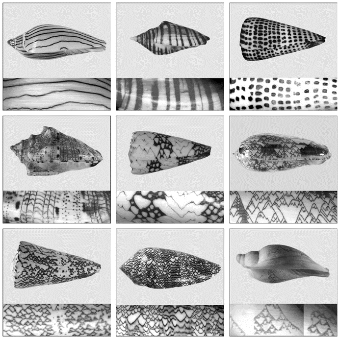
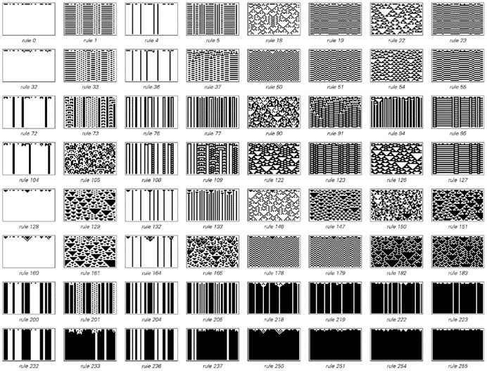
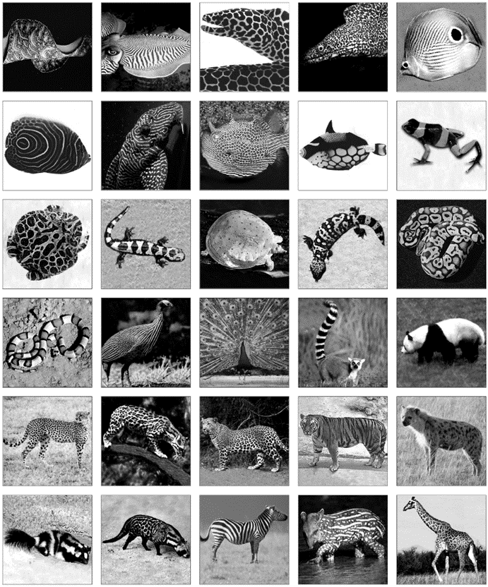
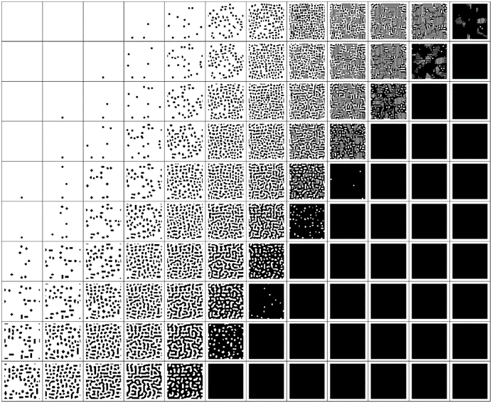

### 8.7  生物色素沉着模式

在视觉上，色素沉着模式代表了生物体中复杂性的最明显例子之一。而过去人们通常认为，要获得这种模式中所见的复杂性，必须有一些高度复杂的潜在机制，可能与自然选择的优化有关。

然而，根据本书中的发现，我强烈怀疑事实上生物体中绝大多数的色素沉着模式实际上是由基本规则极其简单的过程产生的——而且这些规则往往是随机选择的。

(p 422)

以下图片展示了一些在软体动物壳上发现的典型图案示例。其中许多图案相对简单，但也有一些非常复杂。然而，观察这些图案时，人们会注意到它们与本书之前多次见过的图案——由简单的一维元胞自动机生成的图案——有着惊人的相似性。

>软体动物壳上色素沉着模式的典型示例。在每张特写照片中，图案都是从上到下生长的，就像在一维元胞自动机中一样。带有三角形的图案通常被称为“帐篷”形或“分叉”形。右下角的那个壳是一个稍微罕见的样本，可以看到接近明显的嵌套图案。大多数壳的长度在一到四英寸之间；右下角的那个长九英寸。这些图案都是在大致白色的背景上呈现出的不同深浅的棕色。这些壳的类型如下：第一排：艾略特蜗牛、扇形蜗牛、有字母的锥螺；第二排：音乐蜗牛、带状大理石锥螺、帐篷橄榄螺；第三排：树枝锥螺、纺织品锥螺、假甜瓜蜗牛（立沃尼亚乳头螺）。

(p 423)

我相信，这种相似性并非巧合。软体动物壳，就像一维元胞自动机一样，实际上是一次生长一行，新的壳材料是由壳内动物边缘的软组织边缘产生的。不过，壳上的色素是如何沉积的，目前还不是很清楚。软组织中无疑有一些元素，它们在任何时候都会或不会分泌色素。而且，这些元素之间很可能存在某些相互作用。鉴于这一点，从某种意义上说，最简单的假设是元素的新状态是由其邻居之前的状态决定的——就像在一维元胞自动机中一样。

>从随机初始条件开始，每个最简单的可能对称一维元胞自动机规则的演化所产生的图案示例。所获得的图案类型与前一页上软体动物壳上的图案有着惊人的相似性。

(p 424)

但是，任何给定的软体动物会使用哪种特定的元胞自动机规则呢？对面页面底部的图片展示了所有可能涉及两种颜色和最近邻居的对称规则。将这些图片中的图案与实际软体动物壳上的图案进行比较，人们会注意到一个显著的事实，即这两种情况下出现的图案范围极为相似。

传统观念可能会认为，每种软体动物都会精心优化其壳上的图案，以避免捕食者或吸引配偶或猎物。但我认为更有可能的是，这些图案实际上是由从最简单可能性集合中随机选择的规则生成的。这意味着，如果这些图案中出现复杂性，那么它在某种程度上是一种巧合。这并不是说有一些精心设计的机制专门用来产生这种复杂性。相反，它只是本书发现的基本现象的一个不可避免的结果，即简单的规则往往会产生复杂的行为。

事实上，在许多软体动物种类中，它们壳上的图案——无论简单还是复杂——在动物的一生中都被一层不透明的皮肤完全覆盖，因此可以推测这些图案不可能通过任何仔细的优化或自然选择过程来确定。

那么其他种类的动物身上的色素沉着图案呢？软体动物壳上的图案几乎独一无二地是按一行一行地构建的；更常见的是图案在整个表面上同时发展。

最常发生的情况是，在胚胎生长的某个阶段，产生色素的细胞前体出现在其表面，然后这些与不同颜色色素相关的细胞群以特定的图案排列。通常，每个单独的细胞群最初大约占十分之一毫米的横截面。但由于动物的不同部分通常以不同的速度生长，成年动物身上最终看到的图案在不同部位的比例会有所不同——例如，由于头部生长较慢，所以动物头部的图案比例较小。

(p 425)

>动物色素沉着图案的典型例子。请注意，许多截然不同的动物最终会形成非常相似的图案。

(p 426)

对面页面的图片展示了动物色素沉着图案的典型例子，并证明了即使在广大不同类型的动物中，也只有少数几种图案会反复出现。那么这些图案是如何产生的呢？尽管其中一些看起来相当复杂，但事实证明，再次有一种相当简单的规则可以解释它们。

这个想法是，当图案形成时，每个元素的颜色往往会与附近元素的平均颜色相同，而与更远元素的平均颜色相反。这种效果可能起源于激活剂和抑制剂化学物质的产生和扩散，或者例如，不同类型的细胞的实际运动。但无论其起源如何，这种效果本身都可以通过设置一个具有适当规则的二维元胞自动机来轻松捕捉。

下面的图片展示了在进一步元素的相对重要性上有两种略有不同的选择时发生的情况。在这两种情况下，从黑色和白色元素的随机分布开始，很快就会出现明确的图案——在第一种情况下是一组斑点，在第二种情况下是迷宫状或迷宫结构。

下一页展示了使用一系列不同距离元素权重的选择所获得的最终图案。出现了一定范围的图案——几乎所有图案都与实际动物上看到的图案非常相似。

>简单二维元胞自动机的演化，其中每个细胞在每一步的颜色由距离最远可达3的细胞的平均颜色的加权和决定。在所示的两个规则中，细胞本身及其最近邻的权重为1。距离为2和3的细胞权重为负——第一个规则中每个细胞为-0.4，第二个规则中为-0.2。如果加权和为正，则细胞变为黑色，否则为白色。从随机初始条件开始，两个规则都迅速演变为看起来非常像动物中看到的色素沉着图案的稳定状态。

(p 427)

但是，从某种意义上说，所有这些图案在各个方向上都具有相同的基本形式。然而，有许多动物的色素沉着图案呈现出具有明确方向的条纹。有时这些条纹非常规则，可能由产生重复行为的任何可能机制产生。但在条纹不太规则的情况下，它们通常看起来非常像本页底部图片中使用第一种说明中描述的简单机制版本生成的图案。

>在水平和垂直方向上细胞权重不同的规则示例。在第一种情况下，距离为2和3的细胞仅在垂直方向上产生影响；在第二种情况下，它们仅在水平方向上产生影响。结果是形成垂直或水平的条纹。

(p 428)

