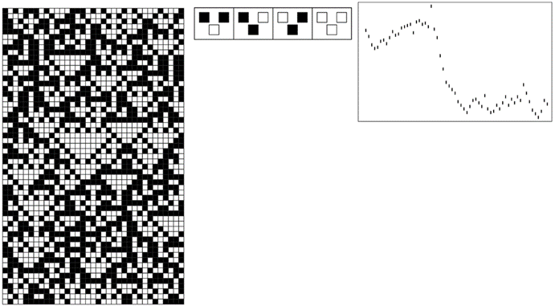

### 8.8  金融系统

在本书思想的发展过程中，我多次被问及这些思想是否适用于金融系统。毫无疑问，它们确实适用，作为一个例子，我将简要讨论几乎所有金融市场中最明显的特征：价格波动的明显随机性。

无论是股票、债券、商品、货币、衍生品还是其他任何类型的金融工具，人们在不同时间看到的价格序列都显示出一些总体趋势，但也表现出不同程度的明显随机性。

那么，这种随机性的根源是什么？

在最朴素的经济理论中，价格是价值的反映，而资产的价值等于从该资产中获得的所有未来收益（如股息）的总和，再减去因等待这些收益而损失的利息的折现值。

然而，从这个角度看，似乎很难理解为什么价格会有任何显著的波动。通常的说法是，价格实际上并不是由真实价值决定的，而是由在任何给定时间可以获得的该价值的最佳估计决定的。然后，人们假设这些估计最终受到世界上发生的各种事件的影响，从而在某种意义上，价格的随机波动只是外部环境随机变化的反映。

>上一页所示类型的规则生成的图案，距离2和3的细胞权重有多种选择。对于距离2，权重在页面上从-0.9到0变化；对于距离3，权重在页面上从左到右从-0.7到0.4变化。在所有情况下，进化都是从相同的随机初始条件开始的，并一直持续到稳定为止。请注意，实际动物的色素沉着图案可能包含的元素数量可能比这里显示的图案多或少。

(p 429)

然而，虽然这可能是数周或数月（在某些情况下可能是数小时或数天）时间尺度上的主要影响，但很难相信它能解释在短至几分钟甚至几秒钟的时间尺度上经常出现的明显随机性。

此外，人们偶尔会发现一些看似纯粹投机的情况，其中交易在没有任何重大外部输入的可能性下进行——而在这种情况下，价格往往会表现出更多而不是更少的看似随机的波动。

了解这一点后，人们可能会认为，随机波动可能只是价格调整到其正确值的方式中不可避免的特征。但在双方谈判中，经常可以看到价格相当平稳地收敛到最终价格。当然，人们也可以构建在更多方之间运行的算法，这些算法也会导致相当平稳的行为。

因此，在实际市场中，很可能还有其他因素在起作用。毫无疑问，部分原因仅仅是记录价格的交易序列通常由一系列不同的实体执行——无论是人类、组织还是程序——每个实体都有自己决定合适价格的详细方式。

但正如我们在本书中研究过的许多其他系统一样，一旦系统中有足够多的独立元素，那么可以合理预期，人们看到的整体集体行为将超越单个元素的细节。

有人有时声称，市场在某种程度上必然是随机的，否则就可以通过预测市场来赚钱。然而，许多人相信他们每天都以这种方式赚钱。而且，除了某些简单情况外，很难看出反馈机制如何存在，以便在每次使用它们时系统地消除可预测元素。

毫无疑问，随机性有助于维持市场的一定程度的稳定性——就像它有助于维持我们在本书中讨论过的许多其他类型系统的稳定性一样。事实上，大多数市场都是为了防止与某些类型的随机性丧失相关的极端不稳定而设立的——有时是通过明确暂停交易来实现的。

(p 430)

但为什么市场上会存在随机性呢？

实践经验表明，特别是在较短的时间尺度上，人们所看到的许多随机性纯粹是市场内部动态的结果，与交易对象的性质或价值几乎没有或根本没有关系。

那么，人们该如何理解这一切呢？人们需要一个基本模型来描述市场中大量实体的运作和相互作用。但传统数学强调将一切简化为少数连续数值函数，在这方面能提供的东西相当有限。

然而，从程序的角度来思考似乎更有前景。事实上，作为初步近似，人们可以想象市场中的实体就像元胞自动机中的实体一样，可以根据其他实体的行为遵循简单的规则。

为了更具现实性，人们需要建立一个复杂的网络来表示不同实体之间的信息流。而且，人们需要为每个实体分配相当复杂的规则——当然，这些规则与典型编程交易系统中的规则一样复杂。但从我们在本书中所学到的内容来看，系统底层结构的这种复杂性似乎不太可能对其整体行为产生关键影响。

因此，作为一种最小的理想化方法，人们可以尝试将市场视为一个简单的一维元胞自动机。然后，每个细胞对应一个交易实体，而细胞在特定步骤的颜色则指定该实体在该步骤是选择买入还是卖出。人们可以想象出各种方案来更新这些颜色。但是，作为市场中信息流的一种非常简单的理想化表示，人们可以例如，将每种颜色视为由一条固定规则给出，该规则基于每个实体查看其邻居在上一步中的行为。

根据传统直觉，人们会认为这样一个简单的模型必然具有极其简单的行为，当然与真实市场中看到的情况截然不同。但正如我们在本书中所发现的那样，简单的模型并不一定具有简单的行为。实际上，下面的图片展示了可能出现的行为的一个例子。

(p 431)

在真实市场中，人们通常无法详细了解每个实体的具体行为。实际上，人们往往只知道交易执行的价格序列。而在一个简单的元胞自动机中，这大致相当于连续步骤中获得的黑白细胞总数的运行差。

一旦元胞自动机的基本规则是这样的，即信息最终会从一个实体传播到所有其他实体——这实际上是有效市场假说的一个最简版本——那么细胞总数的连续变化就必然会表现出显著的随机性。

人们总是可以使底层系统更加复杂——比如通过建立一个细胞网络，或者允许不同的细胞具有不同且可能变化的规则。但是，尽管这会使人们在观察系统中每个元素的完整行为时更难以识别出明确的规则，但它并不影响这一基本观点：系统的演化可以内在地产生随机性。

>下面是一个非常简单的市场理想化模型的例子。每个细胞对应一个在每个步骤中要么买入要么卖出的实体。根据所示规则，通过查看前一步中其两个邻居的行为来确定给定细胞的行为。下面右下方的图给出了一个大致类似于市场价格的东西，即连续步骤中黑白细胞总数的运行差。尽管在系统完整行为中可以看到可预测性的斑块，但右下方的图在很多方面看起来都是随机的。

(p 432)

