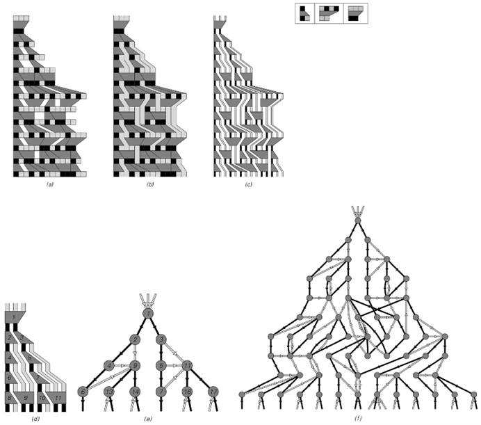
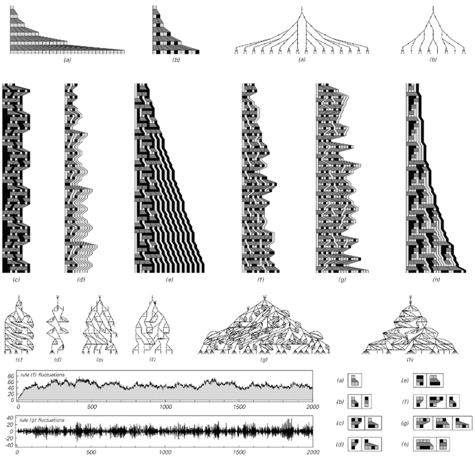
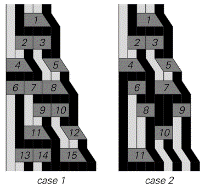

### 9.10  宇宙中事件的排序

在上一节中，我讨论了一种模型，其中熟悉的时间概念可以在没有任何内置全局时钟的情况下出现。我所使用的特定模型是基于移动自动机的——在其中，单个活动细胞的存在仅迫使宇宙中同时发生一个事件。但正如我们将在本节中看到的那样，实际上并不需要如此僵化的设置，甚至不需要像活动细胞这样的任何构造。

我们可以将移动自动机视为我在第3章中介绍的替代系统类型的特例。这类系统通常接受一系列元素，并在每一步中根据某些确定规则将这些元素块替换为其他元素。

下面的图片显示了此类系统的一个示例，并说明了——就像在移动自动机中一样——更新事件之间的关系可以如何通过因果网络来表示。

>从一般替代系统构建因果网络的步骤。替代系统的工作原理是根据所示规则在每一步中替换元素块。每个这样的更新事件都成为因果网络中的一个节点。在这里所示的情况下，所有在从左到右的扫描中发现的匹配替换都在每一步中进行。

(p 497)

>第88页讨论的顺序替代系统的示例，以及由此产生的因果网络。在顺序替代系统中，在任何步骤中，只执行从左到右扫描中找到的第一个适用的替换。上面的规则（a）产生一个纯粹重复的因果网络，因此不会产生任何有意义的空间概念。规则（b）、（c）和（d）产生的因果网络实际上随时间大致线性增长。在规则（f）中，因果网络呈指数增长，而在规则（e）中，尽管其整体增长特性尚不清楚，但因果网络也增长得相当快。请注意，为了获得规则（e）的因果网络中所示的10个级别，有必要追踪底层替代系统的演化，总共需要258步。

(p 498)

与移动自动机相对应的替代系统可以被认为是具有特别设置的规则和初始条件，以便在任何特定步骤上只能发生一个更新事件。但是，对于大多数规则（包括上一页所示的规则）来说，在每个步骤中通常可以进行几种可能的替换。

决定进行哪种替换的一种方案就是简单地从左到右扫描字符串，然后选择第一个适用的替换。这个方案正好对应于我们在第3章中讨论的顺序替代系统。

对面页上的图片展示了几种可能发生的情况。得到的行为通常相当简单，但在某些情况下，它可能会变得非常复杂。就像在移动自动机中一样，出现的因果网络通常随时间线性增长。但是，同样像在移动自动机中一样，存在像（a）这样的规则，其中没有增长——实际上也没有空间的概念。还有像（f）这样的规则——这些规则在一般替代系统中比在移动自动机中更为常见——其中因果网络实际上随时间呈指数增长。

但是为什么要在每一步只进行一次替换呢？下一页的图片展示了如果再次从左到右扫描，但现在执行所有适合的替换，而不仅仅是第一个替换，会发生什么。

在规则（a）和（b）的情况下，结果是在每个步骤中更新每一个元素。但由于这些特定规则中的替换每次只涉及一个元素，因此实际上我们得到了第82页上讨论的那种与邻居无关的替代系统。正如我们在那里发现的那样，这样的系统只能产生相当简单的行为：每个元素反复分支成几个其他元素，产生一个具有规则树形式的因果网络。

那么，涉及超过一个元素的替换会发生什么呢？在许多情况下，行为仍然相当简单。但正如下一页上的几幅图片所示，相当简单的规则就足够了——就像我们在本书中讨论过的许多其他系统一样——可以获得高度复杂的行为。

(p 499)

>一般替代系统的示例以及由此产生的因果网络。在这里展示的图片中，在每一步都会执行在从左到右的扫描中找到的每个适合的替换。规则（a）和（b）的作用类似于第84页上讨论的那种与邻居无关的替代系统，并产生指数增长的树状因果网络。底部的图表显示了规则（f）和（g）产生的模式的增长率。在规则（f）的情况下，该模式被证明是重复的，周期为796步。

(p 500)

然而，人们可能会想知道，所观察到的行为在多大程度上取决于用于选择在每个步骤中应用哪些替换的确切方案。答案是，对于绝大多数规则（包括对面页图片中的规则（c）到（g））来说，使用不同的方案会产生截然不同的行为——以及截然不同的因果网络。

但值得注意的是，确实存在一些规则，无论使用哪种方案，都能得到完全相同的因果网络。事实证明，对面页图片中的规则（a）和（b）就是这种现象的简单例子，如下面的图片所示。

对于每个规则，下面第一张图片中的三个不同图片对应着三种不同的替换方式。虽然每张图片中特定更新事件的位置不同，但关键是这些事件之间的因果联系网络始终完全相同。

这当然不是每个替代系统的真相。实际上，第二张图片中的图片展示了它如何失败，例如对面页中的规则（e）。在这些图片中，人们可以看到在事件4之后，在两个情况下选择了不同的替换，并且这些替换所隐含的因果关系也不同。

那么，什么能够确保在特定的替代系统中永远不会出现这种情况呢？本质上，需要确保的是，仅凭元素序列本身就必须能够唯一地确定系统中每个部分可以进行哪些替换。人们仍然可以选择是否在特定步骤中实际执行给定的替换，或者是否将该替换延迟到后续步骤。但必须确保的是，在任何给定部分的系统中，最终将进行哪些替换绝不能有任何歧义。

>当在对面页的规则（a）和（b）中随机进行替换时，它们的行为。尽管获得的详细模式不同，但这些特定规则中代表替换事件之间关系的因果网络始终完全相同。

>在对面页的规则（e）中进行替换的两种不同方式的示例，产生了两个不同的因果网络。

(p 501)

在像第500页顶部那样的规则中，每个替换只涉及一个元素，这必然是事情必须遵循的方式。但是，对于那些涉及多个元素块的替换的规则呢？这样的规则是否仍然具有必要的属性？

下面的图片展示了两个具有这种属性的规则示例。在每个规则的第一张图片中，替换是在随机选择的步骤中进行的，而在第二张图片中，替换在某种意义上总是在最早的可能步骤中进行。但关键是在任何情况下，系统中任何特定位置最终将进行哪些替换都不存在任何歧义。因此，表示不同更新事件之间关系的因果网络始终完全相同。

那么，为了使整个替代系统以这种方式运行，系统的规则必须具有哪些基本属性呢？基本答案是，不同的替换绝不能相互干扰。保证这一点的一种方法是替换中涉及的块永远不会重叠。

>这些替代系统的示例中，无论替换的方式如何，都能得到相同的因果网络。在每个规则的第一张图片中，替换基本上是随机进行的。在第二张图片中，替换是在最早的可能步骤中进行的。请注意，规则（a）有效地对其初始条件中的元素进行排序，始终将黑色置于白色之前。

(p 502)

在对面页上显示的两条规则中，唯一指定的替换是针对块 的。在任何 和 的序列中，不同形式的 块不重叠是不可避免的。如果有像 、 或 这样的块的替换，那么它们可能会重叠。但是，存在一个无限序列的块，如 、 或 ，它们不可能重叠，因此不同的替换永远不会相互干扰。

如果一条规则涉及对几个不同块的替换，那么为了避免干扰的可能性，必须要求这些块本身或彼此之间不能重叠。具有这种性质的最简单的非平凡块对是 和 ，而最简单的三重块是 、 和 。任何其规则仅指定对这些块进行替换的替代系统都保证无论替换的顺序如何，都会产生相同的因果网络。

一般来说，这个条件实际上要弱一些。因为没有必要在替换中完全不存在重叠——只需要在替换系统演变过程中实际能够生成的任何元素序列中不出现重叠即可。

最终，存在各种各样的替代系统，它们具有这样的性质：它们产生的因果网络总是与规则应用的顺序无关。

那么，这对宇宙模型意味着什么呢？

在像元胞自动机这样的系统中，从某种意义上说，相同的底层规则在每个步骤中总是以完全同步的方式应用于每个元胞。但我们在本节中看到的是，也存在可以在任何时间和任何地点应用规则的系统——但总是会出现相同的明确因果网络。

因此，这意味着不需要任何内置的全局时钟，甚至不需要像活动元胞这样的机制。仅仅通过选择合适的底层规则，就可以确保任何与这些规则一致的事件序列都会产生相同的因果网络，从而在实际上产生相同的宇宙感知历史。

(p 503)

