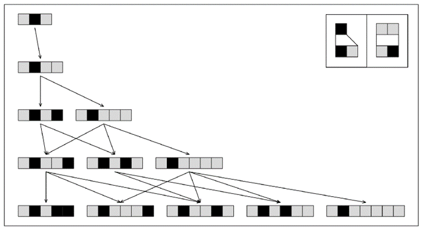
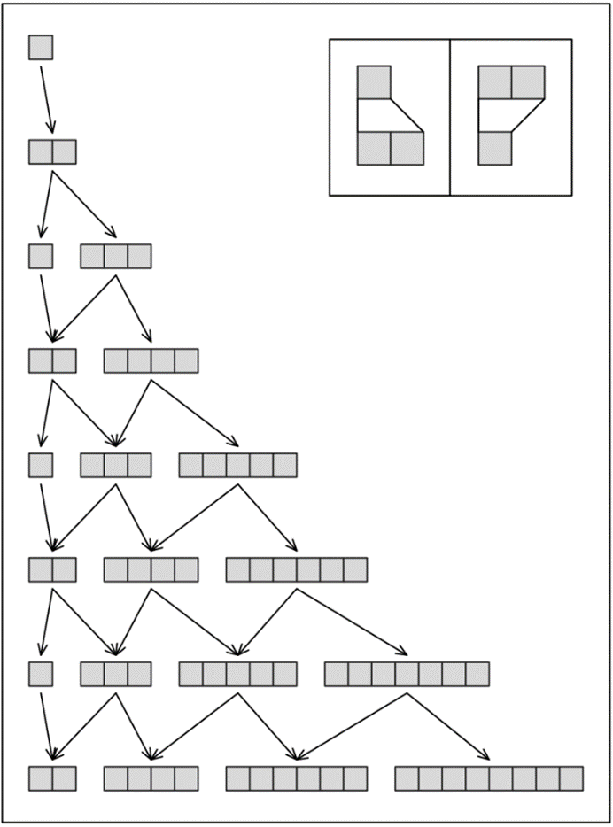
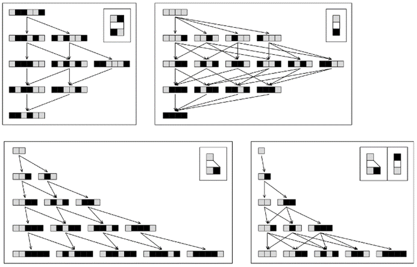

### 9.11  时间中的唯一性和分支性

如果我们的宇宙没有内置的全局时钟，也没有像活动元胞这样的结构，那么在最低层次上，其规则的应用方式几乎不可避免地会存在至少一些任意性。

然而，在上一节中，我们发现了一个相当显著的事实，即存在这样的规则，即无论这些规则如何应用，相同的因果网络——以及因此对宇宙相同的感知历史——总是会出现。

但最终，我们宇宙的底层规则是否确实迫使存在一个唯一的感知历史呢？在第五章的末尾，我介绍了多向系统作为允许多重历史的系统的例子。事实证明，多向系统在基本结构上实际上与我上一节讨论的替代系统非常相似。

这两种类型的系统都在元素字符串上执行相同类型的替换。但在替代系统中，每一步总是只执行一组替换，得到一个新的字符串；而在多向系统中，则执行所有可能的替换，因此通常会生成许多新的字符串。

下面的图片展示了这一机制如何工作的一个简单例子。在这张特定图片的第一步中，恰好只有一个符合规则的替换可以进行，因此只生成了一个字符串。但在后续步骤中，可以进行几种不同的替换，因此生成了几个字符串。一般来说，像这样的图片中的每一条路径都对应于多向系统演化过程中可能存在的一个历史。

>一个多向系统的简单例子，其中在每个步骤中，都尽可能地对每个字符串进行替换。

(p 504)

那么，我们宇宙的终极模型是否可能基于一个多向系统呢？起初，人们可能不这么认为。因为我们的日常印象是，我们的宇宙只有一个确定的历史，而不是一堆不同历史的集合。而且，如果我们能够从外部观察一个多向系统，我们会立即看到存在不同的路径，对应于不同的历史。

但关键点是，如果我们宇宙的完整状态实际上就像多向系统中的一个单一字符串，那么我们永远无法从外部观察这个多向系统。作为多向系统内部的实体，我们的感知不可避免地会认为只遵循了一条路径，对应于一个单一的历史。

如果有人能够从外部观察多向系统，这条路径看起来会相当任意。但对我们这些处于多向系统内部的人来说，它是代表我们经历的唯一路径。

直到几个世纪前，人们还普遍认为地球在空间中有着某种根本上的独特位置。但渐渐地，人们开始明白事实并非如此，从某种意义上说，仅仅是因为我们的存在，才使得我们在空间中的特定位置看起来具有任何独特性。然而，至今仍有人相信我们——以及我们的宇宙——在某种程度上有着独特的历史。但如果事实上我们的宇宙是多向系统的一部分，那么这将不是真的。实际上，我们宇宙所经历的特定历史中唯一独特的事情就是它是我们所经历的历史。

从纯人类的角度来看，想到我们存在的所有细节在本质上都不是独特的，而且在多向系统中可能存在其他路径，导致一切都将不同，这让我感到相当失望。从科学的角度来看，也不得不承认，我们宇宙的一些特征并不是由任何一组有限的底层规则决定的，而是在某种程度上只是与我们在多向系统中恰好遵循的特定路径相关的历史偶然事件，这也同样令人不满。

在第七章的前几部分，我们讨论了我们在许多自然系统中观察到的表观随机性的各种可能起源。如果宇宙是由一个多向系统描述的，那么就会有一个额外的随机性来源：即与我们经历的历史相对应的路径的任意性。

(p 505)

在许多方面，这种随机性与我们在第七章开头讨论的环境随机性相似。但一个重要的区别是，即使人们能够有效地将一个系统从宇宙的其余部分中完全隔离开来，这种随机性仍然会发生。如果过去人们在一个这样的系统中看到了表观随机性，那么除了假设存在一个潜在的多向系统之外，似乎别无选择。但本书的一个发现是，实际上，仅仅通过遵循明确的底层规则，就有可能产生看似几乎完美的随机性。

事实上，我并不期望随机性的观察能够合理地证明我们的宇宙是多向系统的一部分。而且，我猜测，要确定这一点，唯一的办法实际上是找到一组具有特定属性的多向系统规则，即无论遵循哪条路径，这些规则都会始终产生与我们宇宙的各种观测特征相符的行为。

在某种程度上，一个多向系统能够始终表现出任何特定形式的行为可能会让人感到惊讶。因为人们可能会想，有这么多不同的路径可供选择，几乎任何行为都可能在某条路径上发生。事实上，如下图所示，构造一个能够产生特定类型所有可能字符串的多向系统并不难。

但是，如果人们不仅关注单个字符串，而且关注多向系统中沿路径存在的字符串序列，那么就会发现这些序列不再那么随意。事实上，在任何具有有限规则集的多向系统中，这样的序列都必须受到各种约束。

一般来说，多向系统中的每条路径都可以被认为是由多向系统规则中指定的替换可能应用的方式序列定义的。而每条这样的路径又反过来定义了我们在上一节中讨论的那种因果网络。但正如我们之前所见，某些底层规则具有这样的属性：无论替换以何种顺序应用——从而无论多向系统中遵循哪条路径——这种因果网络的形式最终都是相同的。

>一个能够生成任意长度字符串的多向系统，但其中只有特定长度的序列实际上会出现在任何路径上。

(p 506)

下面的图片展示了一些具有这种属性的规则的简单示例。而且，事实证明，从多向系统路径的总体模式中识别出这种属性的存在是相当容易的。

如果从给定的初始字符串开始，那么通常通过应用不同的替换来生成不同的字符串。但是，如果要获得相同的因果网络，那么必须总是存在可以应用于已生成字符串的替换，从而产生相同的最终字符串。这意味着在多向系统中，任何两个发散的路径都必须在仅一步之内就能再次收敛——这样，像下面这样的图片中的所有箭头都必须位于四边形的边上。

然而，大多数多向系统并不完全具有这种属性，因此，通过遵循它们中的不同路径获得的因果网络将不会完全相同。但是，事实证明，每当路径最终能够收敛时——即使不是在固定数量的步骤内——在足够大的规模上，所获得的因果网络中必然存在相似性。

在单个事件层面上，因果网络的结构通常会有很大差异。但是，如果查看足够大的事件集合，这些细节往往会消失，无论选择哪条路径，因果网络的整体形式在本质上都是相同的。这意味着在足够大的规模上，宇宙将呈现出一个独特的历史，尽管在单个事件层面上会存在相当大的任意性。

>具有完全相同因果网络的多向系统示例。所有这样的多向系统都具有这样的属性，即每一对在某个特定步骤上发散的路径都可以在接下来的步骤上再次收敛。显示的第一条规则具有对字符串中的元素进行排序的效果。

(p 507)

如果多向系统中的收敛性不足，那么仍然可能会陷入不同类型的字符串中，这些字符串永远不会相互产生。如果发生这种情况，那么这意味着宇宙的历史实际上可以遵循许多真正独立的分支。但是，每当多向系统的演化产生显著的随机性时，这通常似乎并不会发生。

因此，这表明在某种程度上，多向系统并不太难以重现我们对宇宙中或多或少确定发生的事情的日常感知。但是，虽然这意味着宇宙因果网络中可能存在任意性，但我仍然倾向于怀疑并非如此——而且事实上，宇宙所遵循的特定规则最终具有这样的属性，即它们总是产生相同的因果网络。

