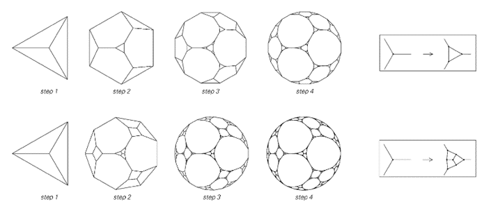
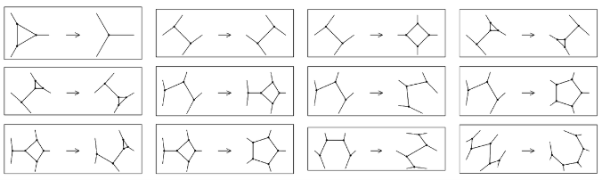
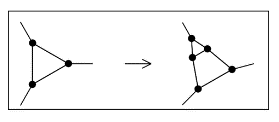
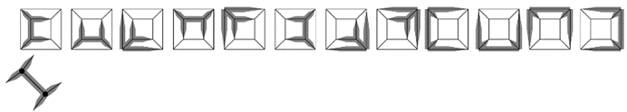
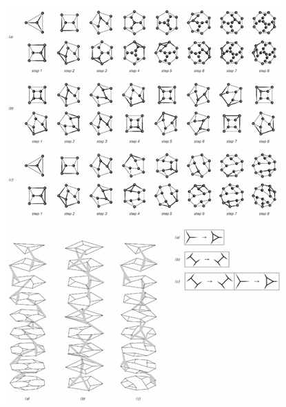
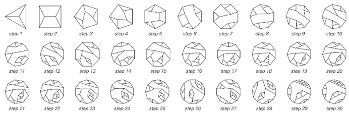
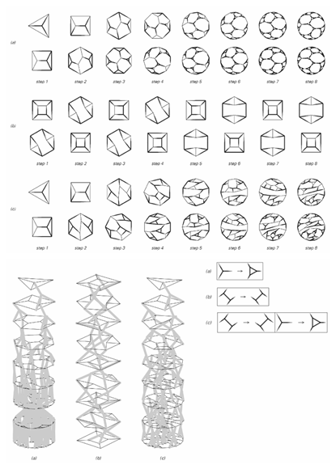
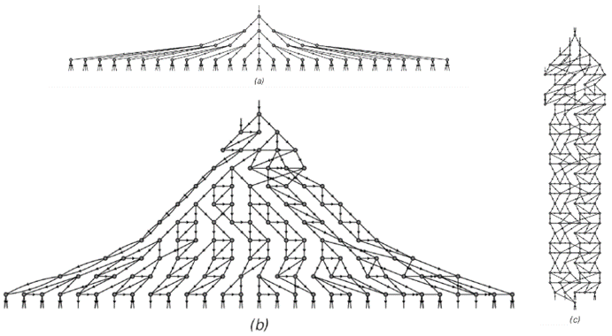
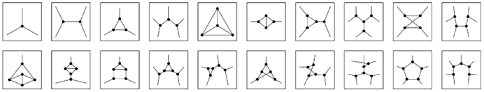
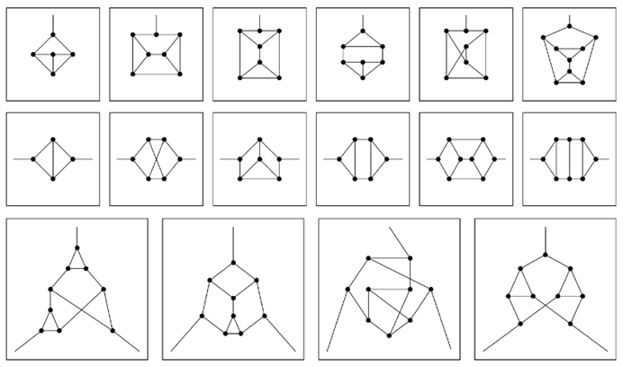

### 9.12  网络的演化

在本章的前面部分，我提出空间在最底层可能由巨大的节点网络构成。但是，这样的网络可能会如何演化呢？

最直接的可能性是，它的工作原理可能与我们在过去几节[9, 10, 11]中讨论的替换系统非常相似——即在网络中的每一步，都可以根据某些固定规则用其他部分替换网络中的某些部分或某些部分。

对面页面顶部的图片展示了两个非常简单的例子。从一个连接类似于四面体边缘的网络开始，所示的两个规则都是通过用某个固定的节点群在每个步骤上替换每个节点来工作的。

这个设置与我们在第83页和第187页讨论的与邻居无关的替换系统非常相似。正如在这些系统中一样，可以产生复杂的结构，但这些结构总是呈现出高度规则的嵌套形式。

(p 508)

那么更一般的替换系统呢？对于网络来说，有没有类似的系统呢？答案是肯定的，它们基于不仅替换单个节点，而且替换节点群，如下面第二组图片所示。

在之前章节中讨论的字符串替换系统中，给定的规则可以涉及用任何其他元素块替换任何元素块。但在网络中，不可避免地会有一些限制。例如，如果一个节点群与网络其余部分有一定数量的连接，那么它就不能被一个具有不同数量连接的节点群所替换。此外，不能像下面第一张图片那样进行替换，即从对称的节点群替换为一个需要选择特定方向的节点群。

>在每个步骤中，每个节点都被一个固定的节点群所替换的网络演化。所得网络具有规则的嵌套形式。极限网络的维度分别是 Log[2,3] ≃ 1.58 和 Log[3,7] ≃ 1.77。

>涉及在网络中用其他节点群替换节点群的规则示例。所有这些规则都保持了网络的平面性。请注意，其中一些规则不能反向进行，因为它们的右侧太对称，无法确定应使用左侧的哪个方向。

(p 509)

但是，尽管有这些限制，仍然可以进行相当多的替换；例如，总共存在419种不同的替换方式，涉及不超过五个节点的节点群。

那么，给定一个特定形式的节点群的替换，应该如何将这种替换实际应用于网络呢？起初，人们可能会认为可以设置一个类似于元胞自动机的模拟，并一次性替换所有相关的节点群。

但通常这并不可行。因为如下面第二张图片所示，在给定网络中，特定形式的节点群通常可以以许多重叠的方式出现。

这个问题本质上与我们之前在字符串替换系统中遇到的元素块问题[9, 10, 11]没有区别。但一个额外的复杂性是，在网络中，与字符串不同，元素的顺序并不是立即可见的。

然而，仍然可以设计一些方案来决定在网络中的哪个位置进行替换。一个相当简单的方案，如对面页面所示，允许在每个步骤中只进行一次替换，并选择替换的位置以影响最近更新最少的节点。

在页面上半部分的每对图片中，上面一张显示了替换前的网络形式，下面一张显示了替换后的结果——在两种情况下，都突出了参与替换的节点群。在页面下半部分的3D图片中，连续步骤中出现的网络被堆叠在一起，每个替换中涉及的节点由灰色线条连接。

>一个替换，其结果方向无法确定。

>左下角节点群在特定网络中的12种出现方式。在所示特定情况下，每种方式都与另外四个方式中的节点完全重叠。

(p 510)

>在这些网络演化的例子中，每个步骤都根据所示规则替换单个节点群。每对图片分别代表每次替换前后的网络状态。在这两种情况下，受替换影响的节点都被突出显示。替换发生的位置由需要涉及网络中尽可能旧的节点的要求决定。上面图片中的节点是用“时钟”绘制的。时钟中黑色扇区的起始角度表示节点的创建时间，而其结束角度表示当前步骤，因此较旧的节点具有较大的黑色扇区。

(p 511)

不可避免的是，这些图片的绘制方式存在一定的随意性。因为基本规则只规定了网络中连接的模式，而没有规定节点在页面上的布局方式。为了明确在不同步骤中获得的网络之间的关系，即使是相同的网络也可能以略有不同的方式绘制。

然而，对于规则（a），很容易看出它产生了一个简单的嵌套结构，与第509页上所示的结构直接类似。而对于规则（b），则得到了明显的重复行为。

那么更复杂的行为呢？事实证明，即使是规则（c），它本质上只是规则（a）和（b）的组合，也已经可以产生更复杂的行为。

下面的图片显示了该规则演化的更多步骤。所得到的行为似乎永远不会重复，所产生的网络也不具有任何明显的嵌套形式。

那么其他替换方案呢？对面页面上的图片展示了如果在每个步骤中不仅允许单个替换，而且允许所有不重叠的替换，会发生什么情况。

网络的构建需要较少的步骤，但结果在性质上与前一页相似：规则（a）产生嵌套结构，规则（b）产生重复行为，而规则（c）产生的行为看似复杂，并在某些方面呈现随机性。

>这是前一页中规则（c）演化的更多步骤。随着步骤的连续进行，节点的数量以不规则（但大致呈线性）的方式增加。

(p 512)

>这些是根据与第511页相同的基本底层规则进行的网络演化示例，但现在每一步都替换所有可能的不重叠的节点群。

(p 513)

就像字符串上的替换系统一样，人们可以找到因果网络来表示网络上不同更新事件之间的因果关系。作为示例，下面第一组图片展示了前一页上演化过程的因果网络。

在相对简单的规则（a）的情况下，结果表明结果与所使用的更新方案无关。但对于规则（b）和（c），不同的方案通常会产生不同的因果网络。

那么，哪些基本替换规则会导致因果网络与规则的应用方式无关呢？情况与字符串非常相似——基本标准只是规则中出现的所有替换都应该是针对那些永远不会自我重叠或相互重叠的节点群。

下面第二组图片显示了所有可能的不同节点群，最多包含五个节点——其中除了三个之外，其余的都可以自我重叠。

>这些因果网络代表了前一页上所示网络演化过程中更新事件之间的关系。

>包含最多五个节点的所有可能的不同节点群，无需考虑平面性。

(p 514)

但在稍大的节点群中，发现有许多节点群不会自我重叠——实际上，一旦每个悬挂的节点之间至少有两个连接，这种情况就变得普遍了。

下面列出了前几个示例。在几乎所有这些示例中，不仅单个节点群内部没有重叠，而且不同节点群之间也没有重叠。这意味着基于这些节点群集合的替换规则将具有这样的性质：它们产生的因果网络与所使用的更新方案无关。

我之前展示的各种规则的一个特点是，它们都保持了网络的平面性——也就是说，如果从一个可以在平面上绘制而不交叉任何线条的网络开始，那么随后得到的每一个网络也将具有这一性质。

然而，在我们的日常经验中，空间显然并不具备这一性质。但除了显示实际发生情况的实际问题之外，实际上在设置能够产生非平面性的规则方面并没有根本的困难——事实上，许多基于以下节点群的规则都会这样做。

因此，最终，如果有人设法找到了宇宙的终极规则，我预计它们将产生在小范围内看起来主要是随机的网络。但这种随机性很可能正是允许空间维度出现明确且稳健的3值的原因——尽管我们宇宙中所有复杂的现象也必须在同一网络的结构中以某种方式得到表示。

>没有自我重叠且大多也没有相互重叠的最简单的节点群。对于不重叠的节点群集合的替换具有因果不变性的性质。

(p 515)

