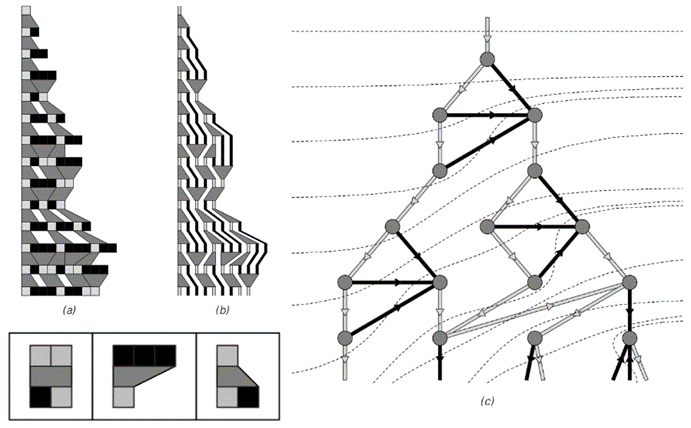
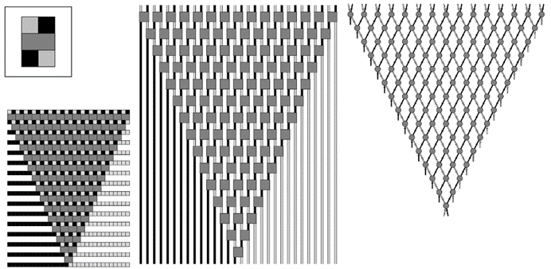
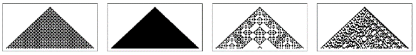
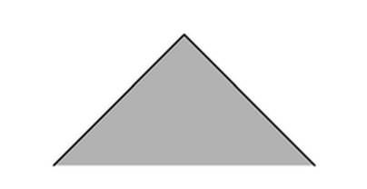
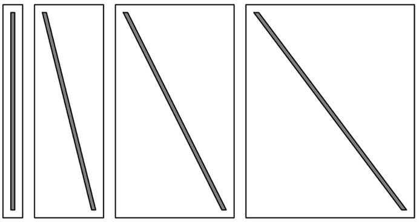
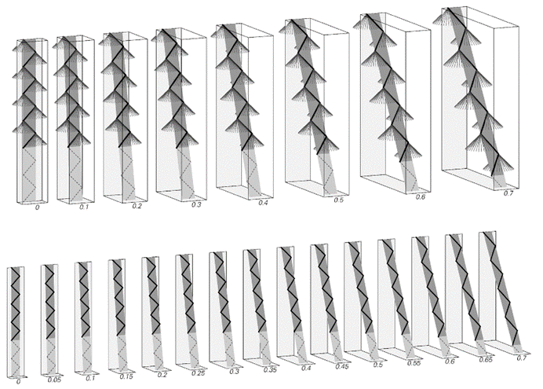

### 9.13  空间、时间和相对论

在前面的几节中，我论证了作为宇宙中的观察者，我们所能观察到的一切在某种层面上都必须纯粹地与宇宙中事件之间的因果联系网络相关联。而在过去的几节[10, 11, 12]中，我概述了一系列模型类型，说明了这样的因果网络实际上是如何建立起来的。

但是，因果网络的性质与我们通常的空间和时间观念有什么关系呢？结果发现，这里有一些微妙的差异——但这些差异似乎正是最终产生相对论理论的原因。

正如我们在前面的章节[9, 10, 11]中所看到的，如果有一个系统的明确演化历史，那么就可以很容易地从中推导出因果网络。但是，如果只给出一个因果网络，那么关于演化历史我们能说些什么呢？

下面的图片展示了如何从由特定演化历史推导出的因果网络中的一组特定切片中恢复出该演化历史中的连续步骤。但是，如果选择另一组切片会怎样呢？一般来说，得到的字符串序列将不会与任何可能来自同一底层替换系统的东西相对应。

>通过从因果网络中选取适当的切片来恢复演化历史中状态的连续性的一个例子。任何一致的切片选择都将对应于一个可能的演化历史——具有相同的底层规则，但潜在地有不同的替换应用顺序确定方案。

(p 516)

但是，如果有一个系统，它产生的因果网络不依赖于其底层规则的应用方案，那么情况就不同了。在这种情况下，任何一致地将因果网络划分为过去和未来的切片都必须对应于底层系统的一个可能状态——而任何不重叠的此类切片序列都必须代表系统的一个可能的演化历史。

如果我们能够明确地看到与我们的宇宙相对应的系统的特定底层演化历史，那么这将在某种程度上立即为我们提供宇宙中空间和时间的绝对信息。但是，如果我们只能观察到宇宙的因果网络，那么我们对空间和时间的了解就必然需要通过间接观察因果网络的切片来推导出来。

事实上，只有一些因果网络才能产生合理的空间概念。因为我们可以将因果网络中的连续切片视为对应于时间上连续时刻的状态。但是，要有一个可以合理地视为空间的东西，就必须能够识别出一些或多或少保持不变的背景特征——这意味着因果网络必须在时间上连续产生的状态之间产生一致的相似性。

人们可能认为，如果底层系统在连续步骤上不发生变化，那么这将立即为空间提供一个固定的结构。但事实上，如果没有更新事件，那么根本不会构建出任何因果网络。因此，像下一页顶部所示的系统是最简单的系统之一，它甚至能产生一些模糊地类似于普通空间的东西。

在实践中，我当然不期望即使在我们宇宙中那些看似没有发生什么大事的部分，其因果网络也会像下一页顶部所示的那样简单。事实上，正如我在上一节末尾所提到的，我预期的是，在小尺度上，总是会出现各种复杂且看似随机的行为——尽管在大尺度上，这些行为通常会被冲淡，从而呈现出我们通常与空间相关联的那种一致的平均特性。

(p 517)

我们通常所体验到的空间的一个基本特征是它的局部性，这种局部性导致在某个特定位置发生的大多数事情最初只能影响离它们非常近的事物。

这种局部性被构建到像元胞自动机这样的系统的基本结构中。因为在这样的系统中，底层规则允许一个特定单元格的颜色在每个步骤中只影响其紧邻的邻居。这导致在这样的系统中，效果只能以有限的速度传播，例如，这在下方第二组图片中的模式边缘的最大斜率中得到了体现。

在物理学中，似乎也存在一个最大速度，即任何事件的影响可以传播的速度：光速，大约等于每秒3亿米。在时空物理学中，人们经常绘制像下方所示的那种“光锥”来指示从空间中某个特定位置在特定时间发出的光信号将到达的区域。那么，在因果网络中，这个概念的对应物是什么呢？

>一个非常简单的替换系统，其因果网络具有可以视为对应于一维普通空间高度规则理想化的切片。该规则实际上只是将元素排序，使黑色元素排在前面，并且无论使用什么更新方案，都会产生相同的因果网络。

>元胞自动机产生的图案示例，说明了第6章中讨论的一个事实，即每个图案的边缘都有一个最大斜率，等于每步一个细胞，这对应于信息传输速率的绝对上限——类似于物理学中的光速。

(p 518)

答案很直接，因为因果网络的定义本身就表明，要想了解某个特定事件的影响如何传播，只需在因果网络中跟随该事件之后的连续连接即可。

但抽象地说，没有理由认为这些连接会导向在空间上可以以任何方式视为附近的点。在本书中我所研究的各种底层系统中，许多在其基本规则中并没有特定的局部性。但我在过去几节[10, 11, 12]中讨论的关于字符串和网络的具体系统类型确实具有一定的局部性，因为它们所做的每次替换都只涉及少数几个附近的元素。

人们可能会选择考虑像这样的系统，只是因为它们的规则似乎更容易指定。但它们的局部性在产生任何可以合理识别为空间的东西时似乎也很重要。

因为如果没有局部性，那么在通过因果网络产生的连续切片中，将很难以特定的方式匹配对应的部分。因此，连续切片之间将不会有一致性，这是拥有稳定空间概念所必需的。

在字符串替换系统的情况下，底层替换规则的局部性立即意味着系统中影响的整体局部性。因为系统中的不同元素总是以一维字符串的形式排列，结果是局部替换规则只能将影响传播到字符串中附近的元素——这与一维元胞自动机非常相似。

然而，如果处理的是基于网络的底层系统，那么情况可能会更加复杂。因为正如我们在前几节讨论的——并且将在本章的最后几节再次讨论——网络的结构与普通空间的结构之间通常只有近似的对应关系。因此，例如——我们稍后将结合量子现象进行讨论——有时可能会存在一种连接网络各部分的线，而这些部分在三维空间中通常不会被认为是相邻的。因此，当网络中在连接上相邻的节点群被更新时，它们可能会将影响传播到空间中可能被认为是遥远的点。

>物理学中光锥的示意图。在空间中的一点发出的光通常会随着时间的推移扩散成一个锥形，其横截面在这里以示意图的形式展示。

(p 519)

然而，如果网络要与我们在宇宙中看似存在的空间相对应，那么这种现象必须不太重要——最终，必须近似地存在一种简单的局部性，例如第518页中简单因果网络所存在的那种局部性。

在下一节中，我将讨论像粒子这样的实际物理实体如何在由因果网络表示的系统中传播。但最终，因果网络的核心在于它们的连接代表了所有可能的影响传播方式。然而，这些连接也最终定义了我们在系统中对空间和时间的概念。特别是在像第518页上那样规则的因果网络中，人们可以立即将因果网络中的每个连接视为在特定时间间隔内在空间中传播一定距离的影响。

那么，对于更复杂的因果网络呢？人们可能会想象，它的连接可能代表空间中不同的距离和时间上不同的间隔。但是，除了查看因果网络中的连接之外，没有独立的方法来计算空间中的距离或时间间隔。因此，最终唯一有意义的是，将因果网络中的每个连接都视为对应于空间中相同的基本距离和时间上的基本间隔来测量空间和时间。

人们可能会猜测，这个基本距离大约是10-35米，而基本时间间隔大约是10-43秒。但无论这些值是多少，一个关键点是它们的比率必须是一个固定的速度，我们可以将其与光速相对应。因此，这意味着在某种意义上，因果网络中的每个连接都可以被视为代表以光速传播的影响。

有了这个认识，我们现在几乎可以看到，我所讨论的系统类型几乎不可避免地会成功地再现相对论理论的基本特征。

(p 520)

但首先，我们必须考虑运动的概念。

说一个人没有动，意味着他在某种程度上想象自己在整个时间过程中都在同一个空间区域内取样。但如果一个人在移动——比如说以固定的速度——那么这意味着他想象自己正在取样的空间区域会随着时间系统地移动，如下面的简单图示所示。

但正如我们在讨论因果网络时所看到的，人们如何选择在不同时间匹配空间在很大程度上是任意的。事实上，人们可以仅仅将不同的运动状态视为对应于这样的不同选择：在每种情况下，人们都将空间匹配起来，以便将自己所处的点视为在整个时间过程中都是相同的。

以固定速度运动则是最简单的情况——也是所谓狭义相对论所强调的情况。至少在第518页图片中那样高度规则的因果网络背景下，这有一个简单的解释：它只是对应于以不同角度观察因果网络的切片。

一般来说，因果网络中连续的平行切片对应于底层系统在不同时间点的连续状态。但在像第518页图片那样的图示中，没有任何东西能绝对地确定这些切片的整体角度。关键在于，实际上人们可以将不同角度的切片解释为对应于不同固定速度的运动。

如果角度太大，以至于切片之间存在上下连接，那么就会出现问题。但除此之外，无论角度如何，连续的切片都必须对应于底层系统可能的演化历史。

人们可能会认为，从不同角度切片得到的状态必然只与不同组的基本规则相一致。但事实并非如此，相反，完全相同的规则可以重现所有角度的切片。这是因为第518页上的替换系统具有因果不变性的性质——即无论使用哪种方案来应用其基本规则，它都会给出相同的因果网络。

在不像第518页上那样规则的因果网络中表示匀速运动会稍微复杂一些。但是，只要空间有足够的均匀性以形成稳定的结构，人们仍然可以想象类似于在不同角度下的平行切片，它们代表着不同固定速度下的运动。

>固定速度下运动的时空图形表示。

(p 521)

关键是，每当底层系统具有因果不变性时，完全相同的基本规则就可以解释在不同角度切片中看到的现象。这意味着，无论运动速度多快，实际上都会应用相同的规则。

值得注意的是，物理学中也似乎发生了同样的事情。因为日常经验以及各种详细的实验都强烈支持这样的观点：只要没有加速度或外力的影响，物理系统就会以完全相同的方式工作，无论它们的运动速度有多快。

起初，人们可能无法想象，任何在某个层面上只是对各种基本元素应用固定程序的系统，能够成功地捕捉到运动现象。因为显然，像典型的元胞自动机这样的系统就不行——例如，它在不同角度下的有效演化规则通常会有很大的不同。但是，有两个关键的想法使得运动在我所讨论的这类系统中得以实现。首先，因果网络可以表示所有可以观察到的东西。其次，由于因果不变性，通过相同的底层规则可以产生因果网络中的不同切片。

从历史上看，物理过程应该总是独立于整体运动的想法至少可以追溯到三百年前。从这个想法出发，人们期望例如光应该总是以其通常的速度相对于任何发射它的物体传播。但是，如果一个人恰好相对于这个发射体在运动呢？光看起来会以不同的速度传播吗？在声音的情况下会是这样。但大约在19世纪末人们发现，在光的情况下并不是这样。而狭义相对论的提出，本质上就是为了解释这一令人惊讶的事实。

然而，在过去，似乎没有明显的潜在机制能够解释这一基本理论的有效性。但现在看来，我所描述的离散因果网络模型几乎不可避免地能够做到这一点。

(p 522)

从本质上讲，原因是——正如我上面所讨论的——任何因果网络中的每个单独连接几乎都可以通过定义来表示光速下的效应传播。所出现的空间整体结构可能很复杂，而且可能存在最终以各种速度移动的对象。但至少在局部上，单个连接基本上将光速定义为任何效应传播的固定最大速率。关键在于，无论效应源移动得多快，它们都会这样做。

因此，人们可以使用基本的标准论证来推导出所有从普通相对论理论中熟悉的各种现象。一个典型的例子是时间膨胀，即对于以一定速度移动的系统来说，一个固定的时间间隔似乎对应于静止系统中更长的时间间隔。下一页的图示示意性地展示了这一最初出乎意料的结果是如何产生的。

基本思想是考虑一个可以充当简单时钟的系统在不同速度下移动时会发生什么。在传统的物理学层面，人们可以将时钟想象为有一个光子在固定距离的两面镜子之间来回反射。但更一般地说，人们可以想象在因果网络的某个固定片段中存在的交错连接。

在下一页的图示中，时间沿着页面向下流逝。时钟的内部机制用一条锯齿状的黑色线表示——这条线的每次扫过都对应着一个时间单位的流逝。

黑色线总是以光速移动——因此它总是位于光锥的表面上，如图片顶部一行所示。但在接下来的图片中，整个时钟被设定以越来越接近光速的速度移动。

每幅图中的深灰色区域代表时钟的固定时间量——对应于黑色线条的固定次数扫过。但如图所示，这基本上只是一个几何问题，可以看到这个深灰色区域将对应于静止系统中越来越长的时间量——这完全符合相对论时间膨胀的标准公式所预测的方式。

(p 523)

>相对论时间膨胀经典现象的简单推导。这些图示展示了一个非常简单的理想化时钟在不同光速分数下的行为。这个时钟可以想象为由一个光子在固定距离的两面镜子之间来回反射组成。（在我的方法中，更一般地说，它也可以被视为因果网络的一个片段。）时间显示为沿着页面向下流逝，因此时钟中的光子描绘出一条锯齿状路径。基本假设——在我的方法中，这只是因果网络基本属性的结果——是光子总是以光速移动，因此其路径总是位于像图片顶部一行所示的光锥表面上。时钟的固定时间间隔——如深色灰色区域的长度所示——对应于静止时越来越长的时间间隔。这种时间膨胀的量由经典相对论公式1/Sqrt[1-v2/c2]给出，其中v/c是时钟速度与光速之比。在粒子加速器中经常观察到这种时间膨胀——并且在GPS卫星中必须对其进行校正。它导致了所谓的孪生悖论，即在一个高速航行的宇宙飞船中的双胞胎成员所经历的时间将少于留在地球上的双胞胎。时间膨胀是一种普遍现象，不仅仅局限于像图示中那样简单的时钟，这在我的方法中依赖于因果网络的一般属性。一旦建立了基本假设，这里给出的时间膨胀推导在原则上与1905年给出的原始推导没有不同，尽管我相信它在许多方面都要清晰得多。请注意，有必要考虑二维运动——以便时钟作为一个整体可以垂直于其内部光子的路径移动。如果这些线是平行的，那么不仅会得到纯粹的时间膨胀，还会得到时间膨胀和长度收缩的混合。

(p 524)

