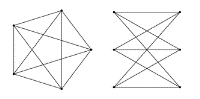

### 9.14  基本粒子

宇宙中有一些方面——特别是时空结构——当今物理学倾向于认为它们是连续的。但过去一个世纪以来，人们已普遍接受所有物质都是由可识别的离散粒子组成的这一事实。

实验发现，存在数量相对较少的几种根本不同的粒子，电子、光子、μ子和六种基本类型的夸克就是其中的几个例子。而宇宙的一个引人注目的规律性就是，同一类粒子——比如电子——在性质上似乎绝对相同。

但粒子究竟是什么？就目前的实验所能揭示的而言，例如，电子的尺寸为零，且没有内部结构。但特别是如果空间是离散的，那么电子和其他粒子似乎几乎不可避免地由更基本的元素组成。

那么，这究竟是如何工作的呢？我怀疑的一个立即的可能性，实际上与实际情况相差不远，即这些粒子类似于我们在本书中之前看到的，如以下所示的4类元胞自动机系统中的局部结构。如果真是这样，那么就意味着在最低层次上，宇宙的规则不需要引用特定的粒子。相反，我们所看到的所有粒子都只是由更基本的元素形成的结构。

在网络中，可视化局部结构可能有些困难。但下面的图片仍然展示了一个简单的例子，说明局部结构如何在一个规则的平面网络上移动。

这两个页面上的例子都展示了在非常规则的背景上存在的结构。但要获得物理学中实际粒子的任何形式的现实模型，就必须考虑在更复杂和随机的背景上的结构。任何有可能代表实际空间（即使是看似空白的部分）的网络，无疑都会显示出各种看似随机的活动。因此，任何可能代表粒子的局部结构都必须能够在这种随机的背景上持续存在。

>第4类元胞自动机中粒子状局部结构的典型例子。

>网络中的粒子状局部结构。

(p 525)

然而，一开始人们可能会认为，这种随机性会不可避免地破坏任何形式的明确持久的结构。但下面第一组图片显示了两个简单的例子，其中随机性并没有破坏这种结构。在第一个例子中，存在持久的局部裂纹。在第二个例子中，存在两种不同类型的区域，它们由具有明确特性的边界分隔开，这些边界像局部结构一样持续存在，直到它们相互湮灭。

那么网络呢？事实证明，在这里同样可以得到即使在随机性存在的情况下也能持久的明确结构。为了看到这样的例子，请考虑设置类似第509页的规则，以保持网络的平面性。

从一个平面网络开始——即它可以被平展地画在一张纸上，没有任何线条交叉——这样的规则当然可以产生各种复杂且看似随机的行为。但是，由于规则的设置方式，它们产生的所有网络都必须是平面的。

如果从一个像下面图片中那样的网络开始，该网络只能用交叉的线条绘制，那么网络的非平面性将会保持。但这种非平面性在多大程度上与网络中的明确结构相对应呢？

>一维元胞自动机的例子，这些自动机即使在很大程度上随机的背景下也支持各种形式的持久结构。这些是代码为294和1893的三色总体规则。

>一个具有单一不可约线条交叉的网络。

(p 526)

通常，一个非平面网络可以有多种不同的绘制方式，每种方式都在不同的地方有线条交叉。但图论中有一个基本结论表明，如果一个网络不是平面的，那么它必然包含可以简化为顶部图片中两种形式之一（或对于每个节点有三个连接的网络，仅第二种形式）的特定部分。

因此，这意味着我们实际上可以有意义地将非平面性与明确的结构联系起来。虽然从某种程度上说，这种结构可以在网络中扩散，但关键是它必须实际上具有第二种图片所示形式的局部核心。

一般来说，我们可以想象网络中有几块非平面部分——可能每块都像是一个提手。但如果网络的底层规则保持平面性，那么这些非平面部分必须各自独立持久存在——并且在某种意义上，它们只能通过相互湮灭等过程消失。

那么，这些非平面部分可能像物理学中的实际粒子吗？

在宇宙网络规则的现实情况下，平面性本身可能不会保持。但物理学中的观察表明，存在几种守恒量，如电荷。最终，这些量的值必须反映由网络演化规则保持的底层网络的属性。

如果这些规则满足我之前几节[10, 11, 12, 13]中讨论的因果不变性约束，那么我怀疑这意味着它们将不可避免地表现出各种附加特征——可能特别包括通常所说的局部规范不变性。

但这里最相关的是，与非平面性类似，网络演化规则所守恒的量的非零值似乎可能与网络中的某种局部结构或连接纠缠有关。我怀疑，正是这样的结构定义了物理学中观察到的各种基本粒子的核心。

在本书的结果出现之前，这种观点似乎完全站不住脚。因为无论对网络及其演化的具体论点如何，传统直觉都会使人们认为粒子的复杂属性必然是由复杂的底层结构造成的。但我们在本书中反复看到的是，事实上，即使底层结构非常简单，也完全有可能产生极其复杂的现象。我怀疑，物理学中的粒子——以及它们的各种属性和相互作用——只是这一普遍现象的又一个例子。

>K5和K3,3是导致网络非平面性的两种形式。

>K3,3是如何嵌入到对面页面所示的网络中的。

(p 527)

一个立即浮现出来的、似乎表明基本粒子必须以某种方式基于简单的离散结构的事实是，它们的电荷量等属性的值似乎总是处于简单的有理数比例之中。在传统粒子物理学中，这通过解释说，如果不是全部的话，那么许多粒子在某种程度上都只是同一底层抽象对象的表现，这些对象通过一组简单的固定对称操作相互关联。但从网络的角度来看，人们可以想象一个更明确的解释：粒子的核心只有一组简单的离散可能结构——每个结构可能都通过一组对称操作以某种相当机械的方式相互关联。

但除了电荷等属性外，所有粒子的另一个重要固有属性是质量。与电荷不同，例如，基本粒子的观测质量似乎从未处于简单的比例之中——例如，μ子的质量大约是电子的206.7683倍，而τ轻子的质量大约是μ子的16.819倍。但尽管有这样的结果，但人们仍然可以设想，在真正的基本粒子质量之间最终可能存在简单的关系——因为事实证明，实际上观测到的质量还包括不同量的相互作用能。

粒子的一个定义性特征是，它可以在空间中移动，同时保持其身份。在传统物理学中，这种运动有直接的数学表示，而且通常没有必要追问其背后的机制。但在我所采取的这种方法中，运动不再是这样一个固有的概念，而粒子的运动必须被视为由一系列明确的低级步骤组成的过程。

因此，最初，人们可能会惊讶于竟然可以设定特定类型的粒子以不同的速度移动。但从上一节的讨论中可以得出，这实际上是具有显示因果不变性的底层规则的几乎不可避免的结果。因为假设在粒子周围，因果网络（以及因此的空间的表观结构）具有某种均匀性，那么以适当的角度切割因果网络总会使任何粒子看起来都处于静止状态。关键是，因果不变性则意味着在所有此类情况下都可以使用相同的底层规则来更新网络。

(p 528)

但如果存在两个以不同速度移动的粒子呢？如果以适当的角度切割因果网络以使第一个粒子看起来处于静止状态，那么与第二个粒子相关的事件会是什么样子？答案是，第二个粒子在连续切片之间移动得越多，涉及的更新事件就越多。因为实际上，与粒子在任一切片或下一个切片上相关联的任何节点都必须被更新——而且粒子移动得越多，这些节点之间的重叠就越少。此外，与粒子移动的方向相比，事件的模式中不可避免地会出现不对称性。

这里有很多微妙之处，要解释正在发生的事情的细节，无疑需要相当多新的和相当抽象的概念。但我相信，将出现的一般图景是，当粒子移动得更快时，它们似乎会拥有更多与之相关联的节点。

很可能，粒子的固有属性（如电荷）与某种核心相关联，这种核心对应于涉及大致固定数量节点的明确网络结构。但我怀疑，粒子的表观运动将与一种从核心到周围空间均匀背景的某种插值“外衣”相关联。通过不同的因果网络切片，这种“外衣”的表观大小可以发生变化。但我怀疑，在特定情况下，“外衣”的大小将以某种方式与该情况下粒子的表观能量和动量相关。

在传统物理学中，一个重要的事实是粒子之间的相互作用似乎会保持总能量和动量的守恒。可以想象，这背后的原因是这种相互作用在某种程度上倾向于保持网络节点的总数。实际上，也许在大多数情况下（除了与宇宙整体膨胀相关的情况），网络的基本规则至少平均而言只是重新排列节点，而不会改变它们的数量。

(p 529)

在传统物理学中，能量和动量总是被假定为具有连续值。但就像位置的情况一样，这与足够小的底层离散元素并不矛盾。

正如我将在本章最后一节讨论的那样，量子力学倾向于让人认为动量更高的粒子在空间中的分布某种程度上会逐渐变得更加集中。那么，这与动量更高与节点更多相关联的观点如何保持一致呢？部分答案可能与以下事实有关：在网络中对应于粒子的部分之外，网络可能以与没有粒子时相同的方式匹配，从而产生均匀的空间。而在对应于粒子的网络部分内，空间的有效结构可能非常不同——例如，添加了更多的长程连接以减少整体的有效距离。

