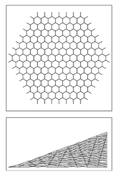
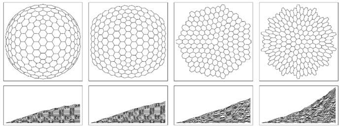
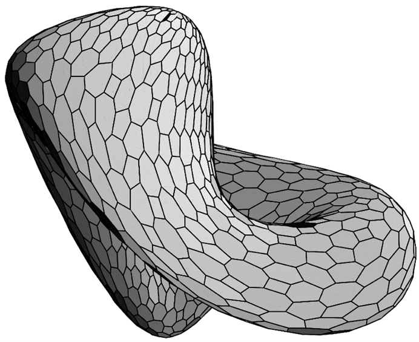

### 9.15  重力现象

与基本粒子相反，人们可以问宇宙在最大尺度上如何表现。在这种尺度上最明显的效应是重力现象。那么，这如何从我所讨论的这类模型中产生呢？

近一个世纪以来，关于重力的标准理论一直是广义相对论——它基于将重力与空间曲率相关联的想法，然后指定这种曲率如何与存在的任何物质的能量和动量相关。

一般来说，磁场对由不同材料制成的物体有不同的影响。但一个经过实验验证、相当准确的关键观察结果是，无论物体是由什么材料制成的，重力对物体运动的影响都是完全相同的。这使人们能够将重力视为空间的一般特征，而不是例如专门作用于不同物体的某种类型的力。

(p 530)

在没有重力或任何力的作用下，我们对空间的通常定义意味着，当一个物体从一点移动到另一点时，它总是沿着一条直线移动，这条直线对应于最短路径。但当存在重力时，物体通常会沿着曲线移动。然而，如果认为空间是弯曲的，那么这些路径仍然可以是最短的，即所谓的测地线。实际上，如果空间具有适当的曲率，就可以得到各种路径，如下图所示。

但在我们的实际宇宙中，是什么决定了空间的曲率呢？广义相对论的答案是，爱因斯坦方程给出了特定类型曲率值的条件，这些条件与存在的物质的能量和动量有关。然后的关键点是，在这种曲率下的空间中的最短路径似乎与在给定物质分布产生的重力影响下移动的物体所遵循的路径一致。

>空间曲率对物体路径影响的例子。在每种情况下，所有显示的路径最初都是平行的，但在存在曲率时则不再平行。这些路径是测地线，它们在表面上以最短的距离到达它们到达的所有点。（一般来说，最短可能只是局部的。）情况（b）显示了一个球体的顶部，这是一个正曲率表面。情况（c）显示了一个负曲率表面z=x²-y²，（d）是一个抛物面z=x²+y²，而（e，f）z=1/(r+δ)——由质量球体产生的空间曲率的粗略类比。

(p 531)

在传统几何学中，对于连续表面（或一般地，连续空间）的曲率概念是熟悉的。但如果宇宙在底层只是一个由节点组成的离散网络，那么曲率是如何工作的呢？在某种程度上，答案是离散网络在大尺度上必须近似于连续空间。

但事实证明，人们实际上也可以在网络的基本结构中识别出曲率。如果有一个简单的六边形阵列（如下面第一张图所示），那么它可以很容易地在一个二维平面上展开。但如果将一些六边形替换为五边形会怎样呢？这仍然是一个基本的二维表面。但是，如果试图保持所有边的长度相同，那么表面将不可避免地变得弯曲——就像足球或测地线圆顶一样。

因此，这表明在网络中，仅仅改变连接的模式就可以有效地改变整体的曲率。实际上，下面的图片展示了一系列网络，它们实际上具有一系列负值和正值的曲率。

>对应于二维平面的六边形阵列。

>具有各种极限曲率的网络。如果网络中的每个区域实际上都是一个六边形（如页面顶部的图片所示），那么网络的行为将如同它是平的。但是，如果像左侧的情况那样引入了五边形，那么网络的行为将越来越像具有正曲率——就像球体的一部分。如果像右侧的情况那样引入了七边形，那么网络的行为将像具有负曲率。在图片的底部一行中，网络是按照第479页的布局排列的，以便连续的高度给出从特定节点到连续距离r的节点数。在r很大的极限下，这个数字大约是r²(1-kr²+...)，其中k正好与曲率成正比。

(p 532)

但是，我们如何根据每个网络的结构来确定曲率呢？在本章前面部分，我们了解到如果一个网络要与某个维度d的普通空间相对应，那么这意味着从任何给定节点出发，通过r个连接，必须到达大约rd-1个节点。但事实证明，当存在曲率时，这会导致对该结果的系统性修正。

在对面页面上的每幅图中，所展示的网络可以认为与二维空间相对应。这意味着，作为初步近似，到达的节点数必须与r呈线性增长。但底部一行的图片显示，这里存在修正。具体情况是，当存在正曲率（如左侧图片所示）时，最终到达的节点数会逐渐少于r个。而当存在负曲率（如右侧图片所示）时，最终到达的节点数会逐渐增多。一般来说，对到达节点数的主要修正与曲率乘以rd+1成正比。

那么在两个维度以上的情况下会发生什么呢？一般来说，结果可能非常复杂，例如可能涉及各种形式的曲率和空间的其他特征。但事实上，对到达节点数的主要修正总是相当简单的：它只是与所谓的里奇标量曲率成正比，再乘以rd+1。而且，这里已经显示出广义相对论的一些迹象——因为里奇标量曲率也被证明是爱因斯坦方程中的一个核心量。

但是，在尝试看到更详细的对应关系时，会立即出现各种复杂情况。最明显的可能是，广义相对论的传统数学表述似乎依赖于连续空间的许多详细属性。虽然人们期望足够大的网络在某种程度上平均起来应该像连续空间一样起作用，但一开始并不清楚与广义相对论相关的属性类型将如何出现。

如果从一个普通的连续曲面开始，那么可以像下面的图片那样，通过一组平面来近似它。人们可能会认为这些平面的边缘会定义出我一直在讨论的那种网络。

>一个由平面近似的曲面，其边缘形成一个三价网络。

(p 533)

但事实上，这样的网络所包含的信息要少得多。因为仅给定一组节点之间的连接，甚至没有明显的方法来知道哪些连接应该与同一个面相关联——更不用说计算出面之间的角度之类的信息了。

然而，尽管存在这些问题，事实证明，所有最终与广义相对论相关的几何特征实际上都可以仅通过大型网络中节点的连接性来确定。

其中之一是所谓的里奇张量的值，它实际上指定了里奇标量曲率是如何由与不同方向相关的不同曲率分量组成的。

如上所述，与网络相关的标量曲率与给定节点在网络上的连续距离r内有多少个节点直接相关——或者实际上，与围绕该节点的连续广义球体内有多少个节点直接相关。而事实证明，里奇张量沿特定方向的投影仅与位于该方向圆柱体内的节点数有关。但是，即使在网络中定义一个一致的方向也并非完全简单。但其中一种方法是简单地在网络中选择两个点，然后说如果网络中的路径是这两点之间同一条最短路径的片段，则它们在同一方向上。根据这个定义，只需要在路径上的每个点设置以该点为中心的球体，就可以形成一个近似圆柱体的区域。

但现在又有一个问题需要解决：至少在其标准表述中，广义相对论是根据四维时空的属性而不是三维空间的属性来设定的。这意味着，重要的不是代表空间的特定网络的属性，而是完整因果网络的属性。

因果网络与空间网络的一个明显区别是，它们的连接是单向的。但事实证明，这正是为了建立时空里奇张量的类似物所需要的。这个想法是从因果网络中的一个特定事件开始，然后形成一个实际上是可以从那里到达的事件的锥体。为了定义时空里奇张量，我们考虑——如第516页所示——通过这个锥体的一系列类空切片，并询问当我们转到连续的切片时，锥体内的事件数量是如何增加的。经过t步后，达到的事件数将与td成正比。但随后有一个与td + 2成正比的修正，其系数是时空里奇标量和时空里奇张量沿所选类空切片序列定义的时间方向投影的组合。

(p 534)

那么这与广义相对论有什么关系呢？事实证明，当没有物质存在时，爱因斯坦方程简单地表明，时空里奇张量——以及它的所有投影——都恰好为零。例如，仍然可以有高阶曲率，但在里奇张量所描述的层面上则不能有曲率。

所以这意味着，任何其行为遵循爱因斯坦方程的因果网络，在锥体内计数节点的层面上，都必须具有与普通平坦空间相对应的相同均匀结构。正如我们在前几节中所看到的[12, 13]，许多潜在的替换规则最终会产生网络，例如，这些网络连接过于广泛，以至于无法在任何有限维空间中与普通空间相对应。但我怀疑，如果有人拥有因果不变的替换规则，并且这些规则实际上成功地保持了固定数量的维度，那么它们几乎不可避免地会导致遵循接近爱因斯坦方程的行为。

这种情况可能与我们在第8章中看到的元胞自动机中的流体行为有些类似——至少如果存在行为足够复杂以产生显著有效随机性的潜在规则，那么几乎每当规则导致总粒子数和动量的守恒时，就会出现接近普通纳维-斯托克斯方程的行为。

那么物质呢？

作为第一步，我们可以问，空间的结构对粒子之类的东西有什么影响——假设我们可以忽略粒子对空间的影响。在传统的广义相对论中，总是假设一个不与任何其他物体相互作用的粒子将沿着空间中的最短路径——或所谓的测地线移动。

(p 535)

但是，对于我们在上一节中讨论的作为网络结构存在的明确粒子呢？给定网络中的两个节点，人们总是可以识别出从一个节点到另一个节点的最短路径，该路径沿着网络中的一系列单独连接。但从某种意义上说，对应于粒子的结构通常不会适合通过这条路径。因为通常结构会涉及许多节点，因此为了能够在网络中移动，通常需要许多连接以或多或少相同的方向进行。

但是，如果假设网络（特别是因果网络）具有一定的均匀性，那么仍然可以推断出我们在上一节中讨论的粒子类型将倾向于沿着测地线移动。而在传统的广义相对论中，沿着测地线运动的想法基本上是一个假设，但现在原则上可以从底层网络模型中明确推导出来。

人们可能会认为，在没有物质的情况下，关于重力就没什么好说的了——因为毕竟爱因斯坦方程表明，至少由里奇张量描述的那种空间曲率是不存在的。但事实证明，仍然可以存在其他类型的曲率——例如由所谓的黎曼张量描述的曲率——这些曲率实际上可以导致各种现象。例子包括熟悉的现象，如围绕大质量物体的反平方引力场，以及不熟悉的现象，如引力波。

然而，尽管广义相对论的数学结构足够复杂，以至于人们往往难以看出时空效应究竟来自何处，但通常认为，物质在某种程度上最终必须为重力提供来源。在完整的爱因斯坦方程中，里奇张量不必为零；相反，它被指定为空间每一点上与该点物质的能量和动量密度的一定组合相等。因此，这意味着要知道即使在主要与重力相关的现象中会发生什么，人们通常也需要了解物质的各种性质。

但为什么一定要明确引入物质呢？传统物理学的假设是，尽管重力可以用空间的性质来表示，但我们宇宙中的其他元素却不能。但在我的方法中，一切都只是从同一个底层网络——或者从空间的结构中浮现出来。事实上，即使在传统的广义相对论中，人们也可以尝试避免明确引入物质——例如，通过想象我们称之为物质的一切实际上都是由纯重力能或由类似重力波的东西组成的。

(p 536)

但据目前所知，这些细节的运作并不成功——因此在广义相对论的层面上，除了明确引入物质之外别无选择。但我怀疑这实际上只是爱因斯坦方程和广义相对论局限性的一个迹象。

因为虽然在大尺度上，这些方程可能提供了对网络中平均行为的合理描述，但几乎可以肯定的是，在接近单个连接尺度的情况下，它们必须得到修改。然而，可以想象，如果人们以具有适当性质的物质作为表示网络中小尺度效应的方式，那么仍然可以在大尺度上使用爱因斯坦方程。

在上一节中，我提出能量和动量可能与网络中多余节点的存在有关。这现在似乎与我们在本节中看到的内容非常吻合。因为如果网络的基本规则是保持与平坦空间相同的平均节点数（在一定近似范围内），那么当存在与能量和动量相对应的更多节点时，这必须通过减少节点数的东西来平衡。但这种减少正是爱因斯坦方程在普通物质存在下所隐含的正曲率所需要的。

