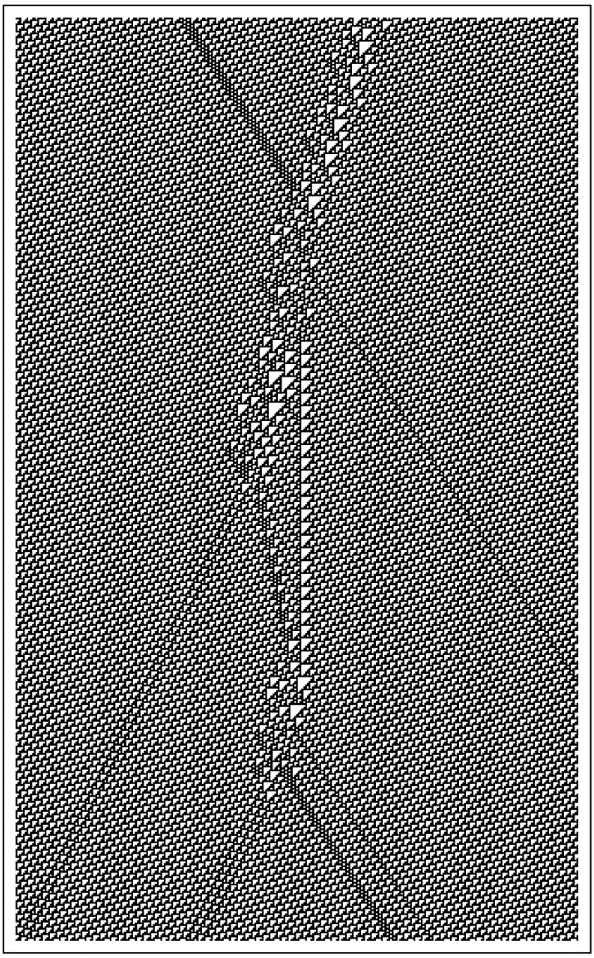

### 9.16  量子现象

从我们对日常可见可触物体的经验中，我们发展出了一种关于事物如何运作的直觉。但近一个世纪以来，人们逐渐意识到，当涉及到像电子这样的东西时，这种直觉中的一些部分已经不再正确。然而，量子理论中已经发展出了一种复杂的数学形式体系，成功地再现了许多观察到的现象。虽然这种形式体系的一些方面仍然神秘莫测，但人们越来越相信，任何基本的物理理论都必须以某种方式建立在其基础上。

(p 537)

然而，我在本书中讨论的程序类型并没有以任何明显的方式与这种形式主义相契合。但正如我们在本书中多次所见，从程序中涌现出的东西可能与其基本规则的明显内容大相径庭。事实上，我强烈怀疑，我在过去几节中讨论的程序类型最终将展现出量子理论的许多（如果不是全部）关键特征。

然而，要看到这一点并不容易。因为量子理论标准形式主义中强调的构造类型与我讨论的程序中立即可见的类型大不相同。最终，建立可靠联系的唯一可靠方法可能是设置相当完整和现实的实验模型——然后逐渐观察这些模型的限制和理想化如何与标准形式主义所期望的相匹配。然而，从我们在本章和本书早先部分所看到的内容中，已经有一些令人鼓舞的迹象可以识别。

然而，起初，事情可能看起来并不乐观。因为我关于粒子（如电子）在网络中作为持久结构的模型最初可能似乎意味着这些粒子在某种程度上是与我们日常经验中熟悉的确定对象相似的。但量子理论中有各种各样的现象似乎表明，电子实际上并不像具有独立于我们观察的确定属性的普通物体那样行为。

那么，这怎么可能是一致的呢？基本答案就是，代表我们整个宇宙的网络也必须包括我们作为观察者在内。这意味着我们无法从外部观察网络并将电子视为确定的对象。相反，我们对电子的任何推断都必须来自网络内部明确进行的过程。

但这不仅仅是在研究电子等问题时才出现的问题：它实际上是我所讨论的模型的一个完全普遍的特征。事实上，正如我们之前在本章中所看到的，正是这一特征使它们能够支持甚至像时间这样基本概念的有意义概念。在更正式的层面上，这也意味着我们所能观察到的一切都可以通过因果网络来捕捉。而正如我稍后将讨论的，我怀疑这样一个网络的因果不变性观念最终将解释量子理论的一些关键特征。

(p 538)

我在过去几节中概述的关于我们宇宙的基本图景是一个网络，其连接根据一些简单的基本规则不断更新。过去，人们可能会认为这样的系统过于简单，无法与我们的宇宙相对应。但从本书中的发现来看，我们现在知道，即使一个系统的基本规则很简单，其整体行为仍然可以极其复杂。

在最底层，我期望的是，尽管应用的规则是完全确定的，但对应于我们宇宙的网络中存在的整体连接模式将不断以足够复杂的方式重新排列，以至于看起来几乎是随机的。

然而，在稍大一些的尺度上，这种随机性将导致某种平均一致性。我认为，正是这种一致性负责维持类似于普通空间的东西——通过逐渐变化产生引力的现象。

但在这个看似随机的背景之上，可能还会叠加一些在多次网络更新中持续存在的确定结构。我认为，这些结构对应于像电子这样的粒子。

正如我在最后两节[14, 15]中讨论的那样，基本规则的因果不变性意味着这些结构应该能够以一系列均匀的速度在背景中移动。通常，像电荷这样的属性将与粒子对应结构核心处的某些特定连接模式相关联，而粒子的能量和动量则与核心周围某个外部区域中节点的大致数量相关联。

那么相互作用呢？如果对应于不同粒子的结构是孤立的，那么基本规则将使它们持续存在。但如果它们以某种方式重叠，那么这些相同的规则通常会产生不同的粒子构型。

(p 539)

在某种程度上，这种情况无疑会有点像典型4级元胞自动机的演化，如下所示。给定一组初始的持续结构，这些结构可以相互作用以产生某种中间行为模式，然后最终解析成一组再次持续存在的最终结构。

在中间行为模式中，人们也可能能够识别出一些确定的结构。那些不会持续很久的结构可能与永远持续的结构大不相同。但那些持续时间更长的结构往往会具有与真正持续的结构越来越接近的属性。虽然持续的结构可以被认为是对应于真实的粒子，但中间结构在许多方面类似于传统粒子物理学中的虚粒子。

因此，这意味着像下面这样的图片可以非常直观地被视为粒子相互作用的时空图——有点像粒子物理学中的费曼图。

然而，一个直接的区别是，在传统粒子物理学中，人们不会想象出像上面图片中那样确定和确定的行为模式。事实上，在我的宇宙模型中，很明显还有更多的事情在发生。因为像上面图片中的任何过程都必须发生在看似随机的网络小规模重新排列的背景之上。而实际上，这个背景的作用是引入一种随机环境，即使具有相同的粒子初始构型，也能以一定的概率产生许多不同的详细行为模式。

即使在传统物理学的标准量子场论中，也存在着即使在没有粒子的真空中也会具有复杂且在某些方面随机的形式的思想。量子场论的全部数学结构还远远没有完全解决。但基本观念是，对于每种可能的粒子类型，都存在一种在整个空间中连续存在的场——粒子的存在对应于该场中的一种简单结构。

一般来说，量子场论的方程似乎表明，即使在没有实际粒子的情况下，场中也可能存在各种复杂的构型。但作为一种初步近似，人们只考虑短命的虚粒子和反粒子对。事实上，对于网络来说，人们也可以经常做类似的事情。因为即使在第527页讨论的平面网络中，许多不同的连接排列也可以被视为由附近非平面持续结构对的不同构型形成的。

规则110类4元胞自动机中局部结构的碰撞。

(p 540)

谈到随机背景影响宇宙中的过程，人们很容易就会想到不同过程概率之间的某些确定关系。例如，如果某个过程有两种不同的发生方式，那么这就会暗示整个过程的总概率应该是这两种不同方式下过程发生概率的总和。

但量子理论的标准形式告诉我们，这是不正确的，实际上人们必须考虑所谓的概率振幅，而不是普通的概率。在数学层面上，这样的振幅类似于波等事物的振幅，实际上只是带有方向的数字。而量子理论告诉我们，整个过程的概率可以通过线性组合过程不同发生方式的振幅，然后查看结果大小的平方（或类似于波的强度的类似物）来获得。

那么，这种数学过程是如何从我讨论过的模型类型中产生的呢？答案似乎很复杂。因为尽管这个过程本身听起来很简单，但它所依赖的构建实际上很难仅仅基于底层网络来定义——而且我还没有找到简单的方法来解开必须做出的各种限制和理想化。

然而，一个潜在的重要观点是，将网络中的粒子仅仅视为根据某些确定的规则相互作用，并受到本质上随机的背景的干扰，这在某种程度上是有误导性的。因为这表明每个粒子相互作用实际上都有一个独特的历史——这个历史由初始条件和随机背景中存在的构型决定。

但真实的情况更为复杂。因为底层网络的更新序列可以以任何顺序进行——但每个顺序实际上都为网络提供了不同的详细历史。但是，如果存在因果不变性，那么最终所有这些不同的历史在某种意义上都必须是等价的。有了这个约束，如果将某个过程分解为几个部分，那么通常就没有简单的方法来描述这些部分的效果是如何结合在一起的。

(p 541)

而且，至少在某些情况下，明确考虑不同的可能历史，并将类似于分配给每个历史的振幅这样的东西结合起来，可能是有意义的。然而，这具体如何工作肯定会取决于人们试图查看的网络的哪个特征。

在量子理论中，如何确定像电子这样的特定粒子正在发生什么，一直是一个重大问题。根据我们对日常物体的经验，我们可能会认为，在不影响电子的情况下做到这一点是可能的。但是，如果我们只有粒子，那么为了了解某个给定粒子的信息，我们不可避免地需要有其他粒子——比如一个光子——明确地与它相互作用。在这种相互作用中，原始粒子必然会以某种方式受到影响。

事实上，仅仅一次相互作用肯定是不够的。因为我们人类通常无法感知单个粒子。事实上，在我们成功地感知到它之前，通常必须有大量的粒子或多或少地在做同样的事情。

最常使这种情况发生的方法是设置某种探测器，该探测器最初处于足够不稳定的状态，以至于单个粒子就能引发一系列后果。通常，这样的探测器被设计成可以演化到一个或另一个具有足够均匀特性的稳定状态，这样我们就可以识别出它对应于测量的确定结果。

然而，最初，这种向有序状态的演化似乎与微观可逆性不一致。但事实上——正如在许多其他看似不可逆的过程中一样——为了保持可逆性，只需要观察系统的足够细节，就可以发现任意且看似随机的行为。关键在于，在得出测量结果时，我们选择忽略这些细节。

因此，尽管我们从测量中得到的实际结果可能相当简单，但总会有许多粒子和许多事件参与其中。事实上，在传统的量子理论中，除非实际上有无穷多的粒子参与，否则任何测量最终都无法得出确定的结果。

(p 542)

正如我上面提到的，普通的量子过程似乎可以遵循不同的历史，这取决于用来决定底层规则应用顺序的方案。但是，如果将测量理想化为涉及无穷多粒子的极限情况，那么它可能会有效地确立一个单一的历史。

这意味着，如果有人知道构成我们宇宙的网络的所有底层细节，那么理论上应该总是可以计算出任何测量的结果。我坚信宇宙的初始条件非常简单。但是，就像我们在本书中看到的许多过程一样，宇宙的演化无疑内在地产生了看似随机的现象。

结果是，代表我们宇宙当前状态的网络的大多数方面在本质上都会显得随机。因此，这意味着要知道它的形式，我们本质上必须对其每一个细节进行采样——如果我们必须使用每个都涉及大量粒子的测量，这显然是不可能的。

然而，有人可能会想象，作为第一个近似值，人们可以仅仅通过说粒子以特定方式行为的某些概率来考虑底层的表观随机性。但是，关于量子理论基础的最常被引用的结果之一是，在实践中，粒子之间可以观察到相关性，这在至少最明显的所谓隐变量理论中似乎无法解释。

特别是，如果你取两个来自同一来源的粒子，那么对其中一个粒子的测量结果会在某种程度上过多地依赖于对另一个粒子进行的测量——即使信息以光速传播也没有足够的时间从一个粒子传到另一个粒子。而事实上，这一事实经常被用来暗示量子现象最终永远不可能是任何确定的底层演化过程的结果。

(p 543)

但这个结论在很大程度上取决于关于空间和粒子性质的传统假设。事实证明，对于我在这里讨论的模型类型，这一结论通常不再成立。

其基本原因是，如果宇宙是一个网络，那么它在某种意义上可以很容易地包含即使粒子在普通空间中相距甚远也仍然相互连接的线程。

然后出现的画面是一个背景，其中包含大量的连接，这些连接保持了对三维空间的近似，以及几条实际上超出该空间范围以在粒子之间建立直接连接的线程。

如果两个粒子一起产生，那么可以合理地预期，代表它们核心的缠结将倾向于有一些共同的连接——例如，这种情况就发生在我们第527页讨论的那种非平面性的团块上。但在改变核心结构的相互作用发生之前，这些共同连接将保持不变——并将继续定义一条直接从一个粒子到另一个粒子的线程。

但这里立刻有一个微妙的点。在本章前面，我讨论了通过计算从一个点到另一个点所需遵循的最小连续单个连接数来测量网络上的距离。然而，如果使用这种距离度量方法，那么两个粒子之间的距离将总是倾向于保持固定，即线程中的连接数。

但问题是，这种距离度量方法实际上只是实践中相关内容的简单理想化。因为我们最终能够实际测量物理距离的唯一方法，实际上是观察光子或其他粒子的传播。然而，这样的粒子总是涉及许多节点。虽然它们可以通过定义背景空间的大量连接从一个点到达另一个点，但在某种意义上，它们不能通过线程中的少量连接。所以这意味着我们通常所经历的距离通常不受线程的影响。

但这并不意味着线程完全没有影响。事实上，我怀疑正是线程的存在导致了在粒子测量中观察到的相关性。

(p 544)

量子理论的标准形式恰好为这些相关性提供了一个相当简单的数学描述。而如何从与网络中的线程相关的详细机制中得出这一点，显然远非显而易见。但是，量子理论标准形式中的这一结果以及其他结果看似简单，这并不意味着它们在任何意义上都特别基础。事实上，我猜想它们中的大多数最终都将依赖于量子理论中的各种限制和理想化——并将作为对更复杂底层行为的简单近似而出现。

自20世纪初以来，量子理论的发展产生了各种各样的复杂结果。而试图从我所概述的模型类型中推导出所有这些结果，无疑将需要大量的工作。但我认为，最令人鼓舞的是，一些最基本的量子现象似乎与因果不变性和空间网络结构等属性有关，这些属性在我们讨论物理学中截然不同的基本问题时就已经出现。

所有这些都支持了我坚信的一点，即最终我们会发现宇宙中的每一个细节都确实遵循着可以用一个非常简单的程序来表示的规则——而我们看到的一切最终都将从这个程序的运行中涌现出来。

(p 545)

