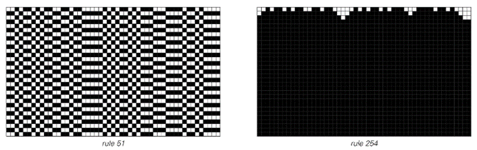
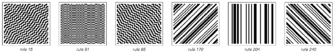
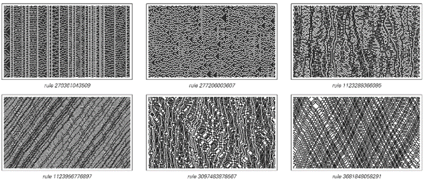
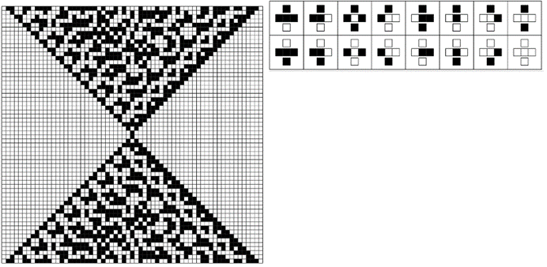
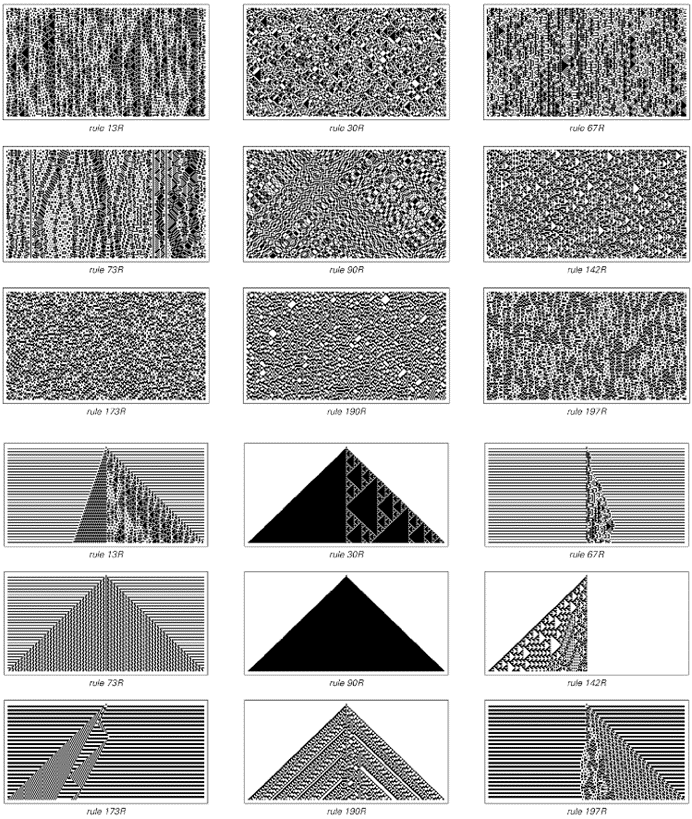
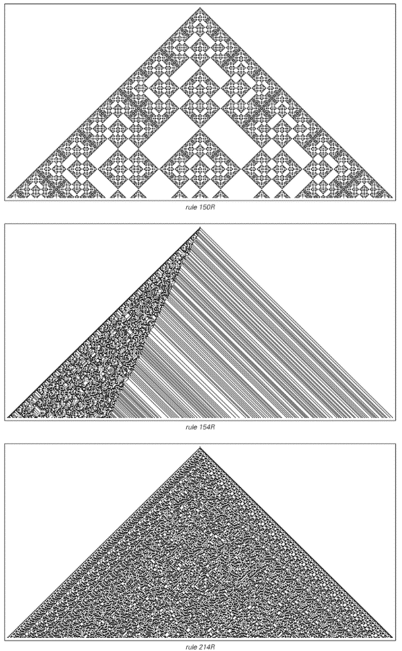
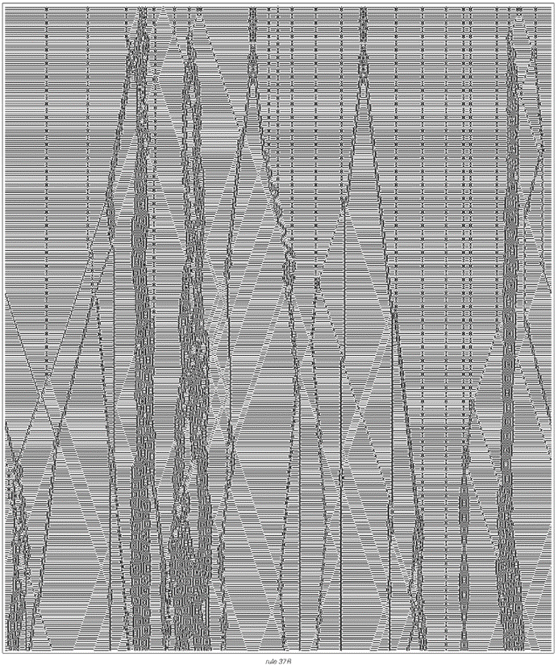

### 9.2  可逆性的概念

在像元胞自动机这样的系统演化的任何特定步骤中，系统的基本规则都会告诉我们如何进行到下一步。但如果想要向后进行呢？能否从特定步骤中黑白细胞的排列推断出之前步骤中细胞的排列？

所有现有证据表明，物理学的基本定律具有这种可逆性。因此，这意味着，只要对物理系统当前状态有足够精确的了解，就有可能不仅推断出系统在未来会做什么，还能推断出它在过去做了什么。

在下面的第一个元胞自动机中，这样做也很直接。因为在任何特定步骤中具有一种颜色的细胞，在之前的步骤中必须总是具有相反的颜色。

但第二个元胞自动机的工作原理不同，它不允许我们向后进行。因为仅仅几步之后，它就会把所有的细胞都变成黑色，不管它们之前是什么颜色——结果是无法判断之前步骤中可能出现了什么颜色。

自然界中有许多系统似乎与下面的第二种情况有些类似，它们似乎会自行组织。而实际上，这与已知物理学基本定律的可逆性之间的冲突与本章下一节的主题有关。

>可逆与不可逆的元胞自动机示例。规则51是可逆的，因此它保留了足够的信息，允许人们从任何特定步骤向后进行，也向前进行。规则254是不可逆的，因为它总是演化为统一的黑色，并且不保留关于早期步骤中细胞排列的任何信息。

(p 435)

但我的目的是探讨哪些类型的系统可以是可逆的。在具有两种颜色和最近邻规则的256个基本元胞自动机中，只有下面显示的六个是可逆的。如图所示，所有这些自动机都表现出相当简单的行为，仅对细胞的初始配置进行了相当简单的变换。

那么，在保持可逆性的同时，是否可能获得更复杂的行为？总共有7,625,597,484,987个具有三种颜色和最近邻规则的元胞自动机，在这些自动机中，人们发现了仅1800个是可逆的。在这1800个中，许多再次表现出简单的行为，很像下面第一组图片所示。但也有一些表现出更复杂的行为，如下面第二组图片所示。

>六个可逆的基本元胞自动机行为示例。在所有情况下，对初始条件进行的变换都足够简单，因此在演化过程中向后进行和向前进行都是直接的。

>具有三种颜色和最近邻规则的1800个可逆元胞自动机中的一些行为示例。尽管这些系统表现出会打乱初始条件的复杂行为，但它们仍然都是可逆的，因此从每幅图片底部的细胞配置开始，总是可以推断出之前所有步骤的配置。

(p 436)

现在如何判断这些系统是可逆的呢？它们的演化不再只导致初始条件的简单变换。但人们仍然可以检查，从每幅图片底部的特定细胞配置开始，是否可以逆向演化以到达图片的顶部。对于给定的特定规则，进行详细分析以证明或反驳其可逆性通常是相当直接的。

但在试图理解可逆系统中可能出现的行为范围时，考虑具有专门构建为可逆规则的元胞自动机类别通常很方便。下面给出了这样一类的一个示例。这个想法是，即使规则被颠倒，它们也仍然保持不变，从而交换了过去和未来的角色。

这些规则可以通过取普通的元胞自动机并添加对两个步骤之前颜色的依赖来构建。

得到的规则可以正向和反向运行。在每种情况下，它们都需要知道不是一个而是两个连续步骤上细胞的颜色。然而，有了这些知识，这些规则就可以用来确定未来或过去步骤上细胞的配置。

接下来的两页[438, 439]展示了这种元胞自动机在随机和简单初始条件下的行为示例。

>一个明确设置为可逆的元胞自动机示例。如果将该系统的所有元素颠倒过来，其规则将保持不变——实际上交换了过去和未来的角色。该规则产生的图案必须表现出相同的时间反转对称性，如左图所示。这里使用的特定规则是基于取基本规则214，然后添加一条规则，即每当细胞在两个步骤前为黑色时，细胞的新颜色应被反转。请注意，通过允许总共四种颜色而不是两种颜色，可以构建一个仅依赖于前一步骤的版本。

(p 437)

>从随机和简单初始条件开始的可逆元胞自动机示例。在图片的上半部分，每个细胞在两个连续的第一步中被选择为黑色或白色的概率相等。在图片的下半部分，这些步骤中只有中心细胞被视为黑色。

(p 438)

>三个可逆元胞自动机在300步内的演化。在第一种情况下，得到了一个规则的嵌套图案。在其他情况下，图案显示出许多随机性特征。

(p 439)

>一个支持局部结构的可逆元胞自动机示例。由于基础规则的可逆性，当互换其初始和最终状态时，每次碰撞都必须能够同样好地发生。

(p 440)

在某些情况下，行为相当简单，所得到的图案具有简单的重复或嵌套结构。但在许多情况下，即使使用简单的初始条件，所产生的图案也高度复杂，并且在许多方面看起来是随机的。

基础规则的可逆性具有一些明显的后果，例如存在指向侧面但不向下的三角形。但尽管它们具有可逆性，这些规则仍然能够产生我们在元胞自动机以及本书中介绍的许多其他系统中看到的复杂行为类型。

那么局部结构呢？

对面页面上的图片表明，这些结构也可能在可逆系统中出现。对于可能发生的碰撞类型的细节存在一些限制，但可逆规则通常往往与普通规则非常相似。

因此，最终看来，尽管只有很小一部分可能的系统具有可逆性，但这样的系统仍然可以表现出与其他任何地方一样复杂的行为。

