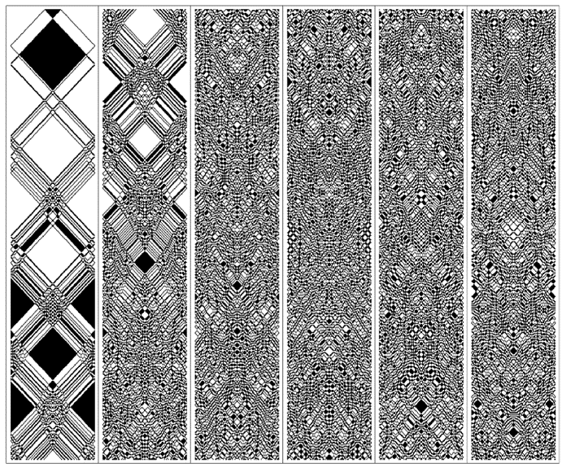
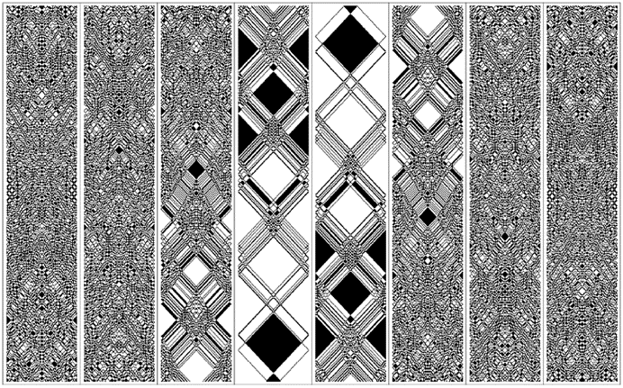
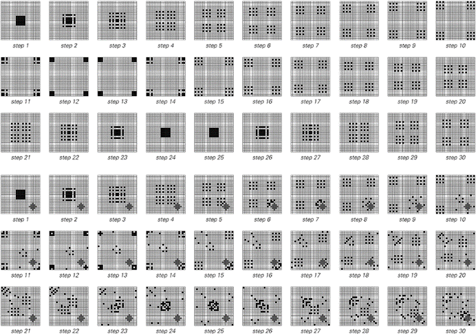
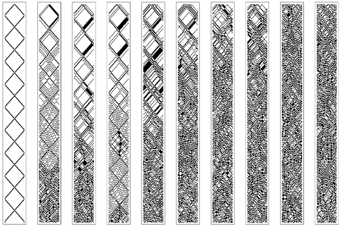

### 9.3  不可逆性与热力学第二定律

我们来自粒子物理学和其他领域的所有证据表明，在基本层面上，物理定律是完全可逆的。然而，我们的日常经验中充满了看似不可逆的现象的例子。最常见的情况是，一个从相对规则或有序状态开始的系统，会逐渐变得越来越随机和无序。事实证明，这种现象已经在许多简单的程序中显现出来。

下一页顶部的图片展示了一个基于上一节中讨论的可逆元胞自动机的例子。在这个系统中，黑色细胞的作用有点像盒子内部弹跳并在碰撞时相互作用的粒子。

一开始，粒子被放置在盒子中心的简单排列中。但随着时间的推移，图片显示粒子的排列变得越来越随机。

(p 441)

传统科学的典型直觉使人难以理解这种随机性是如何产生的。但本书中的发现表明，即使在非常简单的初始条件下，各种系统也能产生随机性，这使得这一现象看起来不那么令人惊讶。

但可逆性呢？下面图片中使用的元胞自动机的基本规则是完全可逆的。然而，图片本身在初看时似乎并不具备可逆性。因为随着页面上的连续面板向下移动，随机性似乎出现了不可逆的增加。

然而，这个明显矛盾的解决方案相当直接。正如对面页面上的图片所示，如果粒子的简单排列出现在演化的中间阶段，那么人们可以很容易地看到，无论是从该点向前还是向后，随机性都会以完全相同的方式增加。

>一个表现出看似不可逆行为的可逆元胞自动机。从所有黑色细胞或粒子位于盒子中心的初始条件开始，分布逐渐变得更加随机。这种行为似乎是热力学第二定律所描述的核心现象。这里使用的特定元胞自动机是规则122R。系统被限制在100个细胞大小的区域内。

(p 442)

然而，这仍然有些神秘。因为我们的日常经验中充满了随机性增加的例子，就像下面图片的第二部分一样。但我们基本上从未见过像第一部分那样系统性的随机性减少。

通过设定整个图片开始时存在的精确初始条件，原则上当然可以得到这样的行为。但不知怎的，似乎这样的初始条件在实践中基本上从未真正发生过。

>对面页面图片的扩展版本更清楚地展示了底层元胞自动机的可逆性。通过精心构造初始条件，使得在所示的演化过程中，粒子将产生简单的排列。如果从这个排列开始，那么无论是从该点向前还是向后，系统的随机性都将有效地增加。

(p 443)

过去，人们对为什么会这样感到相当困惑。但理解这一切的关键在于认识到，我们不仅要思考正在研究的系统，还要思考在研究过程中所使用的实验和观察类型。

结果，最关键的一点是，实际实验几乎不可避免地只涉及我们相对容易描述和构建的初始条件。在这种类型的初始条件下，像前一页那样的系统总是趋向于表现出越来越大的随机性。

但是，究竟是什么决定了实验中可以使用的初始条件类型呢？有理由认为，在任何有意义的实验中，设置实验的过程应该比实验旨在观察的过程简单。

但是，如何比较这些过程呢？我将在本书后面部分详细阐述的答案是，将所有这些过程都视为计算。因此，得出的结论是，设置实验所涉及的计算应该比实验所要研究的系统演化所涉及的计算简单。

显然，从一个简单的状态开始，然后逆向追踪可逆系统的实际演化，我们可以找到导致随机性减少的初始条件。但是，如果你看看最后几页的图片[442, 443]，行为的复杂性似乎排除了任何更容易找到此类初始条件的方法。事实上，我将在第12章中论证，计算等价性原则表明，通常不应该存在这样的简化程序。

由此产生的结果是，没有任何合理的实验能够涉及设置那种会导致随机性减少的初始条件，因此，所有实际实验都只会显示出随机性的增加。

我认为，正是这一基本论点解释了物理学中所谓的热力学第二定律的观察到的有效性。该定律是在一个多世纪前首次提出的，但尽管有许多相关的技术成果，其有效性的基本原因至今仍然相当神秘。

(p 444)

热力学领域一般关注物理系统中的热和能量问题。自19世纪中叶以来，人们就知道的一个基本事实是，热是与大量原子或其他粒子的随机微观运动相关的一种能量形式。

热力学第二定律的一种表述是，与这些粒子的有序运动相关的任何能量都趋向于不可逆地退化为热。而本部分开头的图片基本上就展示了这种现象。起初，粒子以相当规则和有序的方式运动。但随着时间的推移，发生的运动变得越来越随机。

上面使用的元胞自动机在几个细节上与通常在热力学中研究的实际物理系统不同。但在付出一些额外的技术复杂性代价后，设置一个更现实的系统是相当直接的。

接下来两页的图片[446, 447]展示了一个特定的二维元胞自动机，其中代表粒子的黑色方块四处移动并相互碰撞，基本上就像理想气体中的粒子一样。这个元胞自动机与本节开头介绍的元胞自动机一样，具有可逆性。但它还有一个额外的特性，即在每次碰撞中，其中的粒子总数保持不变。由于每个粒子都可以被认为具有一定的能量，因此可以推断出系统的总能量是守恒的。

在第一个示例中，粒子在一个空的方形盒子中弹跳。结果证明，在这种情况下，只会出现非常简单的重复行为。但几乎任何变化都会破坏这种简单性。

在第二个示例中，例如，一个小而固定的障碍物会导致粒子排列的迅速随机化——非常类似于我们在本节前面讨论的一维元胞自动机中看到的随机化。

(p 445)

因此，尽管所有粒子的总能量保持不变，但能量的分布却变得越来越随机，这正如通常的第二定律所暗示的那样。

这在实际应用中产生的一个重要后果是，以系统的机械功的形式从系统中提取能量变得越来越困难。在理想化的层面上，人们可能会想象通过向系统中插入某种桨来做到这一点，该桨会因粒子的撞击而受到力的作用。

>一个模拟理想气体粒子行为的简单二维元胞自动机的表现。在上面的图片组中，粒子在一个空的方形盒子中弹跳。在下面的图片组中，盒子内包含一个小而固定的障碍物。在上面的图片组中，粒子的排列显示出简单的重复行为。然而，在下面的图片组中，粒子的排列随着时间的推移变得越来越随机。这里使用的元胞自动机的基本规则是可逆的，并且保持粒子总数不变。这些具体规则基于2x2的块——这是将在下一节中讨论的块元胞自动机的二维推广。对于每个2x2的块，除非块内正好有两个粒子以对角线方式排列，否则粒子在特定步骤中的配置将保持不变；如果是这种情况，粒子将移动到相对的对角线上。

(p 446)

下面的第二组图片展示了在第一组图片中的情况(a)和(b)中，这种力可能如何随时间变化。在情况(a)中，由于没有发生随机化，因此可以很容易地预测力，并且很容易想象利用这种力来产生系统的机械功。但在情况(b)中，力迅速随机化，并且没有明显的方法可以从中获得系统的机械功。

>来自对页的元胞自动机的时间历程。在每种情况下，都截取了盒子中线的切片。远离中线的黑色单元格以逐渐变浅的灰色显示。情况(a)对应一个空的方形盒子，并显示出简单的重复行为。情况(b)对应一个包含固定障碍物的盒子，在这种情况下可以看到快速的随机化。每个面板对应于系统演化的100个步骤；盒子的宽度为24个单元格。

>在将理想化的桨放置在上述系统中线时受到的力。该力反映了在每个步骤中从上方和下方到达中线的粒子数量之间的不平衡。在情况(a)中，这种不平衡很容易预测。然而，在情况(b)中，对于大多数实际目的而言，它迅速变得随机。这种随机性基本上使得构建一台能够不断将热量转化为机械功的物理永动机变得不可能。

(p 447)

尽管如此，人们可能会想象能够设计出一台复杂的机器，也许配有精密的桨板排列，即使粒子分布看似随机，也能从中提取出系统的机械功。但事实证明，为了做到这一点，机器必须能够有效地预测每个粒子在每个时间步骤中的位置。

正如我们将在第12章中讨论的那样，这意味着机器必须执行与系统本身实际演化相对应的同样复杂的计算。结果是，在实践中，人们永远不可能制造出能够持续以热能（或随机粒子运动）的形式获取能量并将其转化为有用机械功的永动机。

这种永动机的不可能性是热力学第二定律的一种常见表述。另一种表述是，一个被称为熵的量会随时间的推移而增加。

熵被定义为在对系统进行一组特定测量后，关于系统仍未知的信息量。熵的具体值将取决于所进行的测量，但第二定律的内容是，如果在不同时间重复相同的测量，则从这些测量中推导出的熵将随时间的推移而增加。

如果人们能够找到系统中所有粒子的位置和属性，那么关于系统的信息将不再有任何未知之处，系统的熵就会是零。但在实际实验中，人们无法期望能够进行如此完整的测量。

更现实地说，人们所做的测量可能只能给出盒子内某些区域中粒子的总数。那么，就存在大量与这些测量结果相一致的粒子详细排列的可能性。熵被定义为需要额外多少信息才能选出实际发生的特定排列。

我们将在第10章中更详细地讨论信息量这一概念。但在这里，我们可以想象为所有与我们测量结果相一致的粒子可能排列进行编号，以便选出单一排列所需的信息量本质上就是这样一个数字的长度（以位数计）。

(p 448)

下面的图片展示了以这种方式计算的熵在类似上述系统中的行为。我们看到的是，熵确实倾向于增加，正如热力学第二定律所暗示的那样。

实际上，我们所做的测量代表了确定系统状态的尝试。但随着系统中粒子排列的随机性增加，这种尝试变得越来越不成功。

人们可能会想象，可能存在一套更复杂的测量，能够以某种方式避免这些问题，并且不会导致熵的增加。但正如我们将在第12章中讨论的那样，事实证明，设置这样的测量将不得不涉及与系统本身实际演化相同水平的计算努力。因此，人们得出结论，与在实际实验中进行的测量相关的熵将始终趋于增加，正如热力学第二定律所表明的那样。

>熵作为时间函数的图像，适用于第447页案例(b)中所示类型的系统。上面的图是案例(b)的精确表示；下面的图是一个尺寸为其三倍的系统。在每个案例中，熵都是通过计算出与系统内6x6网格区域内粒子总数的测量结果相一致的粒子可能配置的数量来确定的。正如热力学第二定律所表明的那样，熵随时间增加。请注意，如果上述图像继续向左延伸，它们将是完全对称的：从简单的初始条件出发，无论是向前还是向后，熵都会以相同的方式增加。

(p 449)

在第12章中，我们将更详细地讨论得出这一结论所涉及的一些关键思想。但基本点是，热力学第二定律所隐含的熵增加现象，在某种程度上是本书中发现的一个现象的直接结果，即即使在简单的初始条件下，许多系统也能产生复杂且看似随机的行为。

我们在前几章中多次提到随机性产生的一个方面是，一旦系统中产生了显著的随机性，该系统的整体属性往往会变得与其初始条件的细节在很大程度上独立。

在任何可逆系统中，不同的初始条件必然导致至少略有不同的状态——否则就没有唯一的方式可以逆向进行。但关键在于，尽管从不同初始条件得出的结果在细节上有所不同，但它们的整体属性仍然可能非常相似。

对面页面上的图片展示了可能发生的情况的一个例子。每张单独的图片都有不同的初始条件。但每当产生随机性时，最终得到的整体模式看起来几乎无法区分。

基本规则的可逆性意味着在某种程度上，必须能够识别出由不同种类的初始条件产生的结果。但关键在于，要做到这一点，需要比任何在实际测量过程中有意义地进行的计算都要复杂得多的计算。

因此，这意味着如果一个系统产生了足够的随机性，我们可以认为它正在向一个独特的平衡状态演化，该平衡状态的属性在实际应用中与其初始条件无关。

在某种意义上，这一事实在物理学的许多日常应用中都是隐含的。因为它允许我们仅通过指定几个参数（如温度和化学成分）来表征各种物理系统，从而避免了我们总是需要知道每个系统的初始条件和历史的细节。

任何特定系统都趋向于演化到一个独特的平衡状态，这也是热力学第二定律的常见表述。因此，我们再次发现，第二定律与我们在这本书中早期看到的基本现象有关。

(p 450)

但第二定律究竟有多普遍？它真的适用于我们在自然界中看到的各种系统吗？

从近一个世纪前开始，人们就普遍认为第二定律是一个几乎普遍的原理。但实际上，这方面的证据却出奇的少。

事实上，第二定律的所有详细应用几乎都只关注一个特定领域：气体的行为。因此，现在有充分的证据表明，气体遵守第二定律——正如本节前面提到的理想化模型所表明的那样。但是其他类型的系统呢？

>在一个可逆的元胞自动机中，不同初始条件下向平衡态的演化。除了不发生随机化的特殊情况外，不同初始条件下得到的行为在整体属性上最终几乎是无法区分的。然而，由于基本规则是可逆的，因此不同初始条件下的细节总是至少略有不同——否则就不可能以唯一的方式逆向进行。这里使用的规则是122R。连续的两对图片仅在中心单个单元格的颜色上有所不同。

(p 451)

>具有各种规则的可逆元胞自动机的示例。有些会迅速随机化，正如热力学第二定律所表明的那样。但其他则不会——因此实际上并不遵守热力学第二定律。

(p 452)

对面页面上的图片展示了各种可逆元胞自动机的示例。从这些图片中我们可以立即看到，虽然一些系统表现出热力学第二定律所暗示的那种随机化，但其他系统则没有。

最明显的例外是规则0R和规则90R等情况，其中产生的行为只有非常简单的固定或重复形式。现有的数学研究确实已经识别出这些简单的热力学第二定律的例外情况。但它们却以某种方式隐含地假设了不可能存在其他类型的例外。

然而，下一页的图片展示了规则37R在多个步骤中的行为。在观察这张图片时，我们发现了一个显著的现象：既没有向增加随机性的系统性趋势，也没有任何形式的简单可预测行为。事实上，系统似乎永远不会安定下来，而是继续永远波动，有时变得更有序，有时则更无序。

那么，在热力学第二定律的背景下，如何理解这种行为呢？我认为，从实际应用的角度来看，除了得出结论认为规则37R根本不遵守热力学第二定律之外，别无选择。

事实证明，规则37R中发生的情况与自然界中许多系统似乎发生的情况并无太大不同。如果热力学第二定律总是被遵守，那么人们可能会期望我们宇宙的每一个部分都会演化到完全随机的平衡状态。

然而，很明显，这种情况并没有发生。事实上，有许多类型的系统，特别是生物系统，似乎至少暂时地表现出向更有序而不是更随机状态发展的趋势。

这些系统是如何工作的？一个共同的特点似乎是存在某种分区：系统有效地分解为多个部分，这些部分在很长一段时间内至少以某种方式独立演化。

第456页的图片展示了如果从一个小范围的随机区域开始规则37R会发生什么。在一段时间内，人们会看到插入的随机性会持续存在。但最终，系统似乎会自行组织，仅产生少量简单的重复结构。

(p 453)

>这是规则37R的可逆元胞自动机在演化过程中的更多步骤。这个系统是一个例子，它并没有以任何有意义的方式遵守热力学第二定律。它并没有表现出越来越随机的行为，而是在相当有序和相当无序的状态之间波动。

(p 454)

这种自组织现象与热力学第二定律的预期截然相反。起初，它似乎也与系统的可逆性不一致。因为如果最后只剩下几个简单的结构，那么怎么可能有足够的信息来逆向重建初始条件呢？

答案是，人们不仅要考虑留在系统中间的稳定结构，还要考虑在演化过程中产生的各种小结构。为了逆向进行，需要设置事物，以便吸收正向演化过程中产生的结构序列。

然而，如果只让发射的结构逃逸，并且从不吸收任何其他结构，那么实际上就会丢失信息。结果是，人们看到的演化本质上可能是不可逆的，因此，我们在本书中之前看到的在没有可逆规则的元胞自动机中出现的各种自组织形式都有可能发生。

如果我们从大局上观察宇宙，就会发现，从某种意义上说，发射的辐射多于吸收的辐射。事实上，这与夜空看起来是黑色的，而不是每个方向都有明亮的星光这一事实有关。但最终，发射和吸收之间的不对称性是宇宙随时间膨胀而不是收缩的结果。

结果是，尽管有热力学第二定律，尽管有基本规则的可逆性，但宇宙的区域仍有可能变得越来越有组织。这就是有组织的星系、恒星和行星能够形成的一个重要原因。

允许信息逃逸是逃避热力学第二定律的一种相当直接的方法。但是，对页上的图片所展示的是，即使在一个完全封闭的系统中，完全不允许任何信息逃逸，像规则37R这样的系统也仍然不遵循热力学第二定律所暗示的随机性增加的均匀趋势。

相反，在系统的不同区域之间会形成各种膜，在每个区域内，有序的行为可以发生，至少在膜存在的时候。

(p 455)

>这是根据规则37R从一个包含相当随机区域的初始条件开始的演化的一个例子。尽管这个系统是可逆的，但这个区域倾向于自行组织成更简单的形式。初始条件的信息最终由辐射向外的局部结构携带。

(p 456)

这种基本机制很可能是许多生物系统中起作用的主要机制：每个细胞或每个生物体都与其他生物体分离，只要它存活下来，就能表现出有序的行为。

但是，看着第454页上规则37R的图片，人们可能会问，我们所看到的效果是否只是暂时的，如果我们等待足够长的时间，是否会发生不同的事情。

对于一个有限大小的封闭系统来说，最终得到的行为必须重复自己，这是不可避免的特征。而在第452页上展示的0R和90R等规则中，重复的周期总是很短。但对于规则37R来说，结果通常是周期相当长。事实上，对于第454页上展示的具体例子，周期是293,216,266。

然而，一般来说，一个包含一定数量细胞的系统的最大可能周期只有在系统的演化从任何初始条件最终遍历系统的所有可能状态时才能实现，如第258页所述。如果这实际上发生了，那么至少最终系统不可避免地会在看似随机的状态中花费大部分时间。

但在规则37R中，并没有这样的各态历经性。相反，从任何特定的初始条件开始，系统只会访问所有可能状态的一小部分。然而，由于总状态数极其庞大——对于大小为100的系统来说，大约是10^60——因此，规则37R访问的状态数，以及因此产生的重复周期，仍然可以非常长。

对规则37R在很长时间后的极限行为进行正式研究涉及许多微妙之处。但不管这些微妙之处如何，基本事实依然是我所能说的是，规则37R并不遵循热力学第二定律的预测。

事实上，我强烈怀疑自然界中有许多系统或多或少地以相同的方式表现。热力学第二定律是一个重要且相当普遍的原则——但它并不是普遍有效的。通过从简单程序的角度思考，我们因此能够在本节中不仅理解为什么热力学第二定律通常是正确的，而且还能看到它的一些局限性。

(p 457)

