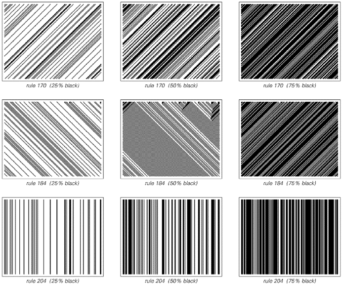
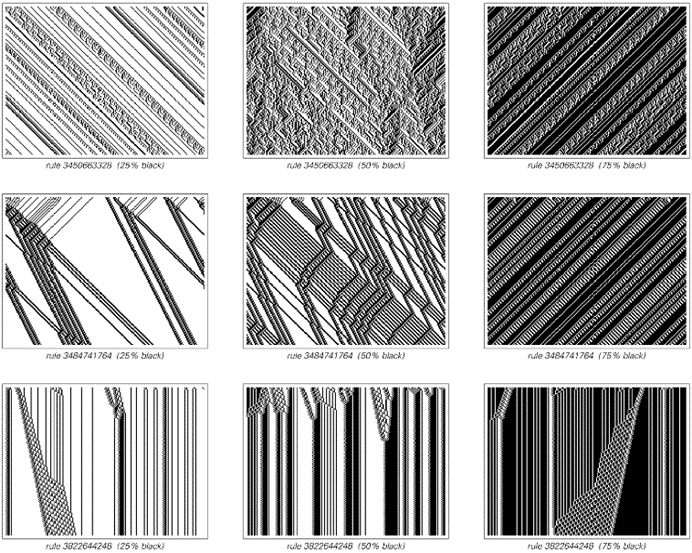
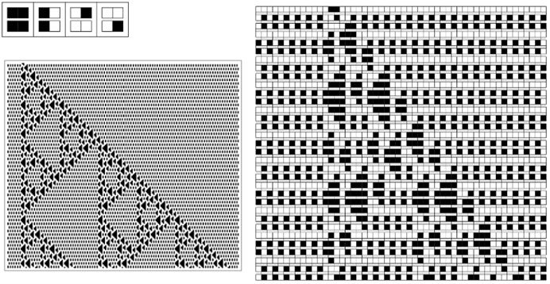
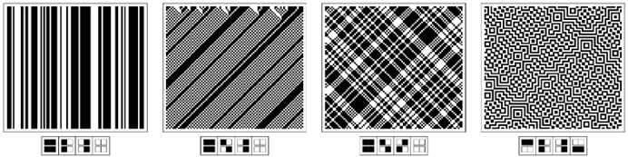
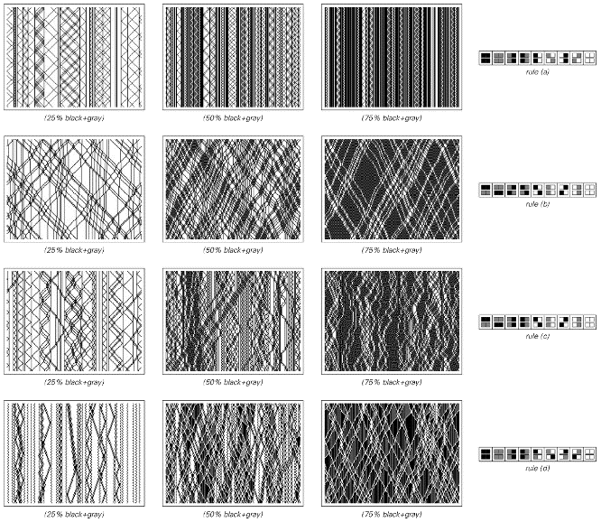
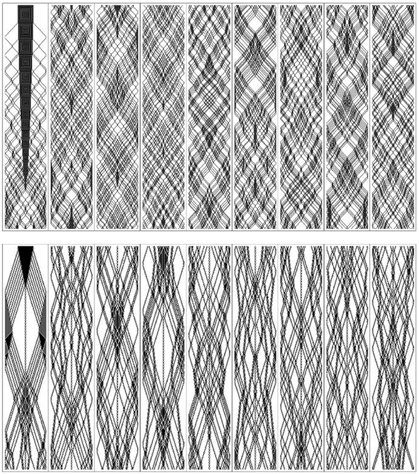
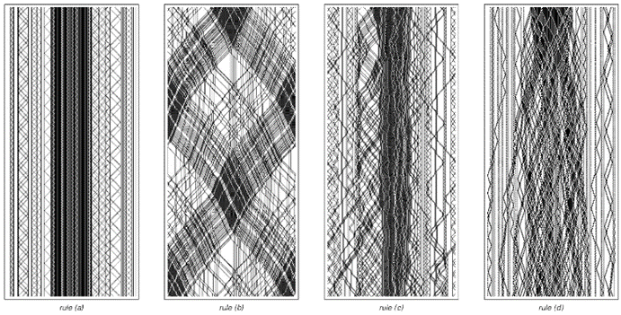
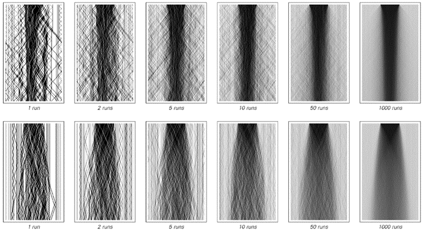

### 9.4  守恒量与连续现象

可逆性是物理学基本定律中似乎存在的一个普遍特征。另一个特征是各种量的守恒——例如，在任何封闭物理系统的演化过程中，能量和电荷等量的总值似乎总是保持不变。

对于大多数规则而言，像元胞自动机这样的系统通常不会表现出这样的守恒定律。但就像可逆性一样，事实证明有可能找到一些规则，例如，这些规则可以保持每一步中出现的黑色细胞总数不变。

在只有两种颜色和最近邻规则的基础元胞自动机中，唯一的例子是相当简单的，如下面的图片所示。

>演化过程中保持黑色细胞总数不变的基础元胞自动机。这里展示的规则的行为足够简单，以至于在每种情况下，黑色细胞数量如何保持每步不变都相当明显。

(p 458)

但是，对于次近邻规则，更复杂的例子成为可能，如下面的图片所示。

一种生成必然会表现出守恒量的系统集合的直接方法是，不使用普通的元胞自动机，而是使用块元胞自动机。块元胞自动机的基本思想在下一页的顶部进行了说明。在每个步骤中，根据某个确定的规则，相邻细胞的块被替换为相同大小的其他块。然后在连续的步骤中，这些块的排列会移动一个细胞的位置。

>具有次近邻规则且演化过程中保持黑色细胞总数不变的元胞自动机示例。尽管肉眼无法立即看出，但在每幅图片中，黑色细胞的总数在每个连续步骤中都保持不变。在4,294,967,296种可能的次近邻规则中，只有428种表现出这里所示的守恒性质。

(p 459)

有了这个设置，如果底层规则将每个块替换为包含相同数量黑色细胞的块，那么整个系统不可避免地会保持黑色细胞的总数不变。

在两种可能的颜色和大小为2的块的情况下，唯一能够保持黑色细胞总数不变的块元胞自动机是第二组图片中所示的那些——所有这些都表现出相当简单的行为。

>块元胞自动机的一个示例。该系统通过将每个步骤中存在的细胞序列划分为对，然后根据所示规则将这些对替换为其他对来工作。细胞与其左邻或右邻配对的选择在连续步骤中交替进行。与许多块元胞自动机一样，所示系统是可逆的，因为在规则中，每对都有一个唯一的前驱。然而，它并不保持黑色细胞的总数。

>具有两种可能颜色和大小为2的块且保持黑色细胞总数不变的块元胞自动机（最后一个示例仅在交替步骤中具有此属性）。碰巧的是，除了这里显示的第二个规则外，所有规则不仅保持黑色细胞的总数不变，而且都被证明是可逆的。

(p 460)

但是，如果允许有三种可能的颜色，并要求例如黑色和灰色细胞的总数保持不变，那么就会出现更复杂的行为，如下面的图片所示。

实际上，正如下一页的图片所示，即使从非常简单的初始条件开始，这样的系统也能产生相当大的随机性。

>具有三种可能颜色且保持黑色和灰色细胞总数不变的块元胞自动机。在规则（a）中，黑色和灰色细胞保持在局部区域。在规则（b）中，它们以相当简单的方式移动，而在规则（c）和（d）中，它们以看似有些随机的方式移动。这里显示的规则是可逆的，尽管它们的行为与非可逆规则相似，但至少在几个步骤之后。

(p 461)

>从上一页的规则（c）和（d）开始，使用非常简单的初始条件。每个面板显示了500步的演化过程，并且迅速随机化是显而易见的。黑色和灰色细胞的行为非常像物理粒子：它们的总数保持不变，并且根据这里使用的特定规则，它们的相互作用是可逆的。请注意，边界的存在至关重要；因为如果没有它们，粒子之间在某种意义上就不会发生碰撞，并且两个系统的行为都会相当简单。

(p 462)

但是，对行为仍然有一个重要的约束：尽管黑色和灰色细胞可能在实际上随机移动，但它们的总数必须始终保持不变。这意味着，如果观察整个系统中彩色细胞的总平均密度，它必须始终保持不变。但是，系统中不同部分的局部密度不必如此——而且一般来说，随着彩色细胞的流入和流出，它们会发生变化。

下面的图片展示了四种不同规则下发生的情况，初始时中间密度较高，两侧密度较低。在规则（a）和（b）中，每个不同的区域实际上都永远保持分离。但在规则（c）和（d）中，这些区域逐渐混合。

与许多种类的系统一样，细胞初始排列的细节通常会对发生的行为细节产生影响。但下面的图片表明，如果只关注密度的总体分布，那么这些细节将在很大程度上变得无关紧要——因此，给定的密度初始分布将总是以相同的总体方式演化，无论构成该分布的细胞特定排列是什么。

>前几页[461, 462]中的块元胞自动机从包含不同密度区域的初始条件开始。在规则（a）和（b）中，区域永远保持分离，但在规则（c）和（d）中，它们逐渐相互扩散。

(p 463)

然后，下面的图片展示了系统（c）和（d）中平均密度如何演化。令人惊讶的是，尽管在最低层次上，这两个系统都由离散的细胞组成，但在两种情况下出现的密度总体分布都显示出平滑的连续行为。

正如在流体等物理系统中一样，最终导致这种情况的是小规模上明显的随机性，它消除了单个细胞或分子的细节——以及守恒量，这些守恒量迫使某些总体特征不会变化得太快。事实上，只要具备这些属性，就会发现基本上总是会出现相同的总体连续行为。

人们可能认为连续行为会在某种程度上依赖于物理学中实际系统的特殊特征。但事实上，我们在这里所看到的是，负责的基本机制已经以更加简洁的方式出现在一些具有非常简单的底层规则的程序中。

>从上一页来看，块元胞自动机（c）和（d）的总体密度演化。尽管在底层，这些系统由离散的细胞组成，但它们的整体行为看起来是平滑且连续的。这里展示的结果是通过对初始条件在细节上有所不同但具有相同总体密度分布的连续更大数量的运行进行平均得到的。在无限次运行（或无限个细胞）的极限下，第二种情况的行为接近于连续扩散方程所暗示的形式。（在第一种情况下，相关性实际上持续得太久，无法产生完全相同的行为。）

(p 464)

