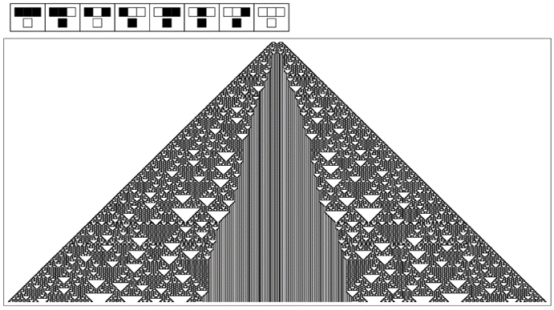

### 9.5  宇宙的终极模型

物理学史见证了宇宙模型的一系列逐步发展，从经典力学，到量子力学，再到量子场理论，以及更前沿的理论。人们可能会想，这个过程是否会永远持续下去，或者是否会在某个时刻达到终点，从而得到一个宇宙的终极模型。

根据物理学中的实际结果来看，人们可能并不会这样认为。因为每当人们试图达到另一个层次的精确度时，都会遇到更复杂的现象。而且，至少从传统科学的直觉来看，这一事实表明需要更复杂的模型。

但本书发现的一个关键点是，更复杂的现象并不总是需要更复杂的模型。事实上，我已经证明，即使基于非常简单程序的模型也能产生在某种意义上任意复杂的行为。

那么，宇宙中的情况是否也是如此呢？甚至可能是，在我们所看到的物理学中所有复杂现象的背后，都隐藏着某个简单的程序，只要运行足够长的时间，它就会以每一个细节重现我们的宇宙？

发现这样的程序无疑将是一个激动人心的事件，也是对我在这本书中发展的新型科学的一种戏剧性的认可。

因为除此之外，这样的程序最终将使人们拥有一个自然的模型，它在任何意义上都不是近似或理想化的。相反，它将是宇宙实际运行的完整而精确的描述，但一切都简化为易于阐述的规则。

从某种意义上说，这样一个程序的存在将是人类思想能够理解宇宙构造这一想法的最终验证。但仅仅知道底层程序并不意味着人们可以立即推断出宇宙将如何表现的每一个方面。因为正如我们在本书中多次看到的那样，底层规则与整体行为之间往往存在很大的距离。而事实上，这恰恰是可以想象一个简单程序能够再现我们在物理学中看到的所有复杂性的原因。

(p 465)

给定一个特定的底层程序，原则上总是可以通过运行它来找出它将做什么。但对于整个宇宙来说，进行这种明确的模拟几乎是不可能的。那么，人们又怎么能期望判断一个特定的程序是否是宇宙的正确模型呢？小规模模拟当然是可能的。我预计，通过将这种模拟与一定程度的可能相当复杂的数学和逻辑推导相结合，人们至少可以再现已知的物理学定律——从而确定一个特定模型是否具有正确的潜力。

那么，如果宇宙确实有一个确定的终极模型，人们应该如何寻找它呢？对于那些熟悉现有科学的人来说，他们最初有一个巨大的倾向，那就是试图从已知的物理学定律出发，逆向工作，并试图“设计”一个具有我们观察到的特定特征的宇宙。

但是，如果事实上存在一个相当简单的终极模型，那么根据我们在本书中所见，我坚信这种方法在现实中永远不会成功。因为人类思维——即使加上当前数学和逻辑的最复杂思想——也远远不能做到所需的程度。

例如，想象一下，从了解对面页上图片的整体特征出发，试图逆向推导出一条能够重现该图片的规则。经过巨大的努力，人们可能会提出一条极其复杂的规则，这条规则在大多数情况下都有效。但是，从整体特征出发，几乎不可能得出实际使用的那条极其简单的规则。

仅仅从一条底层规则出发，推导出它将产生的行为就已经足够困难了。但要以任何系统的方式逆向推导，可能甚至在原则上也超出了任何现实计算的能力。

那么，在这种情况下，人们又怎么可能期望找到那条底层规则呢？几乎总是这样，似乎最好的策略很简单：提出一个适当的一般规则类别，然后只是在这些规则中进行搜索，逐一尝试，并观察它是否产生了人们想要的行为。

(p 466)

但是宇宙的规则呢？我们当然不能简单地搜索某种可能的规则，寻找一个其行为恰好符合我们在物理学中所见的规则吧？

按照传统科学的直觉，这种方法似乎很荒谬。但问题是，如果宇宙的规则足够简单——而本书的结果表明它可能就是这样——那么系统地搜索它就不再那么不合理了。

然而，要开始这样的搜索，首先需要确定要考虑哪些类型的规则。我怀疑，到目前为止，本书所讨论的具体类型的规则中没有一种是足够的。因为我相信，从某种意义上说，所有这些类型的规则可能都已经有太多的内置结构了。

因此，例如，元胞自动机可能已经有了一个过于僵硬的内置空间概念。因为元胞自动机的一个定义特征是它们的细胞总是以刚性阵列排列在空间中。但我强烈怀疑，在我们宇宙的底层规则中，将不会有这样的内置结构。相反，正如我在接下来的部分[6, 7]中所讨论的，我猜想在最底层，将只是存在某些倾向于存在的连接模式，而我们所知道的空间将从这些模式中作为一种大规模极限而出现。

>这里有一个典型的情况，即很难从它所产生的整体行为的描述中推断出底层规则。从某种意义上说，所展示的简单规则与其所产生的行为之间存在太大的距离。我怀疑宇宙的基本规则也是如此。这里展示的特定规则是规则编号为94的基本元胞自动机，其初始条件为 。

(p 467)

实际上，我一般的预期是，我们宇宙中令人惊讶的少数熟悉特征，实际上并不会以任何直接的方式反映在其最终的底层规则中。因为如果所有这些特征都以某种方式被明确且独立地包含在内，那么规则为了包含所有这些特征，必然会变得非常复杂。

因此，如果规则确实很简单，那么几乎不可避免地，我们将无法直接在它中认出我们通常感知到的宇宙的大部分特征。这意味着规则——或者至少它的行为——对我们来说必然是陌生和抽象的。

例如，很可能没有简单的方法通过查看在空间中排列的元素集合来可视化规则的作用。甚至可能连运动这样的基本现象也不会有直接的迹象。

但是，尽管缺乏这些熟悉的特征，我仍然预计实际的规则本身对我们来说并不难表示。因为我相当确定，我们在本书中讨论的逻辑和计算结构将足够通用，能够涵盖所需的内容。事实上，我猜想，就我们在本书中使用的图片类型（或 Mathematica 程序）而言，宇宙的终极规则将会显得相当简单。

毫无疑问，将有许多不同的可能表述方式——其中一些与其他方式截然不同，难以辨认。而且，毫无疑问，最终会发现一种表述方式，使规则在某种程度上显得相当明显和不可避免。

但我相信，如果不先知道规则，那么找到这样的表述方式基本上是不可能的。因此，我猜想，找到规则的唯一现实方法将是从一些非常直接的表示开始，然后在这个表示中搜索大量的可能规则。

可以想象，绝大多数规则将导致完全无法工作的宇宙，例如，其中没有合理的空间概念或时间概念。

(p 468)

但我猜想，在适当的规则类别中，实际上会有相当大一部分规则导致宇宙与我们自己的宇宙至少共享一些特征。正如连续流体力学的相同定律可以在具有不同分子相互作用底层规则的系统中出现一样，我也怀疑，诸如看似连续的空间的存在，以及引力和量子力学的某些特征等属性，也会随着宇宙许多不同的可能底层规则而出现。

但我猜想，当涉及到基本粒子的质量谱——或者甚至可能是空间的整体维度时——这些属性将非常特定于特定的底层规则。

在传统的建模方法中，人们通常首先尝试再现系统的某些特征，然后再继续再现其他特征。但是，如果宇宙的终极规则确实很简单，那么从这个意义上说，这个规则的每一部分都必须对宇宙的许多不同特征负责。因此，在不影响宇宙一系列不同特征的情况下，调整规则的各个部分是不太可能的。

这意味着人们不能合理地期望通过某种增量程序来找到宇宙的终极规则。但这也意味着，如果有人一旦发现了一个能够再现宇宙足够多特征的规则，那么这个规则就极有可能是整个宇宙的最终且正确的规则。

我强烈怀疑，即使在许多最基本的日常物理过程中，宇宙底层规则的每一个元素都会被广泛运用。因此，如果这些基本过程被正确再现，那么我相信人们可以相当确信自己已经掌握了宇宙的完整规则。

回顾物理学史，人们可能会认为仅仅再现日常物理过程是完全不够的。因为人们可能会期望总有一些其他深奥的现象，比如在粒子物理学中，会被发现，并显示出所找到的任何规则在某种程度上都是不完整的。

(p 469)

但我不这么认为。因为如果宇宙的规则确实很简单，那么我认为引入一个新现象，无论它多么深奥，都将涉及修改规则的一些基本部分，这也会影响甚至常见的日常现象。

但为什么我们应该相信宇宙的规则实际上是简单的呢？当然，在特定类型的所有可能规则中，只有有限数量的规则可以被视为简单的，这些规则在定义上就是某种特殊的。然而，回顾科学史，人们可能会期望最终会发现我们宇宙的规则并没有什么特别之处——正如我们在太阳系或银河系中的位置也没有什么特别之处一样。

事实上，人们可能会假设实际上存在无数个宇宙，每个宇宙都有不同的规则，而我们只是生活在其中一个特定的——并且基本上是任意的——宇宙中。

几乎不可能确定地证明这样的理论是不正确的。但它的一个后果是，它并没有给我们任何理由认为我们特定宇宙的规则应该是简单的。因为在所有可能的规则中，绝大多数都不是简单的；事实上，它们反而倾向于几乎无限复杂。

但我认为，我们知道我们宇宙的规则并不太复杂。因为如果规则的不同部分的数量，例如，与宇宙历史上曾经出现过的不同情况的数量相当，那么我们就不会期望能够仅使用有限数量的物理定律来描述宇宙的行为。

事实上，如果你看看当今的物理学，不仅有有限数量的物理定律，而且各个定律往往在各种备选方案中呈现出最简单的形式。知道这一点，人们可能会相信，出于某种原因，宇宙被设定为拥有贯穿始终的最简单规则。

但也许不幸的是，我认为这个结论并不必然成立。正如我上面所讨论的，我强烈怀疑到目前为止发现的绝大多数物理定律并不是真正的基本定律，而是某些终极底层规则大规模行为的涌现特征。这意味着在已知物理定律中观察到的任何简单性可能与底层规则的简单性几乎没有联系。

(p 470)

事实上，结果表明，简单的总体规律几乎可以在任何底层规则下出现。因此，例如，由于随机性的产生，各种各样的元胞自动机都表现出第464页上描述的简单密度扩散定律——无论它们的底层规则是否简单。

因此，我们目前在物理学中所制定的定律之所以简单，可能并不是因为某个终极底层规则的简单性，而是因为我们所容易感知的宇宙总体特征所表现出的涌现行为的一般性质。

事实上，基于这种论点，人们可能会认为宇宙可能根本没有单一的终极规则，而是可能以某种方式存在着一系列无限层次的规则，每一层次的规则都具有一定的简单性，并且这种简单性越来越独立于其下层次的细节。

但人们不应该认为这样的设置会使得询问我们的宇宙为何如此变得没有必要：因为即使某些特征可能是从涌现行为的一般性质中不可避免地产生的，我相信，在达到我们所生活的宇宙的过程中，仍然有许多看似任意的选择必须做出。因此，人们将不得不再次询问，为什么是这些选择被做出了，而不是其他的选择。

所以，如果我是正确的，即宇宙只是遵循一个单一、简单的底层规则，那么最终可能最少需要解释的东西。

当然，人们会询问为什么是这个特定的规则，而不是另一个规则。我怀疑这样的问题永远不会有有意义的答案。

但找到终极规则将是科学的一大胜利，也是对人类思想至少在某个方向上已经达到可能性的边缘的明确证明。

(p 471)

