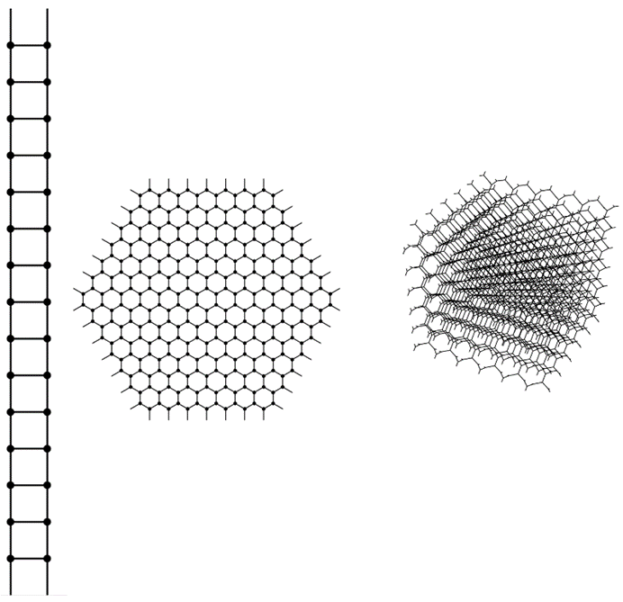
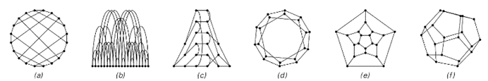

### 9.7  空间作为网络

在上一节中，我认为如果物理学的最终模型要尽可能简单，那么人们应该期望我们宇宙的所有特征在某种程度上都必须纯粹从空间的属性中涌现出来。但如果真是这样，空间应该是什么样的呢？

倒数第二节的讨论表明，为了出现最丰富的属性，从某种意义上说，应该尽可能少地构建刚性的底层结构。考虑到这一点，我相信最有可能的情况是，在最低层次上，空间实际上是一个由节点组成的巨大网络。

在像元胞自动机中的单元格数组一样，每个单元格总是被分配一个确定的位置。但在一个节点网络中，节点本身并没有被分配任何位置。实际上，关于每个节点的唯一定义就是它与哪些其他节点相连。

然而，尽管这种设置相当抽象，但我们将看到，只要有足够多的节点，空间的熟悉属性以及其他物理学中看到的现象就有可能涌现出来。

在第五章中，我已经介绍了一种特定类型的网络，其中每个节点恰好有两个到其他节点的输出连接，以及任意数量的输入连接。我之所以在第五章中选择这种网络，是因为对于这种网络来说，设置演化规则有一个相当简单的方法。但是，在试图找到空间的最终模型时，似乎最好从考虑在基本结构上尽可能简单的网络开始——而事实证明，第五章中的网络比必要的更复杂一些。

首先，没有必要区分输入连接和输出连接，或者确实将任何方向与每个连接相关联。此外，要求网络中的所有节点都具有完全相同的总连接数到其他节点，并不会丢失任何基本内容。

如果只有两个连接，那么只能构建出非常简单的网络。但是，如果使用三个连接，则可以立即构建出各种网络。有人可能会认为，如果允许有四个或五个连接而不是仅仅三个，那么可以获得一个基本上更大的范围。但实际上并不能这样做，因为任何具有超过三个连接的节点都可以有效地分解为一组具有恰好三个连接的节点，如下面第一组图片所示。

(p 475)

因此，这意味着从某种意义上说，考虑每个节点恰好有三个连接的网络总是足够的。因此，在讨论空间的基本模型时，我将使用这些网络。

下面第二组图片展示了这种网络的一些小示例。已经可以看出相当大的多样性。但是，所展示的网络似乎都没有普通空间所熟悉的许多属性。

那么，如何才能得到与普通空间相对应的网络呢？第一步是考虑具有大量节点的网络。作为这些网络的例子，对面页面顶部的图片展示了特意构建以与普通一维、二维和三维空间相对应的网络。

>具有超过三个连接的节点如何分解为具有恰好三个连接的节点集合的示例。

>每个节点恰好有三个连接的小型网络示例。第一行显示了所有可能的、节点数不超过四个的网络。在接下来的内容中，我只考虑非退化网络，即任意两个节点之间最多有一条连接。示例（i）是最小的网络，无法在不使线条交叉的情况下在二维平面上绘制。示例（k）和（l）是最小的网络，其不同节点之间没有对称性。示例（e）对应于四面体的网络，（j）对应于立方体的网络，而（m）对应于十二面体的网络。示例（o）到（u）展示了绘制同一网络的七种方式，在这种情况下，这个网络被称为彼得森网络。

(p 476)

这些网络在最低层次上只是具有某些连接的节点集合。但关键在于，这些连接的整体模式使得在大规模上出现了与特定维度的普通空间的明确对应关系。

下面第一组图片是为了使这种对应关系显而易见而绘制的。但是，如果人们只是被给出了某个网络的原始连接模式，该怎么办？人们如何能看出该网络是否能与特定维度的普通空间相对应？

下面第二组图片说明了主要困难：给定某个网络的连接模式，该网络可以以许多完全不同的方式布置，其中大多数都无法提供太多关于其与普通空间潜在对应关系的信息。

那么，人们应该如何进行呢？基本思想是研究网络的属性，这些属性既可以从其连接模式中轻易推断出来，也可以至少在某些大规模限制下与普通空间的属性相对应。而距离的概念可能是这些属性中最基本的。

>每个节点有三个连接且实际上是一维、二维和三维的网络的示例。这些网络可以无限延续，并且都具有同质性的特性，即每个节点的环境与任何其他节点都相同。

>同一网络的六种不同布置方式。(a) 节点围绕一个圆排列；(b) 节点沿一条线排列；(c) 节点根据与特定节点的距离在页面上排列；(d) 尽可能使网络距离和空间距离接近的二维布局；(e) 平面布局；(f) 三维布局。

(p 477)

定义两点之间距离的一种简单方法是，它是这两点之间最短路径的长度。在普通空间中，这通常通过减去点的位置坐标的数值来计算。但在网络上，事情变得更加直接，两个节点之间的距离可以简单地视为从一个节点到另一个节点所需遵循的最小连接数。

但是，仅仅通过观察这些距离，人们就能判断一个特定的网络是否与某个维度的普通空间相对应吗？

在很大程度上是可以的。一个测试方法是看是否有办法将网络中的节点布置在普通空间中，使得根据节点在空间中的位置计算出的节点间距离（至少在某些近似情况下）与直接通过网络中的连接计算出的距离一致。

上一页顶部的三个网络就是分别针对一维、二维和三维空间精确布置节点，以实现上述情况的。但是，为什么第二个网络不能同样好地布置在一维空间而不是二维空间中呢？一个观察方法是计算网络中与特定节点给定距离处出现的节点数。

对于这个特定的网络，这个问题的答案非常简单：在距离r处，恰好有3r个节点——因此，到距离r处的节点总数增长得像r²。但是，如果现在尝试将这些节点全部布置在一维空间中，那么网络必然会膨胀以适应所有节点。事实证明，这个特定的网络只有在二维空间中才能以规则的方式布置，使得基于网络中连接的距离与普通空间中的距离一致。

对于上一页顶部的另外两个网络，也可以给出类似的论证。事实上，一般来说，一个网络对应于普通d维空间的条件是，在某种极限意义上，出现在其中的节点总数随距离r的增长而增长，类似于r^d——这一结果与标准数学事实相似，即二维圆的面积是πr²，三维球体的体积是4/3πr³，四维超球体的体积是1/2π²r⁴，依此类推。

(p 478)

下面我展示了各种网络的图片。在每种情况下，第一张图片都是为了强调网络中的明显规律性而绘制的。但第二张图片则是以一种更系统的方式绘制的——通过选择一个特定的起始节点，然后布置其他节点，使得那些在网络距离上逐渐增大的节点在页面上依次出现在连续的列中。这种设置的特点是，列r的高度给出了在网络距离r上的节点数。

>展示了各种网络的例子，首先是为了强调它们的规律性，其次是为了说明从给定节点出发，通过连续增加步数所能到达的节点数。对于在极限意义上对应于普通d维空间的网络，这个数量随r的增长而增长，类似于r^(d-1)。所有显示的大型网络在某种意义上都是近似均匀的，即无论从哪个节点开始，都能得到类似的结果。网络（e）的有效极限维数是Log[2,3]≈1.58。

(p 479)

通过观察这些高度在页面上的增长方式，人们可以看到它们是否与预期的普通d维空间中的r(d-1)形式相对应。例如，在情况（g）中，人们确实看到了r1的线性增长，这反映了二维空间。

类似地，在情况（d）中，人们看到了r0的增长，这反映了一维空间，而在情况（h）中，人们看到了r2的增长，这反映了三维空间。

情况（f）展示了稍微复杂一些的行为。在这种情况下，基本网络在局部上基本上具有二维形式——但在大尺度上，它被包裹在一个球体上而弯曲。因此，对于相当小的r，人们看到了r^1的增长——这反映了局部的二维形式——但随着r的增大，增长速度会变慢，这反映了曲率的存在。

在本章后面的内容中，我们将看到这种曲率与重力现象之间的关系。但现在的重点是，网络（f）的行为再次非常像具有确定维度的普通空间。

那么，所有足够大的网络是否都以某种方式对应于某个维度的普通空间呢？答案肯定是否定的。例如，上一页中的网络（i）具有树状结构，在距离r处有3r个节点。但这个数量比任何d的r^d增长得都快——这意味着该网络与任何有限维度的普通空间都没有对应关系。

如果网络中的连接是随机选择的——如情况（j）所示——那么几乎永远不会有那种与对应于普通有限维空间的东西所需的局部性。

那么，我们宇宙中空间的实际网络可能是什么样的呢？

它肯定不会像上一页上大多数网络那样简单和规则。因为在其连接模式中，必须编码出我们在宇宙中看到的一切。

因此，在单个连接的层面上，网络最初看起来很可能相当随机。但在更大的尺度上，它必须被安排得与普通的三维空间相对应。而且，无论更新网络的规则是什么，都必须保持这一特征。

(p 480)

