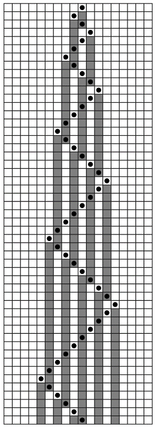
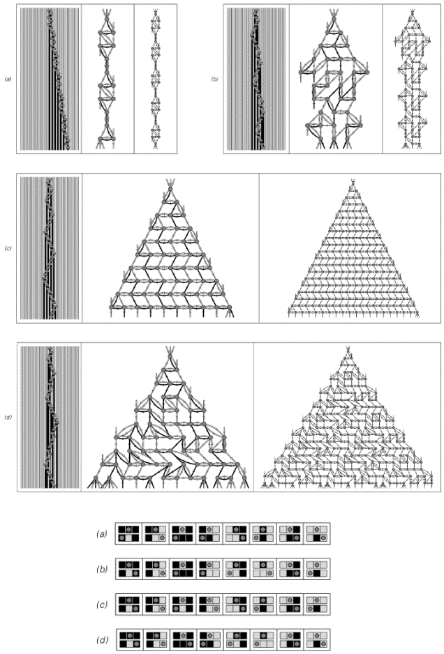
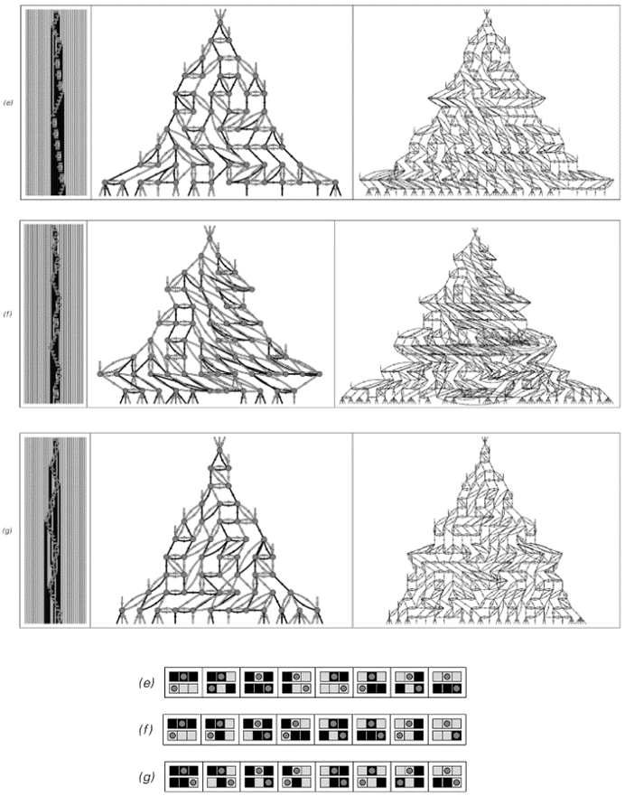
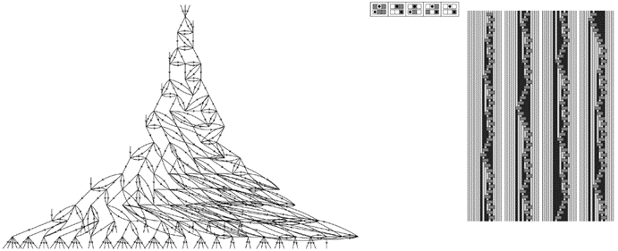

### 9.9  时间与因果网络

我在上一节中论证过，时间的进程应该从根本上被视为类似于元胞自动机这样的系统的演化。但元胞自动机的一个特点是，它被设置为同时更新其所有细胞，就像在某个全局时钟的每一次滴答声中一样。然而，正如想象宇宙由空间中的刚性细胞网格组成似乎不合理一样，想象存在一个全局时钟来定义宇宙中每个元素在时间上的同步更新也同样不合理。

但替代方案是什么呢？起初这可能看起来很奇怪，但我认为最终可能并不太离谱的一种可能性是，宇宙可能并不像所有细胞都同时更新的元胞自动机那样工作，而是更像是一个移动自动机或图灵机，其中只有一个细胞在每个步骤中得到更新。

(p 486)

正如第3章所讨论的，并且如下图所示，移动自动机只有一个活动的细胞，它在每个步骤中移动。因为这个活动的细胞是唯一得到更新的细胞，所以在给定的步骤中，不同元素的行为同步从来不是问题。

然而，起初我们可能会觉得宇宙像移动自动机那样工作很荒谬。因为我们确实没有注意到宇宙中有任何活动细胞按顺序访问不同地方。实际上，相反的是，我们的感知是宇宙的不同部分似乎并行演化，并共同随时间推进。

但事实证明，一个人感知到的像移动自动机这样的系统中发生的事情，很大程度上取决于他是从系统外部观察，还是他自己就是系统的一部分。因为从外部看，人们可以很容易地看到移动自动机演化的每一步，并且可以判断出只有一个活动的细胞按顺序访问系统的不同部分。但是对于实际上是移动自动机一部分的观察者来说，感知可能会大不相同。

因为为了认识到时间的流逝，或者实际上任何事情的发生，观察者的状态必须以某种方式改变。但是，如果观察者本身只是移动自动机内部一组细胞的集合，那么除了移动自动机中的活动细胞访问这组细胞的步骤之外，这样的变化是不可能发生的。

这意味着，在移动自动机内部的观察者所感知到的任何两个连续的时间点之间，可能存在大量的底层移动自动机演化的步骤。

如果观察者能够说出每一步发生了什么，那么很容易就能识别出细胞更新的顺序方式。但是，因为作为移动自动机一部分的观察者实际上只能偶尔知道发生了什么，所以对于这样的观察者来说，在连续的时间点之间，许多细胞似乎都是并行更新的。

为了更详细地了解这是如何工作的，可能需要为观察者建立一个具体的模型。但事实上，事实证明，只需从更新事件及其之间的因果关系，而不是从单个步骤的角度来看待移动自动机的演化就足够了。

>一个移动自动机，其中只有每个步骤中用点指示的单个活动细胞被更新，从而避免了全局同步的问题。

(p 487)

对面页面上的图片展示了这一工作原理的一个例子。图片（a）是我在书中其他地方用于表示移动自动机演化的标准表示法的一个版本——其中连续的线条给出了连续步骤上细胞的颜色，而活动细胞在每个步骤上的位置则由一个灰色点表示。对面页面上的后续图片最终都提供了基本相同的信息，但逐渐以更强调更新事件和因果关系表示的方式来呈现。

图片（b）与（a）非常相似，但展示了移动自动机演化的连续步骤被分开，中间的灰色块表示对应于每次应用底层移动自动机规则的“更新事件”。图片（b）仍然为移动自动机演化的每个单独步骤保留了明确的一行细胞。但在图片（c）中，未在给定步骤上更新的细胞被合并在一起，形成了从一个更新事件延伸到另一个更新事件的垂直彩色条纹。

那么这些条纹的意义是什么？本质上，它们用于携带确定下一个更新事件将是什么所需的信息。如图片（d）开始强调的那样，人们可以将这些条纹视为指示更新事件之间存在哪些因果关系或连接。

这一概念然后为移动自动机的整个演化过程提供了一个截然不同的表示法。因为与其基于演化的连续单独步骤来绘制图片，不如形成一个由各更新事件之间的各种因果关系组成的网络，其中每个更新事件都是该网络中的一个节点，而每条条纹都是从一个节点到另一个节点的连接。

(p 488)

>一系列移动自动机演化的视图，展示了如何创建更新事件之间的因果关系网络。这个网络为宇宙中的时空提供了一个非常简单的模型。图片（a）基本上是我在这本书中使用的移动自动机演化的标准表示法。图片（b）包括灰色块来表示更新事件。图片（c）合并了未更新的细胞。图片（d）强调了垂直条纹作为更新事件之间连接的作用。图片（e）到（g）展示了如何形成网络，其节点对应于更新事件。图片（h）和（i）证明了，在这里使用的特定底层规则下，会产生一个高度规则的网络。

(p 489)

图片（e）显示了图片（d）顶部的更新事件和条纹，现在更新事件已被明确编号。图片（f）和（g）然后展示了如何从图片（e）中的连接模式出发，将更新事件作为节点排列出来，以生成一个有序的网络。而且，对于这里使用的特定移动自动机规则，最终得到的网络是高度规则的，如图片（h）和（i）所示。

那么这个网络的意义是什么？事实证明，它可以被认为是定义了移动自动机内部观察者所感知的时空结构——与我们之前两节讨论的网络可以被认为定义了空间结构的方式非常相似。网络中的每个更新事件，对应于网络中的每个节点，都可以想象成在时空中的某个点发生。然后，网络中节点之间的连接可以被认为定义了时空中点的邻接模式。

但是，与我们之前两节讨论的空间网络不同，我们这里考虑的因果网络中的连接总是单向的：每个连接都对应一个因果关系，其中一个事件导致另一个事件发生，但反之则不然。

然而，如果时间要有意义，这种方向性正是所需要的。因为时间的进展可以通过这样的说法来定义：只有那些在时间上晚于某个特定事件的事件才会受到该事件的影响。

事实上，上一页中图片（g）到（i）中的网络是特意这样排列的，以便页面上下相邻的行节点至少大致对应于在时间上连续发生的事件。

如图片（e）到（g）中的编号所示，这种时间概念与移动自动机底层演化过程中发生的更新事件序列之间没有直接对应关系。因为关键在于，作为移动自动机一部分的观察者永远不会看到这一演化过程中的所有单个步骤。他们最多只能确定存在一个特定的因果关系网络——因此，他们对时间的感知必须完全来自这个网络的属性。

(p 490)

那么，这种出现的时间概念是否具有我们所熟知的时间的熟悉特征呢？例如，人们可能会认为，在网络中可能存在循环，这会导致我们经历的时间线性进展出现偏差。但事实上，按照我们在这里所做的那样，从一个底层的演化过程中构建出的因果网络，永远不可能出现这样的循环。

那么，原始移动自动机中演化顺序性的痕迹呢？人们可能会想，如果每一步只有一个活跃的细胞被更新，那么系统的不同部分必然会一个接一个地经历时间。但第489页的图片表明，情况并不一定是这样。事实上，在这些网络图中，每一行的所有节点都实际上与下一行的节点并行连接。因此，尽管移动自动机的底层规则不涉及全局同步，但移动自动机内部的观察者仍然可能感知到时间是以同步的方式前进的。

在本章后面的部分，我将讨论在因果网络背景下空间是如何工作的，以及相对论理论的想法是如何产生的。但现在，人们可以简单地认为，像第489页那样的网络布局，时间是从上到下流逝的，而空间则是从左到右展开的。然后人们可以看到，如果沿着网络中的连接移动，尽管人们能够在页面上前后移动，但总是被迫逐步向下移动——这与我们日常经验中能够在空间中或多或少地向任何方向移动，但总是被迫在时间中前进是一致的。

那么，其他移动自动机会发生什么呢？

接下来两页（第492、493页）的图片展示了一些例子。

规则（a）和（b）产生了非常简单的重复网络，其中实际上有时间的概念，但没有空间的概念。任何移动自动机的工作方式都迫使时间永远继续下去。但是，根据规则（a）和（b），空间中只有有限数量的点可以被达到。

然而，其他规则并没有这个问题：在所有这些规则中，随着时间的推移，空间中达到的点越来越多。规则（c）和（d）产生的网络可以以相当规则的方式布局。但规则（e）、（f）和（g）的网络更为复杂，开始显得有些随机。

(p 491)

>第3章中移动自动机的例子以及它们产生的因果网络。在每种情况下，左侧的图片基本上是第3章中使用的移动自动机演化的标准表示。然后，右侧的图片是同一演化的因果网络表示。这些网络是根据第479页的空间网络进行布局的，如果节点需要越来越多的连接才能从顶部节点到达，则将它们放置在连续的行上。

(p 492)

>请注意，单个连接可以连接在底层移动自动机演化过程中非常不同步骤发生的事件。事实上，即使要构建因果网络的一小部分，也可能需要在底层移动自动机中进行任意长的计算。例如，为了制作图片（e）、（f）和（g）中的因果网络，分别需要查看移动自动机演化的2447、731和322步。事实上，在某些情况下，可能存在实际上永远不会解决的连接。例如，在图片（a）中，有向下的连接永远不会到达任何其他节点——这反映了在移动自动机演化过程中，左侧存在活跃细胞永远不会返回的位置。

(p 493)

用于布局前两页（第492、493页）上网络的程序，是直接类比于第479页上空间网络布局的程序：特定节点将被放置在哪一行，是由从顶部节点开始到达该节点所需跟随的最小连接数决定的。

在情况（a）和（c）中，通过这种方式获得的网络具有这样的性质，即节点之间的所有连接都横跨或向下穿过页面。但在显示的其他每种情况下，至少有一些连接也向上穿过页面。那么，这对我们的时间观念意味着什么呢？如前所述，来自演化过程的任何因果网络中都不可能存在循环。但是，如果将时间与页面上的位置向下相对应，那么既有向上也有向下的连接的存在意味着，从某种意义上说，时间并不总是朝同一个方向前进。然而，至少在这里显示的情况下，页面上仍然有一个强烈的平均向下流动——这与我们日常感知的时间只朝一个方向前进是一致的。

就像我们在本书中研究过的许多其他系统一样，我们在因果网络中找到的随机性不可避免地会消除网络构建方式的细节。因此，例如，尽管移动自动机的底层规则总是将空间和时间处理得非常不同，但出现的因果网络却常常表现出一种均匀的随机性，在这种随机性中，空间和时间在许多方面以某种方式相同地工作。

但是，尽管在因果网络层面上存在这种一致性，但移动自动机演化到因果网络的转变往往远非一致。例如，对面页面顶部的图片显示了前一页规则（e）和（f）的因果网络——但现在每个节点都被编号，以指定其衍生的移动自动机演化的步骤。

我们看到的是，即使因果网络中接近顶部的节点也可能对应于在大量移动自动机演化步骤之后发生的事件。事实上，要填写规则（e）和（f）的因果网络的前二十行，分别需要跟随底层移动自动机演化2447步和731步。

(p 494)

因果网络的一个特点是，它们不仅告诉人们某个事件的后果是什么，而且从某种意义上说，还告诉人们其原因是什么。因此，例如，如果人们从下面第一个因果网络中的事件17开始，那么要找出其原因是事件11和16，只需沿着导致它的连接向后追溯即可。

对于这里使用的特定类型的底层移动自动机，每个节点恰好有三个输入连接和三个输出连接。而且，至少当整体上看似随机时，从一个特定节点向前和向后得到的网络看起来会非常相似。在大多数情况下，仍然会存在微小的差异；但下面右侧的因果网络是特意构建的，以确保它是完全可逆的——很像我们在本章开头讨论的元胞自动机。

观察到目前为止我们所看到的因果网络，人们可能会好奇它们的形式在多大程度上取决于用于生成它们的底层移动自动机的特定属性。

例如，人们可能会认为，我们迄今为止看到的所有网络都随时间最多呈线性增长，这一定是由于我们使用的移动自动机规则的一维特性所不可避免的结果。但下面的图片表明，即使使用这样的一维规则，实际上也有可能获得增长更快的因果网络。事实上，在下面的例子中，每一行上的节点数大约比前一行多1.22倍——对应于整体的近似指数增长。

>这些因果网络对应于第493页上的规则（e）和（f），每个节点都明确标记了它是从移动自动机演化的哪一步推导出来的。即使是为了填充这些因果网络的前几行，也必须追踪许多底层移动自动机演化的步骤。

(p 495)

一个系统的因果网络在某种程度上总是与其底层的系统演化相互对应的。在这里展示的情况下，底层演化中活动细胞所访问区域的缓慢增长反映在相应因果网络的快速增长上。

正如我们稍后在本章中将看到的那样，一维移动自动机及其类似系统所能产生的因果网络类型最终是有限制的。但是，使用不同的移动自动机规则，我们仍然可以获得巨大的多样性。

尽管从外部观察，像移动自动机这样的系统可能几乎不具有我们宇宙所熟悉的任何特征，但我们所看到的是，如果我们作为观察者从某种意义上是这些系统的一部分，那么一些与我们宇宙非常相似的主要特征就会立即显现出来。

>这是一个一维移动自动机，它产生的因果网络实际上随时间呈指数增长。底层移动自动机的作用就像一个二进制计数器，产生一个宽度随步数对数增长的图案。在规则中没有显示的三种情况在这里给出的初始条件下从未使用过。

(p 496)

